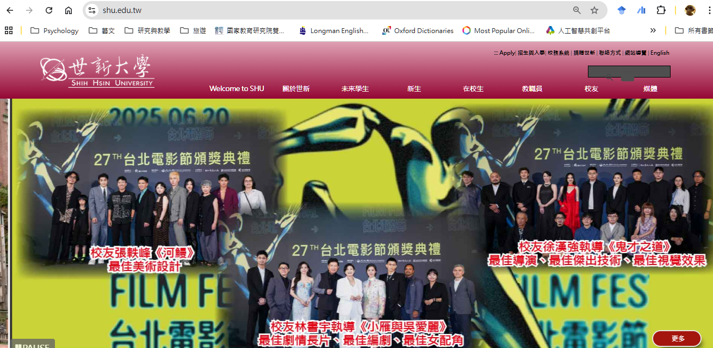
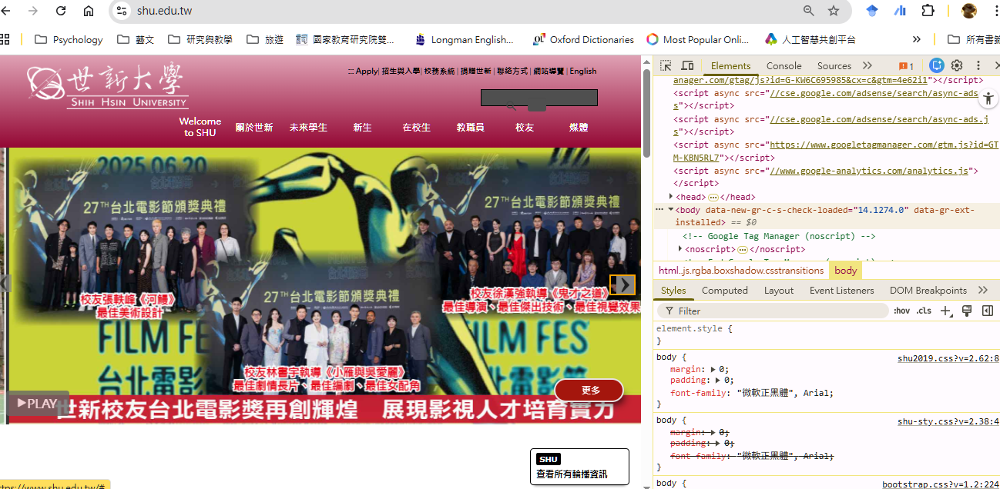
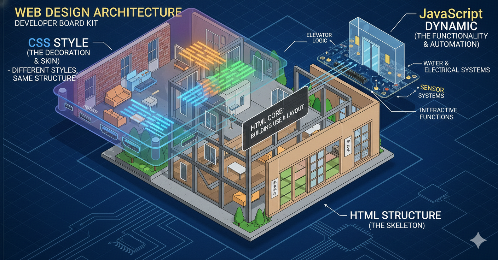
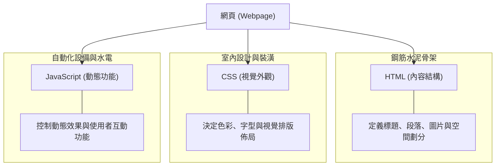
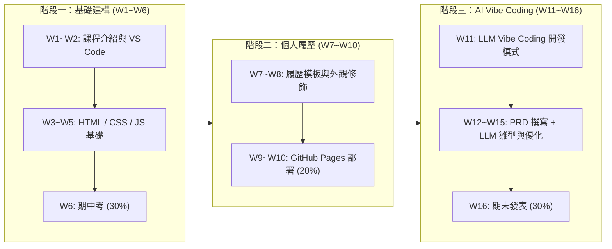

---
puppeteer:
  displayHeaderFooter: true
  scale: 1.15
  headerTemplate: '
第一週：網頁設計課程介紹與總覽
'
  footerTemplate: '
第  頁 / 共  頁
'
  margin:
    top: "1.5cm"
    bottom: "1.5cm"
    left: "1.5cm"
    right: "1.5cm"
---

---

# 第一週：課程介紹講義 (Course Introduction)

**課程名稱**：網頁設計 (Webpage Design)  
**授課教師**：林頌堅 副教授 (Prof. Sung-Chien Lin)  
**授課單位**：世新大學 資訊傳播學系  
**聯絡方式**：scl@mail.shu.edu.tw  
**線上資源**：[W3Schools Online Web Tutorials](https://www.w3schools.com/)  

---

## Ⅰ. 歡迎來到網頁設計 (Welcome & Introduction)

在這個數位時代，網頁不僅僅是資訊的載體，更是連接世界的門戶。從我們每天搜尋資訊的 Google、觀看影片的 YouTube，到社交互動的 Facebook、Instagram，或是電商購物（如蝦皮）、訂房網站（如 Airbnb）與知識共享（如維基百科），網頁無所不在。掌握網頁設計，意味著你擁有了在這個數位世界中「發聲」與「創造」的能力。

本課程為**通識課程**，特別針對**不具備網頁或程式設計背景**的大學生所設計。我們將從最基礎的觀念講起，手把手帶領大家逐步掌握建構現代網頁的核心技術，並融入最新 AI LLM（大型語言模型）的 Vibe Coding 開發流程。

> 💡 **老師的真心話**  
> 學習網頁設計不只是為了成為工程師。在這個視覺與資訊主導的時代，理解網頁背後的運作邏輯能讓你更具備「數位素養」(Digital Literacy)。無論你未來從事企劃、行銷、視覺設計或創業，這份能力都會是你最強大的隱形翅膀！

---

## Ⅱ. 網頁的核心組成：建築的比喻 (Core Components of Webpages)

網頁是指透過 **瀏覽器 (Browser)**（如 Chrome, Edge, Safari）呈現的某一網址下的網路內容。以我們學校網站的首頁為例：

事實上，網頁內部的樣子是這樣 (在瀏覽器中按下 `F12` 鍵，即可開啟「開發人員工具」(Developer Tools)，看見網頁內部的程式碼結構。)

如果把一個網頁比喻成**一棟建築物**，它主要由三個核心要素組成，三者各司其職，共同建構出我們在瀏覽器中所看到的豐富世界：

1. **HTML (HyperText Markup Language - 內容結構)**  
   * **比喻**：建築物的**鋼筋水泥骨架**。  
   * **作用**：定義網頁的內容與結構，例如標題 (`<h1>`)、段落 (`
`)、圖片 (``)、清單與連結。
2. **CSS (Cascading Style Sheets - 外觀樣式)**  
   * **比喻**：建築物的**室內設計與外觀裝潢**。  
   * **作用**：決定網頁的視覺風格，包括配色、字型、元件間距、排版佈局與響應式螢幕呈現。
3. **JavaScript (動態效果與互動功能)**  
   * **比喻**：建築物裏的**自動化設備與功能**（如電梯、自動門、水電系統）。  
   * **作用**：為網頁帶來動態效果、使用者點擊反應與數據互動處理。

> 💡 **老師的真心話**  
> 剛開始看到程式碼時可能會覺得陌生，但別擔心！只要記住這個口訣：  
> **HTML 是長相（結構）、CSS 是化妝（外觀）、JavaScript 是動作（功能）**。我們先把骨架搭好，美化和互動自然就能迎刃而解！

---

## Ⅲ. 本學期 16 週課程進度安排 (16-Week Course Syllabus)

本學期課程採取循序漸進的方式，設計了三個核心模組，帶領大家從零基礎手刻網頁，一路邁向 AI 協作開發 (Vibe Coding)：

| 週次 | 模組 / 單元 | 課程主題與核心內容 | 備註 / 階段目標 |
| :---: | :--- | :--- | :--- |
| **W1** | **課程介紹** | 課程目標、網頁核心觀念（HTML/CSS/JS 比喻）、成績評定說明、本週代表色小任務。 | 開學第 1 週 |
| **W2** | **開發工具體驗** | **編輯軟體 Visual Studio Code (VS Code)** 安裝與環境設定，讓同學迅速上手並發現網頁設計並不困難。 | 建立開發環境 |
| **W3** | **模組一：基礎建構** | **HTML 基礎與內容結構**：學習常用的 HTML 語意標籤、標題、段落、圖片與超連結。 | 網頁骨架搭建 |
| **W4** | **模組一：基礎建構** | **CSS 樣式美化與視覺設計**：學習色彩選擇、字形設定、邊界 (Margin/Padding) 與基本排版。 | 網頁妝點美化 |
| **W5** | **模組一：基礎建構** | **JavaScript 基礎與動態互動**：體驗基本腳本語法、事件監聽與動態互動效果。 | 動態功能體驗 |
| **W6** | **期中檢測** | **期中考 (Midterm Exam)**：快速複習與檢驗 W1~W5 前段基礎知識與實作概念。 | **期中考 (30%)** |
| **W7** | **模組二：個人履歷專案** | **履歷網頁製作 (內容篇)**：提供 Resume 網頁模板，解析 HTML 結構並替換為個人經歷資料。 | 實作專案一 |
| **W8** | **模組二：個人履歷專案** | **履歷網頁製作 (外觀篇)**：修改 CSS 樣式、自訂色彩與字型，打造個人獨特視覺風格。 | 美化個人履歷 |
| **W9** | **模組二：個人履歷專案** | **GitHub 部署上線**：建立 GitHub.com 帳號，學習將履歷專案推送並開啟 GitHub Pages 公開上線。 | 網站正式上線 |
| **W10** | **模組二：個人履歷專案** | **履歷網頁優化與展示**：檢查 RWD 手機版瀏覽效果，完成個人專屬線上首頁。 | **期中作業 (20%)** |
| **W11** | **AI 協作新趨勢** | **網頁 responsive / LLM Vibe Coding**：介紹如何使用大型語言模型 (LLM) 進行網頁 Vibe Coding 開發方法。 | AI 開發模式轉型 |
| **W12** | **模組三：AI 網頁專案** | **PRD (產品需求文件) 撰寫**：學習撰寫標準 PRD，定義網站目標、頁面結構與提示詞 (Prompt)。 | 實作專案二 (企劃) |
| **W13** | **模組三：AI 網頁專案** | **LLM 生成雛型系統**：將 PRD 上傳至 LLM 生成網頁雛型程式碼，並進行初審與同儕互評。 | AI 雛型生成 |
| **W14** | **模組三：AI 網頁專案** | **雛型系統修改與測試**：擔任「AI 品管師」，修改細節程式碼、填入真實圖文與調整 CSS 樣式。 | 程式修復與優化 |
| **W15** | **模組三：AI 網頁專案** | **專案部署與作品集彙整**：將完成的 AI 網頁專案部署至 GitHub Pages，整合為個人作品集。 | **學期專案提交** |
| **W16** | **期末發表** | **期末報告 (Final Presentation)**：全班同學進行學期 AI 網頁專案成果展示與心得分享。 | **期末報告 (30%)** |

> 💡 **老師的真心話**  
> 課程後段加入的「**Vibe Coding**」是目前最新的技術趨勢。利用 AI 協助寫程式，並不是為了偷懶，而是讓我們能將更多精力放在「**創意企劃**」、「**美感設計**」與「**問題解決思維**」上。這也是本課程希望能賦予大家未來的核心競爭力！

---

## Ⅳ. 參考資源與成績評定方式 (Resources & Grading Policy)

### 1. 官方線上參考資源
* **W3Schools Web Tutorials** ([https://www.w3schools.com/](https://www.w3schools.com/))  
  全球最大的網頁開發者學習網站，提供免費且詳盡的 HTML/CSS/JS 教學、範例與線上實作練習器 (TryIt Editor)。

### 2. 成績評定標準
* **出席情形 (Attendance & Participation)：20%**  
  包含每週課堂出席、討論互動與課堂小練習。
* **期中考 (Midterm Exam)：30%**  
  於第 6 週舉行，快速複習並測驗前 5 週的核心觀念與基礎實作。
* **期中作業 - 個人履歷網頁 (Midterm Project)：20%**  
  於第 7~10 週完成，使用履歷模板簡單編輯 HTML/CSS，製作個人履歷並部署至 GitHub.com。
* **學期作業 - PRD AI 網頁專案與期末報告 (Final Project & Presentation)：30%**  
  於第 12~16 週完成，撰寫 PRD、透過 LLM Vibe Coding 生成與修改專案，最後於第 16 週進行成果發表。

> 💡 **老師的真心話**  
> 老師非常看重「**出席情形**」與「**動手做的過程**」。網頁設計是一門實作課，光看課本或投影片是學不會的。只要你每週跟著進度動手練習，遇到困難隨時提出討論，拿高分絕對不是難事！

---

## Ⅴ. 本週課後作業：尋找你的代表色 (Week 1 Homework)

在進入下週 VS Code 實作之前，我們透過一個簡單的小任務，感受網頁設計中「色彩」的魅力。請同學完成以下練習，練習觀察網頁視覺元素並思考如何表達自我：

### 作業步驟說明：
1. **選出代表色**：請前往「[顏色瀏覽器](https://color-browser.vercel.app/)」，選出一種你最喜歡、且認為最能代表你個性的顏色。
2. **記錄色彩資訊**：記錄你選取的**顏色名稱**及其 **RGB 碼**（例如：`rgb(25, 25, 112)`）。
3. **生活連結**：這個顏色經常出現在你生活中的哪些場景或物體中？（例如：黃昏的天空、心愛的吉他、或是某個品牌的標誌）。
4. **自我詮釋**：你為什麼最喜歡這個顏色？你覺得這個顏色的什麼特質可以代表你的個性？
5. **進階觀察 (思考題)**：在網站中，顏色名稱與 RGB 碼下方有一串以 `#` 開頭的符號（例如：`#191970`），它是網頁工程師最常溝通顏色的方式（HEX 色碼）。請試著在網路上搜尋或推測，這串符號代表什麼意思？

> 💡 **老師的真心話**  
> 網頁設計不只是寫程式，更是「視覺溝通」。顏色就是最強而有力的視覺語言！

---

### 下週預告 (Next Week)
第 2 週我們將介紹本課程專用的編輯軟體 **Visual Studio Code (VS Code)**，手把手帶大家設定好開發環境，讓大家踏出輕鬆愉快的第一步！下課後歡迎先去 W3Schools 逛逛，體驗網頁設計的世界吧！
