---
puppeteer:
  displayHeaderFooter: true
  scale: 1.15
  headerTemplate: '<div style="font-size: 11px; margin: 0 auto;">第二週：製作第一個網頁</div>'
  footerTemplate: '<div style="font-size: 11px; margin: 0 auto;">第 <span class="pageNumber"></span> 頁 / 共 <span class="totalPages"></span> 頁</div>'
  margin:
    top: "1.5cm"
    bottom: "1.5cm"
    left: "1.5cm"
    right: "1.5cm"
---

<style>
  /* 全域字型、字級與行距 */
  body {
    font-size: 13pt !important;
    line-height: 1.7 !important;
    font-family: "Microsoft JhengHei", "PingFang TC", "Helvetica Neue", sans-serif;
  }

  /* 階層標題微調 */
  h1 { font-size: 24pt !important; margin-bottom: 0.5em !important; }
  h2 { font-size: 18pt !important; page-break-before: always; }
  h3 { font-size: 15pt !important; }
  h4 { font-size: 13.5pt !important; }

  /* 表格文字放大與排版優化 */
  table, th, td {
    font-size: 12pt !important;
    line-height: 1.5 !important;
  }

  /* 程式碼區塊 */
  pre, code {
    font-size: 11.5pt !important;
    font-family: Consolas, "Courier New", monospace !important;
  }

  /* Mermaid 流程圖節點字體放大 */
  .mermaid text {
    font-size: 14px !important;
  }
</style>

---

# 第二週：製作第一個網頁 (Creating Your First Webpage)

**課程名稱**：網頁設計 (Webpage Design)  
**授課教師**：林頌堅 副教授 (Prof. Sung-Chien Lin)  
**授課單位**：世新大學 資訊傳播學系  
**聯絡方式**：scl@mail.shu.edu.tw  
**線上資源**：[W3Schools Online Web Tutorials](https://www.w3schools.com/)  

---

## Ⅰ. 課前準備 — 建立你的開發環境 (Workspace Setup)

開學第一週我們討論了許多網頁設計的理論與建築比喻，終究要親動手做一次才會有感覺。今天這堂課，我們要一步步地、從無到有，親手打造出一個簡單但完整的網頁！

在開始寫程式碼之前，我們需要先準備好工作的空間，就像畫家準備畫布和畫筆一樣。

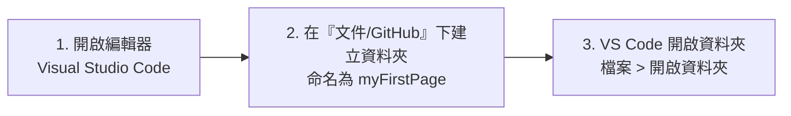

### 實做步驟：
1. **開啟編輯器**：請開啟電腦上的 **Visual Studio Code (VS Code)**。
2. **建立專案資料夾**：請至你電腦的「**文件\GitHub**」(Documents\GitHub) 資料夾下，新增一個資料夾，將其命名為 `myFirstPage`。
3. **在 VS Code 中開啟資料夾**：回到 VS Code，從頂端選單選擇「**檔案 (File)**」>「**開啟資料夾 (Open Folder)**」，然後選擇我們剛剛建立的 `myFirstPage` 資料夾（路徑為 `文件\GitHub\myFirstPage`）。

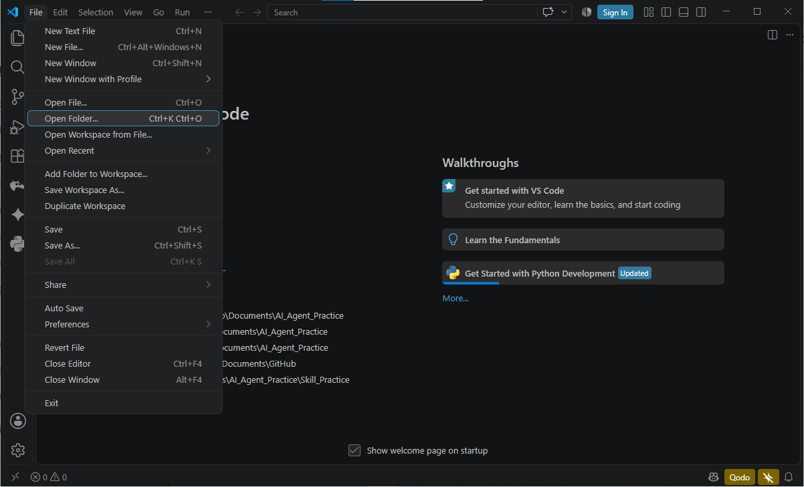

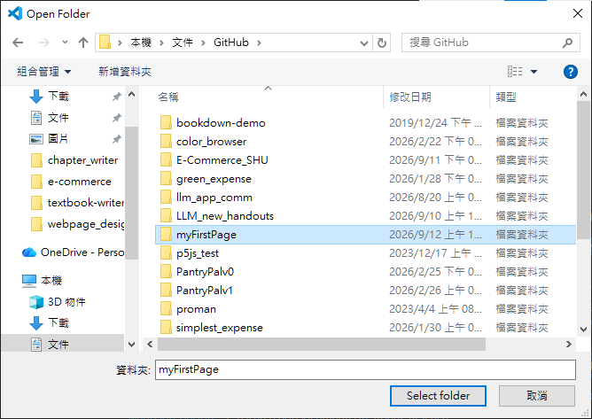
> 💡 **老師的真心話**  
> 每次開始一個新專案，都為它建立一個專屬的資料夾，是一個非常重要的好習慣。將所有網頁專案統一集中在 `文件\GitHub` 下，不僅能讓檔案管理井井有條，也方便未來我們將專案推送上傳至 GitHub 網站！

---

## Ⅱ. 撰寫 HTML 骨架 (Writing HTML Skeleton)

我們的「畫布」準備好了，現在要來畫上網頁的骨架。

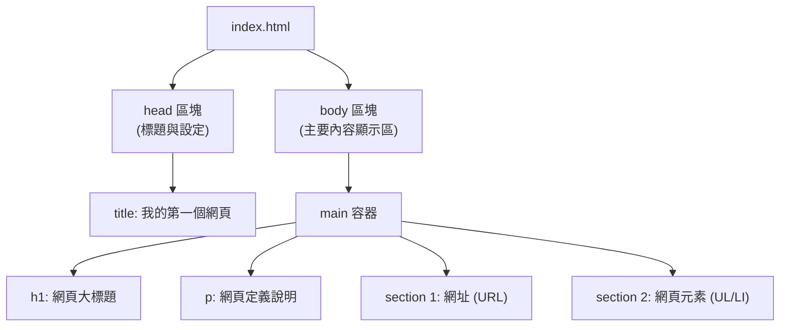

### 實做步驟：
1. **建立 HTML 檔案**：在 VS Code 左側的檔案總管區，點擊新增檔案圖示，將檔案命名為 `index.html`。

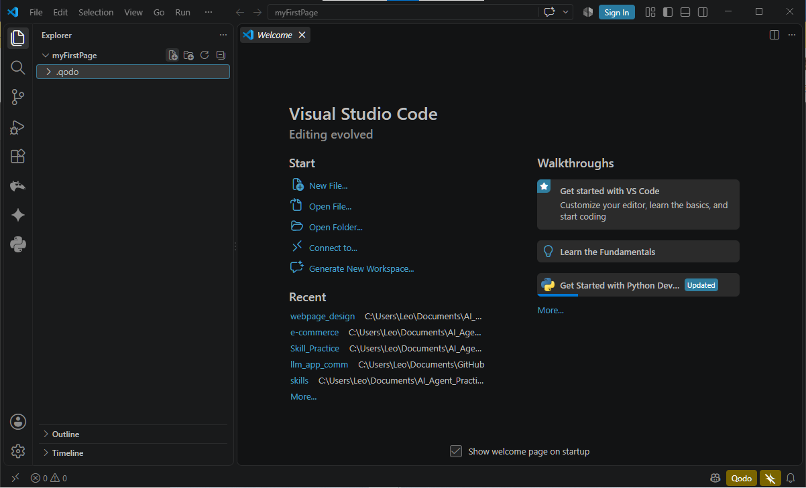

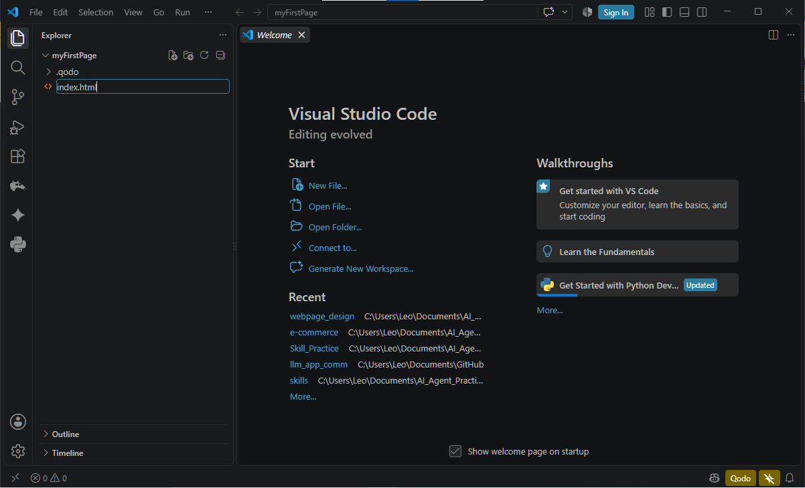

2. **輸入 HTML 程式碼**：在新建的檔案中，輸入以下完整的 HTML 原始碼：

```html
<!DOCTYPE html>
<html>
<head>
    <title>我的第一個網頁</title>
</head>
<body>
    <main>
        <h1>網頁</h1>
        <p>網頁是全球資訊網上，可以用瀏覽器存取的檔案。</p>
        <section>
            <h2>網址</h2>
            <p>每一個放在網路上的網頁都有一個網址，正式的名稱叫做<strong>統一資源定位器 (Uniform Resource Locator, URL)</strong>。</p>
            <p>只需在瀏覽器上輸入網頁的 URL，便可以顯示這個網頁。</p>
        </section>
        <section>
            <h2>元素</h2>
            <p>網頁由多個元素構成，例如：</p>
            <ul>
                <li>標題元素</li>
                <li>段落元素</li>
                <li>圖像元素</li>
            </ul>
        </section>
    </main>
</body>
</html>
```

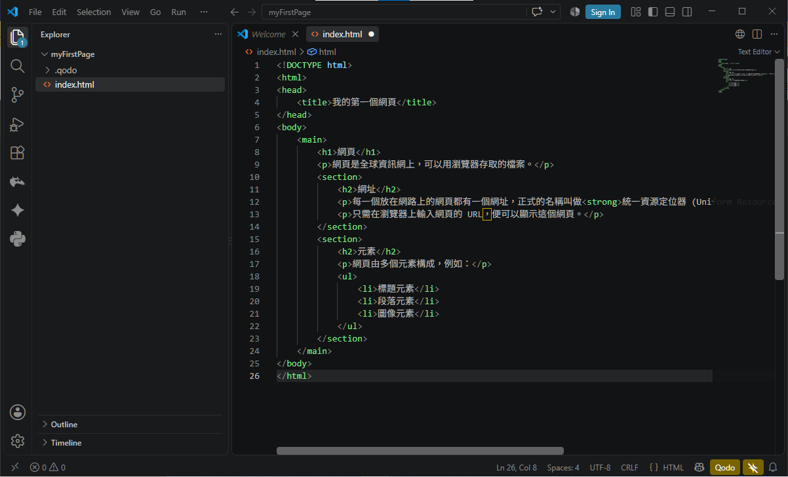

3. **儲存與執行觀看**：
   * **儲存檔案**：在 VS Code 中按下 `Ctrl + S` (Windows) 或 `Cmd + S` (Mac)。
   * **開啟網頁呈現**：開啟電腦的檔案總管，進入 `文件\GitHub\myFirstPage` 資料夾，直接連點兩下開啟 `index.html`。此時瀏覽器將會開啟並呈現你的第一個網頁作品！

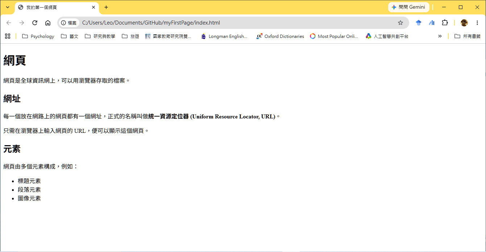

> 💡 **老師的真心話**  
> 為什麼我們將主頁檔命名為 `index.html` 呢？因為在網路世界與 GitHub 伺服器中，`index.html` 是被預設讀取的最核心「預設首頁」！養成使用 `index.html` 作為入口檔名是專業網頁開發的第一步。  
> 此外，在 VS Code 裡你會看到程式碼有不同的顏色（語法高亮 Syntax Highlighting），這能幫助我們輕鬆區分「標籤」與「文字內容」！

---

## Ⅲ. 動手修改與觀察 (Expanding Content & Code Formatting)

網頁的內容是可以隨時擴充與修改的。現在，我們來試著為網頁新增一個關於「網頁外觀」的區塊，並學習如何整理程式碼。

### 實做步驟：
1. **準備更新網頁**：在瀏覽器中觀察結果後，可以保持瀏覽器開啟狀態，直接切換回 VS Code 進行修改。
2. **加入新的 section 區塊**：在第二個 `</section>` 結束標籤之後，加入以下關於 CSS 外觀的程式碼：

```html
        <section>
            <h2>網頁的外觀</h2>
            <p>設計網頁外觀需要利用串接式樣式表 (Cascade Style Sheet, CSS)</p>
            <p>這些外觀樣式，例如：</p>
            <ul>
                <li>元素的寬與高</li>
                <li>元素的背景顏色</li>
                <li>元素的文字顏色</li>
            </ul>
        </section>
```

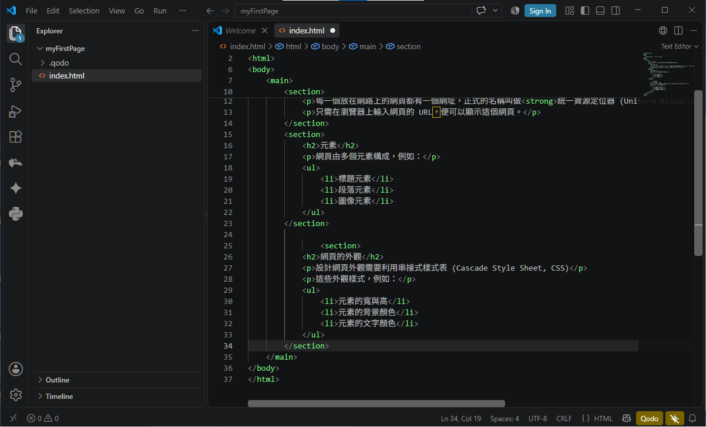

3. **自動整理文件格式 (格式化程式碼)**：  
   此時程式碼的縮排可能變得很亂。請按下快捷鍵 `Shift + Alt + F` (Mac 上為 `Shift + Option + F`)，VS Code 會自動幫你把整個檔案的縮排與格式整理得井然有序！

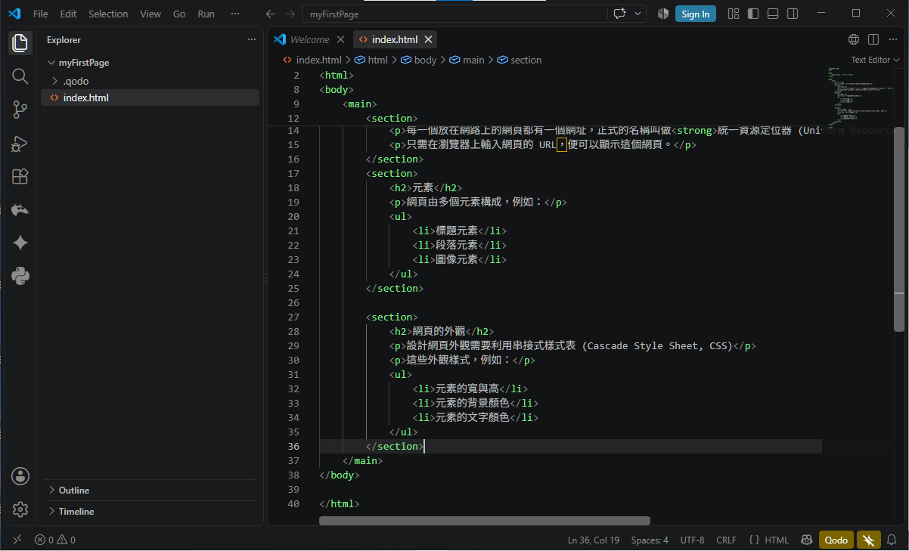

4. **儲存與重新整理頁面**：
   * 在 VS Code 中按下 `Ctrl + S` (Mac `Cmd + S`) 儲存檔案。
   * 切換回剛才開啟的瀏覽器頁面，按下 **重新整理** 按鈕 (或按快捷鍵 `F5` / `Ctrl + R`)，看看網頁是不是立刻出現了新的章節內容！

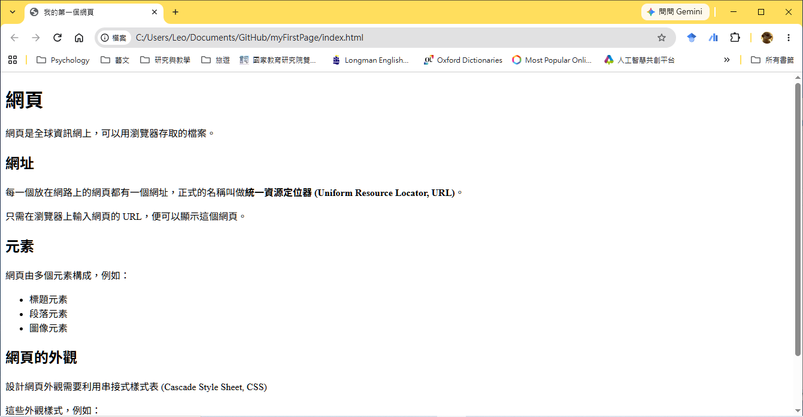

> 💡 **老師的真心話**  
> 當程式碼越來越長時，你會發現程式碼行數編號左邊有一些小小的 `▼` 符號，這就是「**摺疊 / 展開 (Code Folding)**」功能！你可以點擊它暫時收合某個區塊，讓畫面更簡潔，幫助你專注在目前正在修改的程式碼上。這在處理複雜檔案時非常實用！

---

## Ⅳ. 用 CSS 為網頁化妝 (Styling with External CSS)

我們的網頁現在只有骨架，看起來有點樸素。接下來，我們要用 **CSS** 來為它上妝，讓它變得美觀吸引人！

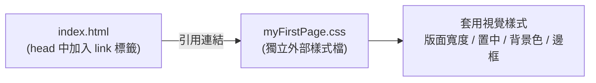

### 實做步驟：
1. **連結 CSS 檔案**：回到 `index.html`，在 `<head>` 區塊中的 `<title>` 元素下一行，加上這行連結程式碼：
   ```html
   <link rel="stylesheet" href="myFirstPage.css">
   ```

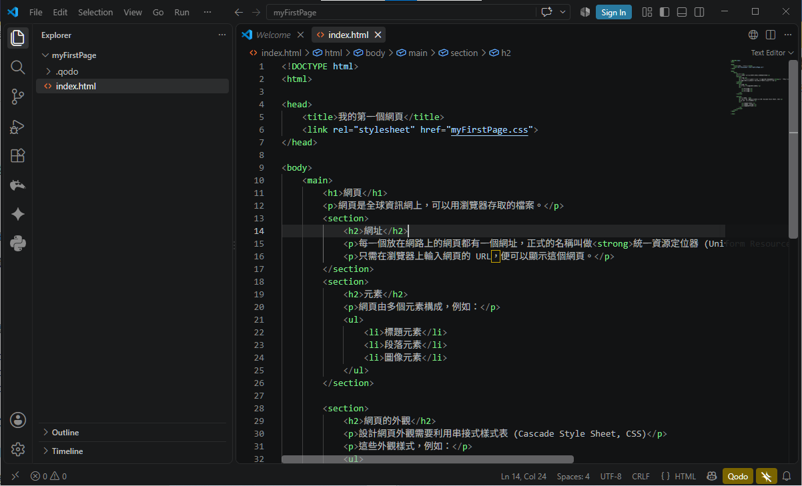

2. **儲存 HTML 檔案**：按下 `Ctrl + S` (Mac `Cmd + S`) 儲存。
3. **建立 CSS 檔案**：在 VS Code 左側檔案總管點擊新增檔案，命名為 `myFirstPage.css`。

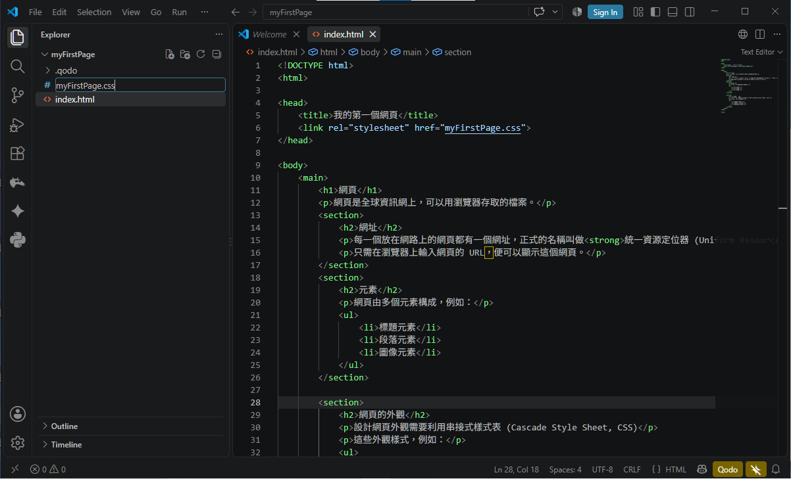

4. **撰寫 CSS 樣式規則**：在 `myFirstPage.css` 中輸入以下樣式程式碼：

```css
main {
    width: 80%;
    margin: auto;
    background-color: rgb(255, 239, 213);
    padding: 20px;
}

h1 {
    text-align: center;
    color: rgb(25, 25, 112);
}

section {
    margin-top: 20px;
    padding: 10px;
    border-top: 2px solid rgb(25, 25, 112);
}
```

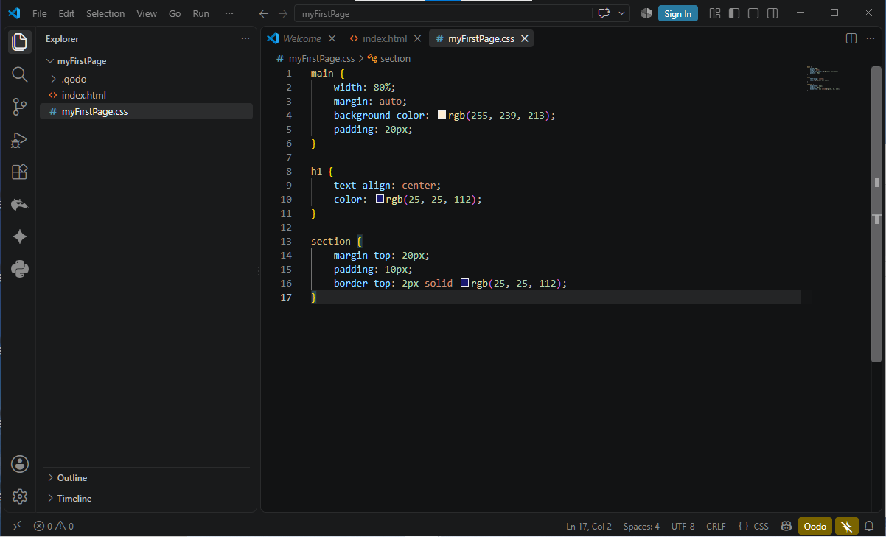

5. **儲存與重新整理瀏覽器**：
   * 在 VS Code 中按下 `Ctrl + S` 儲存 `myFirstPage.css` 與 `index.html` 檔案。
   * 切換回剛才開啟的瀏覽器視窗，按下 **重新整理** (或按快捷鍵 `F5` / `Ctrl + R`)。
   * 看看你的網頁，是不是瞬間擁有柔和背景色、主題深藍標題與質感分隔線了呢？

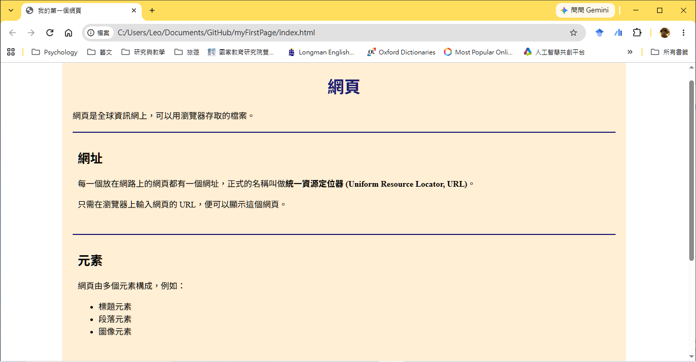

> 💡 **老師的真心話**  
> 這次我們採用的方法叫做「**外部樣式表 (External Style Sheet)**」，將 CSS 寫在獨立檔案中，這是業界最推薦、也最方便維護的方法！其實加上樣式還有「內部樣式表」（在 HTML 內使用 `<style>` 標籤）與「行內樣式表」（直接寫在標籤 `style="..."` 屬性上），詳細使用時機我們會在後續 CSS 專門課程中做深入說明。

---

## Ⅴ. 課後練習與 VS Code 編輯小技巧 (Practice & Tips)

恭喜你！你已經成功建立並美化了你的第一個網頁作品。

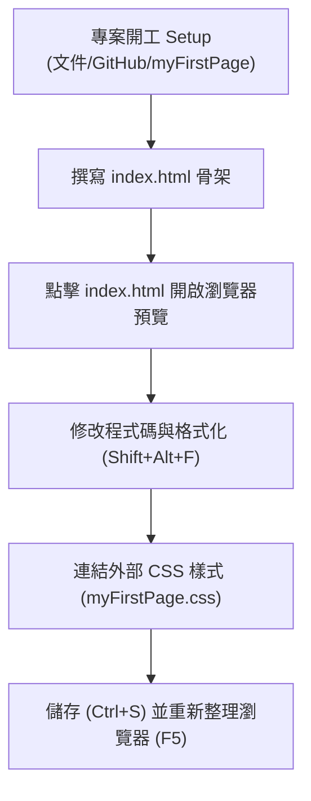

### 課後動手嘗試與叮嚀：
* **動手嘗試**：試著修改看看 `myFirstPage.css` 裡的背景顏色 `rgb(...)` 或文字顏色，儲存後在瀏覽器按下 `F5` 重新整理，看看網頁有什麼變化！
* **溫故知新**：最好的學習方式就是重複練習。試著按照本講義步驟，在 `文件\GitHub` 下自己重新建立一個全新的網頁檔案。
* **儲存你的心血**：記得將練習的專案資料夾備份儲存至個人雲端硬碟。

---

### VS Code 超實用編輯小技巧卡片

| 快捷鍵 / 功能 | 操作方式 | 效果與實用情境 |
| :--- | :--- | :--- |
| **多重游標編輯** | 按住 `Alt` (Mac `Option`) + 滑鼠點擊多處 | 同時在多個不同行建立游標，一起輸入或修改相同文字。 |
| **自動完成 (IntelliSense)** | 輸入標籤或屬性時按 `Enter` 或 `Tab` | 自動選取建議補全程式碼，大幅減少打字錯誤。 |
| **快速註解** | `Ctrl + /` (Mac `Cmd + /`) | 快速將選取程式碼切換為註解狀態（暫時失效）。 |
| **格式化文件** | `Shift + Alt + F` (Mac `Shift + Option + F`) | 自動修正全檔案的縮排與排版，保持程式碼整潔。 |
| **摺疊/展開區塊** | 點擊行號旁的 `▼` 符號 | 收合暫時不修改的程式碼區塊，專注在當前模組。 |

---

### 下週預告 (Next Week)
第 3 週我們將深入進入**模組一：HTML 基礎與內容結構**，學習更多常用語意標籤、清單、表格與超連結，開始為你的網站打造更豐富的內容架構！下課後別忘了多加練習喔！
