---
puppeteer:
  displayHeaderFooter: true
  scale: 1.15
  headerTemplate: '<div style="font-size: 11px; margin: 0 auto;">第三週：利用 HTML 建構網頁內容架構</div>'
  footerTemplate: '<div style="font-size: 11px; margin: 0 auto;">第 <span class="pageNumber"></span> 頁 / 共 <span class="totalPages"></span> 頁</div>'
  margin:
    top: "1.5cm"
    bottom: "1.5cm"
    left: "1.5cm"
    right: "1.5cm"
---

<style>
  /* 全域字型、字級與行距 */
  body {
    font-size: 13pt !important;
    line-height: 1.7 !important;
    font-family: "Microsoft JhengHei", "PingFang TC", "Helvetica Neue", sans-serif;
  }

  /* 階層標題微調 */
  h1 { font-size: 24pt !important; margin-bottom: 0.5em !important; }
  h2 { font-size: 18pt !important; page-break-before: always; }
  h3 { font-size: 15pt !important; }
  h4 { font-size: 13.5pt !important; }

  /* 表格文字放大與排版優化 */
  table, th, td {
    font-size: 12pt !important;
    line-height: 1.5 !important;
  }

  /* 程式碼區塊 */
  pre, code {
    font-size: 11.5pt !important;
    font-family: Consolas, "Courier New", monospace !important;
  }

  /* Mermaid 流程圖節點字體放大 */
  .mermaid text {
    font-size: 14px !important;
  }
</style>

---

# 第三週：利用 HTML 建構網頁內容架構 (HTML Basics & Document Structure)

**課程名稱**：網頁設計 (Webpage Design)  
**授課教師**：林頌堅 副教授 (Prof. Sung-Chien Lin)  
**授課單位**：世新大學 資訊傳播學系  
**聯絡方式**：scl@mail.shu.edu.tw  
**線上資源**：[W3Schools HTML Tutorial](https://www.w3schools.com/html/)  

---

## Ⅰ. HTML 基礎概念與文件結構 (Basic Structure & Elements)

各位同學好！經過第二週親手打造第一個網頁後，今天我們將正式深入認識 **HTML**，這是建構一切網頁的核心基石。

HTML 的全名是 **HyperText Markup Language (超文本標記語言)**。它不像一般撰寫邏輯演算的程式語言，而是一種用來「**標示內容**」的工具。它的主要任務是定義網頁的結構與內容，告訴瀏覽器哪裡是標題、段落、圖片或連結，讓內容能夠正確呈現。

---

### 1. HTML 元素的組成結構與屬性 (Element & Attribute)

所有的 HTML 文件都由稱為「**元素 (Element)**」的單位所組成。一個標準成對 HTML 元素通常由三個部分組合而成：
1. **開始標籤 (Start Tag)**：使用角括號包覆標籤名稱（如 `<p>`、`<title>`、`<a>`、`<em>`）。
2. **元素內容 (Content)**：夾在開始與結束標籤中間的實際文字、圖片或子標籤內容。
3. **結束標籤 (End Tag)**：在角括號中的標籤名稱前加上斜線 `/`（如 `</p>`、`</title>`、`</a>`、`</em>`）。

#### 寫法範例解構：
例如世新大學首頁的超連結元素：  
`<a href="https://www.shu.edu.tw/">世新大學首頁</a>`
* **開始標籤**：`<a href="https://www.shu.edu.tw/">`
* **元素內容**：`世新大學首頁`
* **結束標籤**：`</a>`

再如段落元素：  
`<p>這是段落文字內容</p>`
* **開始標籤**：`<p>`
* **元素內容**：`這是段落文字內容`
* **結束標籤**：`</p>`

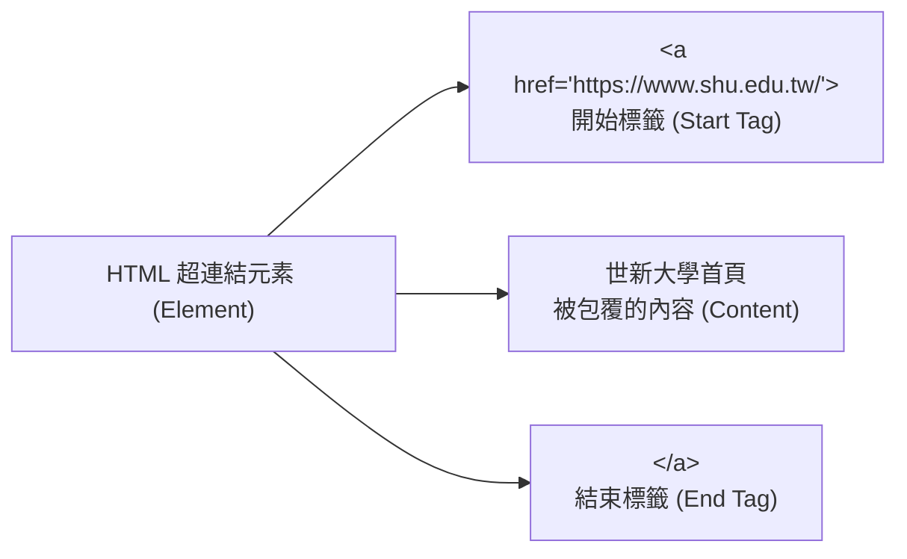

#### 什麼是屬性 (Attribute)？
**屬性 (Attribute)** 是寫在「**開始標籤**」內部的設定，用來提供元素的額外資訊或控制元素的行為。屬性的寫法永遠是 **`屬性名稱="屬性值"` (Name-Value Pair)**。

#### 常用標準元素與屬性範例對照表：

| 元素類型 | 開始標籤 (包含屬性) | 屬性說明 (Attribute) | 元素內容 (Content) | 結束標籤 | 完整元素寫法範例 |
| :--- | :--- | :--- | :--- | :--- | :--- |
| **超連結元素** | `<a href="...">` | `href` 屬性指定跳轉目標網址 | 世新大學首頁 | `</a>` | `<a href="https://www.shu.edu.tw/">世新大學首頁</a>` |
| **段落元素** | `<p>` | （無額外屬性） | 這是段落文字內容 | `</p>` | `<p>這是段落文字內容</p>` |
| **分頁標題元素** | `<title>` | （無額外屬性） | 我的第一個網頁 | `</title>` | `<title>我的第一個網頁</title>` |
| **幕後編碼** | `<meta charset="...">` | `charset` 屬性指定萬國碼編碼 | （空元素，無內容） | （無） | `<meta charset="UTF-8">` |
| **通用容器** | `<div class="...">` | `class` 屬性指定樣式分類名稱 | 產品介紹卡片內容 | `</div>` | `<div class="card">產品介紹卡片內容</div>` |

---

### 2. 單一標籤/空元素 (Void Elements / Self-Closing Elements)

在 HTML 中，並非所有元素都是「成對」出現的！有一類特殊的元素稱為**空元素 (Void Elements)** 或**自閉合元素**。

* **特點**：它們**只有開始標籤，沒有結束標籤**，中間也不需要包覆任何文字內容。
* **作用**：透過屬性直接在網頁中嵌入特定資源或執行控制。

#### 常見空元素範例：
1. **`` (圖片標籤)**：嵌入圖片資源，如 ``
2. **`<meta>` (幕後設定標籤)**：指定網頁編碼或行動螢幕縮放，如 `<meta charset="UTF-8">`
3. **`<link>` (外連檔案標籤)**：引用外部 CSS 檔案，如 `<link rel="stylesheet" href="style.css">`
4. **`<br>` (強制換行標籤)**：在段落中強制斷行。
5. **`<hr>` (水平分割線標籤)**：在網頁中畫出一條橫向分隔線。

---

### 3. 元素之間的階層與繼承關係 (DOM Hierarchy & Inheritance)

網頁是由許多 HTML 元素一層包覆一層組成的**樹狀結構**（稱為 DOM 樹）。元素之間存在著明確的親屬關係：

1. **父元素 (Parent Element)**：直接包覆其他元素的容器。例如 `<body>` 是 `<header>` 和 `<section>` 的父元素。
2. **子元素 (Child Element)**：被包覆在裡面的內層元素。例如 `<h1>` 是 `<header>` 的子元素。
3. **兄弟元素 (Sibling Element)**：擁有相同父元素的同階層元素。例如同在 `<nav>` 內部的多個 `<a>` 標籤。

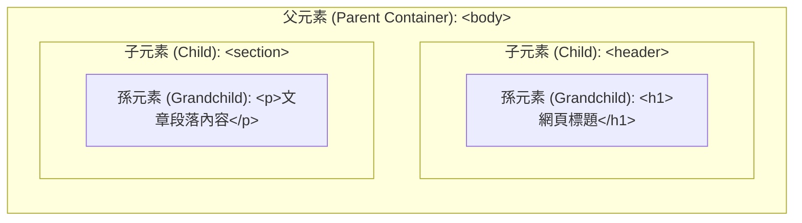

> **老師的真心話：關於「樣式繼承 (Inheritance)」**  
> 在 HTML/CSS 的世界裡，許多文字樣式（如字型、文字顏色、文字大小）具有**繼承性**！當你在父元素（如 `<body>`）設定了文字顏色為深藍色，它裡面的所有子元素（如 `<p>`、`<h1>`、`<ul>`）若沒有另外指定，都會自動「繼承」父元素的文字顏色喔！

---

### 4. 標準 HTML5 根基文件結構

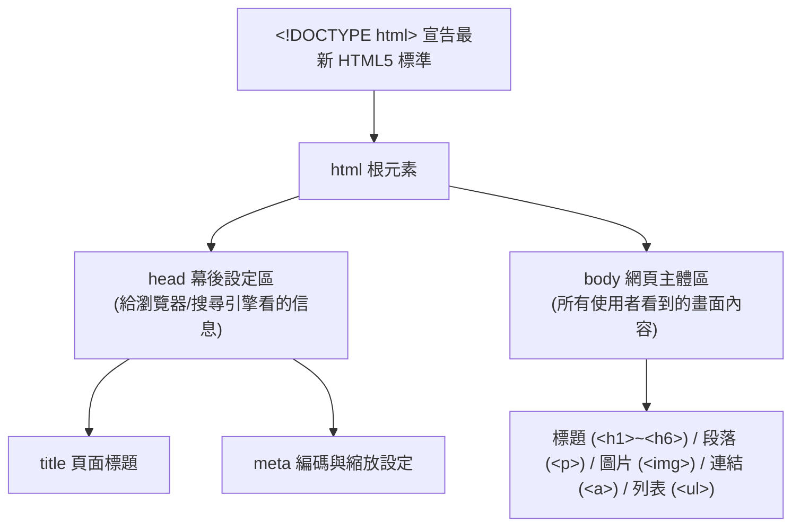

1. `<!DOCTYPE html>`：文件最開頭的宣告，告訴瀏覽器這份文件使用的是最新 **HTML5** 標準。
2. `<html>`：整個網頁文件的根元素，就像一個最大的容器，把所有網頁內容包在裡面。
3. `<head>`：放置給瀏覽器和搜尋引擎看的「幕後設定資訊」（如分頁標題、文字編碼、CSS 引用），頁面上不會直接看到。
4. `<body>`：放置所有使用者能在瀏覽器視窗中看得到的實際內容（如文字、圖片、連結、表格）。

---

### 隨堂實做小練習【步驟 1：搭建 HTML 根基骨架】

請打開 VS Code，跟著以下步驟開啟今天的專案：
1. 在電腦的 `文件\GitHub` 資料夾下新增一個資料夾，命名為 `HTML_Practice`。
2. 在 VS Code 中開啟 `HTML_Practice` 資料夾，並新增一個名為 `index.html` 的檔案。

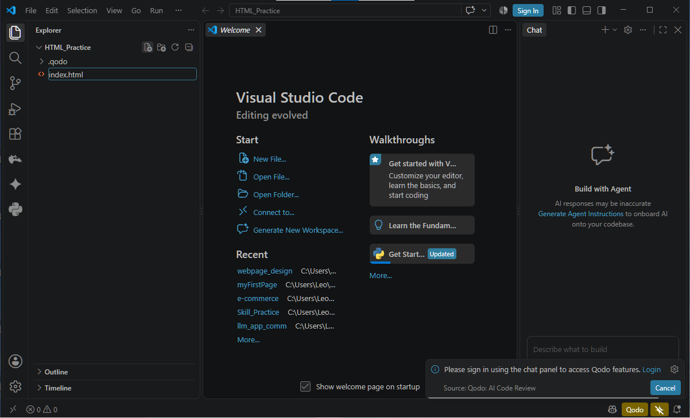

3. 輸入以下基礎結構，並在 `<body>` 中寫下一句你想對這門課說的話：

```html
<!DOCTYPE html>
<html>
<head>
</head>
<body>
    這是大家在瀏覽器視窗中會看到的內容。
</body>
</html>
```

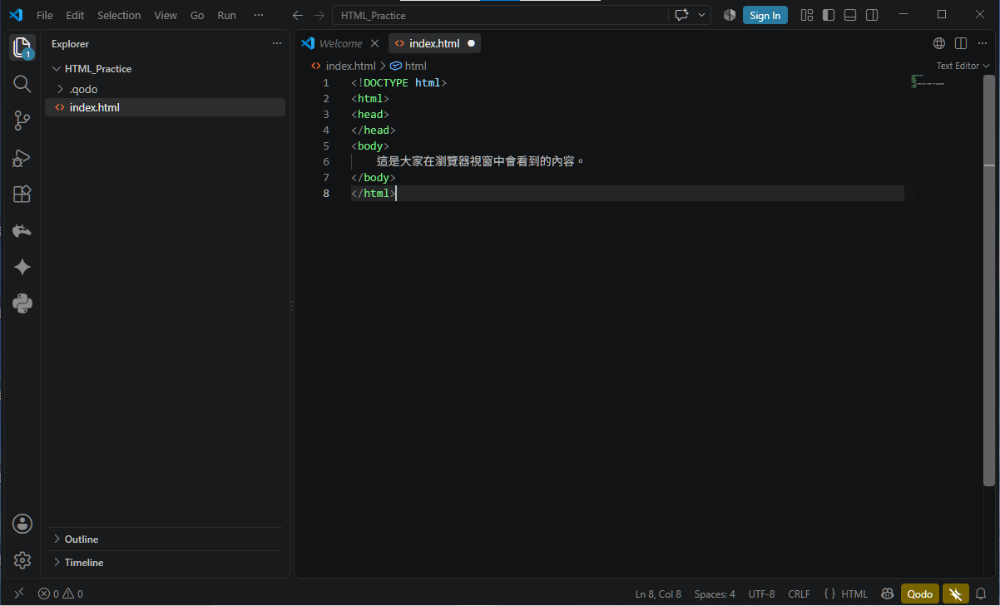

4. 按下 `Ctrl + S` 儲存，至 `文件\GitHub\HTML_Practice` 連點開啟 `index.html` 觀看結果！

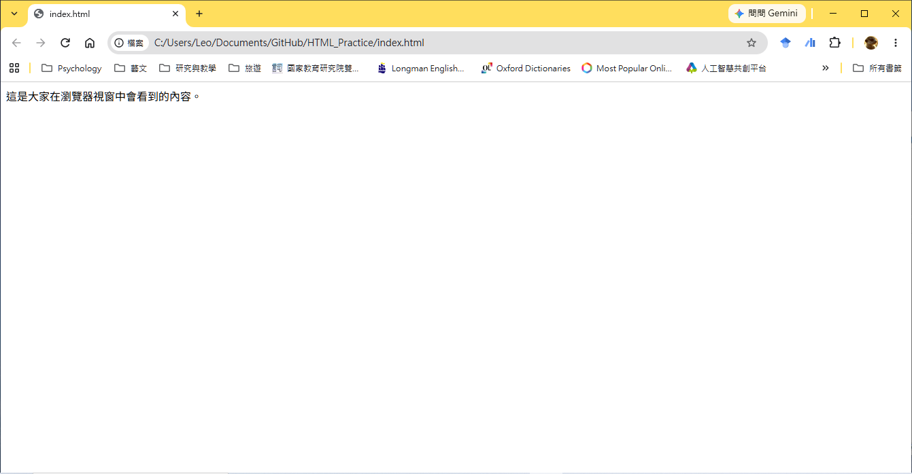

---

## Ⅱ. 網頁幕後設定區 — `<head>` 核心標籤 (Head Settings & Metadata)

`<head>` 區塊內的標籤雖然不會直接呈現在網頁畫面上，但對於瀏覽器的正確解析以及搜尋引擎 (SEO) 來說極為重要！

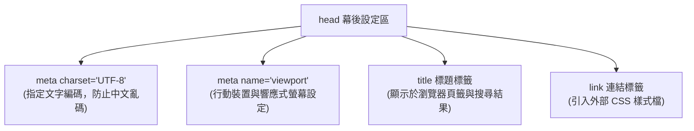

### 核心標籤說明：

1. **`<title>` 分頁標題**：顯示在瀏覽器頁籤上的文字，對於搜尋引擎優化與使用者辨識網頁非常關鍵。
2. **`<meta charset="UTF-8">` 文字編碼**：務必指定使用 **UTF-8** 萬國碼編碼，否則繁體中文內容可能會變成亂碼！
3. **`<meta name="viewport" ...>` 行動螢幕縮放**：讓網頁在手機和平板螢幕上能以正確比例縮放顯示，這是行動優先時代的必備標籤。
4. **`<link>` 引用外部樣式檔**：用來連接外部 CSS 檔案，為網頁美化裝潢。

---

### 隨堂實做小練習【步驟 2：設定 `<head>` 幕後資訊】

請回到 VS Code 中的 `index.html`，修改 `<head>` 區塊，加入編碼與標題設定：

```html
<head>
    <meta charset="UTF-8">
    <meta name="viewport" content="width=device-width, initial-scale=1.0">
    <title>(你的名字) 的個人網頁實作練習</title>
</head>
```

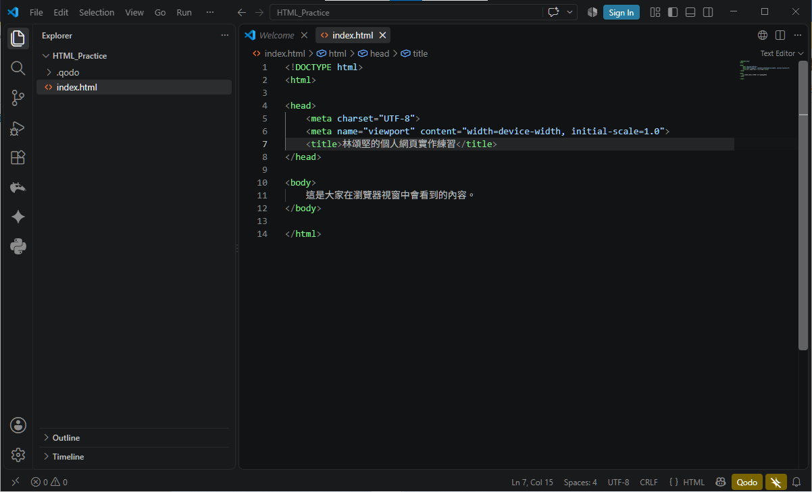

* **動作**：按 `Ctrl + S` 儲存，切換至剛才開啟的瀏覽器視窗按 `F5` (重新整理)，觀察瀏覽器分頁標題是否已經改變！

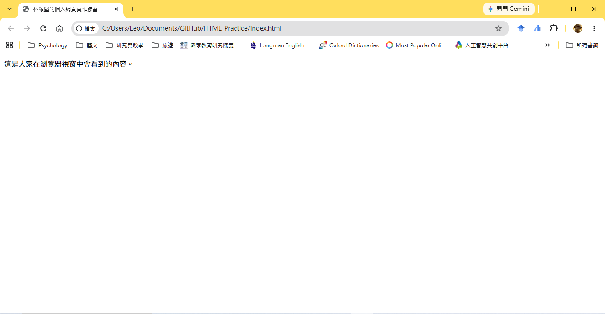
---

## Ⅲ. 標題與文字段落 (Headings & Paragraphs)

文字是傳達訊息的核心，HTML 透過不同的文字標籤來賦予文字合理的意義與文章階層。

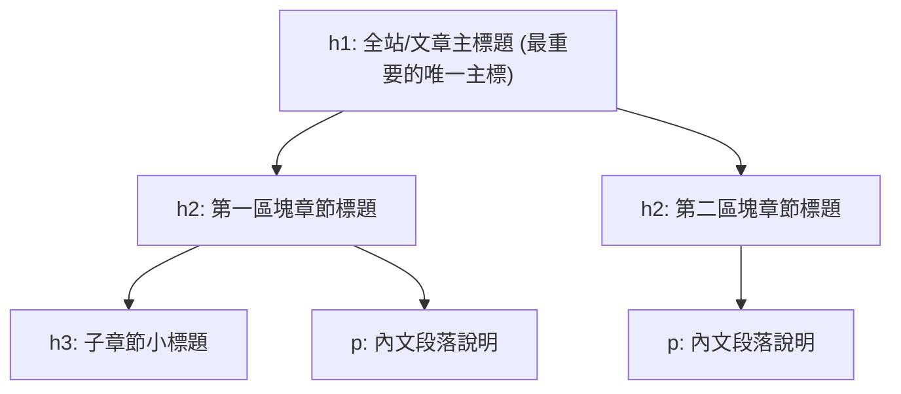

### 標籤與使用說明：

1. **`<h1>` 到 `<h6>` 標題階層**：
   * `<h1>` 字體最大且權重最高，用於網頁的最核心主標題（一頁建議只使用一個 `<h1>`）。
   * `<h2>` 到 `<h6>` 則依序代表次級標題與子項目。
2. **`<p>` 段落標籤**：代表 Paragraph，用於包覆一般的文字段落說明。

> **老師的真心話**  
> 1. **標籤與屬性名稱請一律使用「小寫英文」**：在 HTML 規範中，所有標籤名稱（如 `<a>`、`<p>`、`<h1>`）與屬性名稱（如 `href`、`src`、`alt`）請務必統一使用**小寫英文**撰寫！雖然寫成大寫瀏覽器也能讀懂，但使用小寫是專業網頁開發的標準良好規範。  
> 2. **標題標籤只有 `<h1>` 到 `<h6>`**：請特別注意，HTML 的標題標籤**只有 `<h1>` 到 `<h6>` 這 6 個層級**，完全沒有 `<h7>` 或更高數字的標籤！  
> 3. **標題階層代表文章結構大綱**：`<h1>`~`<h6>` 具備明確的樹狀層級關係（`<h1>` 是全頁主標題，`<h2>` 是章節大標題，`<h3>` 是次要標題）。請不要為了「讓字體變大」而隨意亂挑標題標籤，標題是用來建立文章結構大綱的，視覺的大小樣式請留給 CSS 來設定。

---

### 隨堂實做小練習【步驟 3：加入文章標題與段落】

請刪除 `<body>` 中原本的測試文字，加入一個主標題 `<h1>` 與段落 `<p>`：

```html
<body>
    <h1>歡迎來到我的網頁設計學習筆記</h1>
    <h2>關於我的學習目標</h2>
    <p>這是我在世新大學網頁設計通識課的第三週練習作品。</p>
    <p>透過每週逐步練習，希望能打造出專屬自己的網頁作品集！</p>
</body>
```

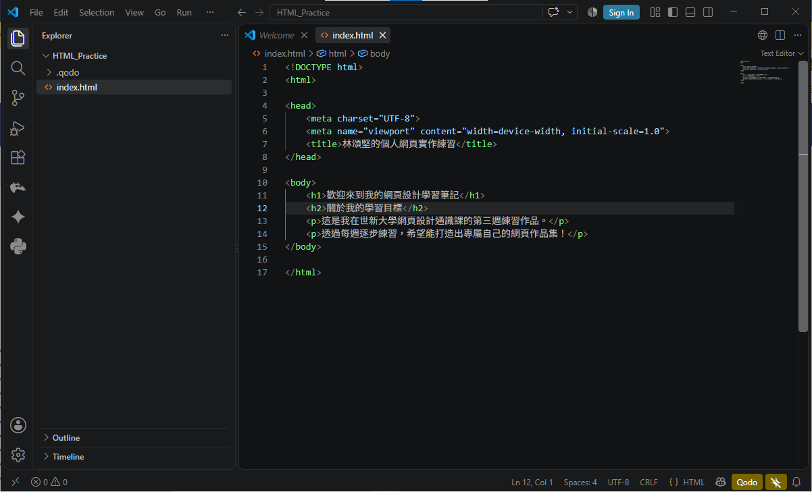

* **動作**：按 `Ctrl + S` 儲存，切換至瀏覽器按 `F5` 重新整理，觀察標題字體大小與段落排版效果。

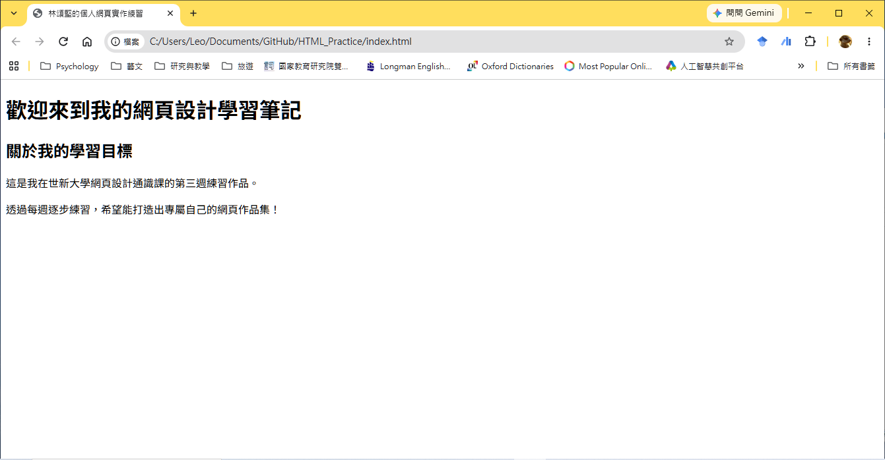
---

## Ⅳ. HTML5 語意化區塊標籤 (Semantic Layout Elements)

傳統網頁開發常常使用無語意的 `<div>` 包辦所有區塊，導致程式碼混亂。HTML5 推出了更有「語意」的結構標籤，讓網頁內容一目了然！

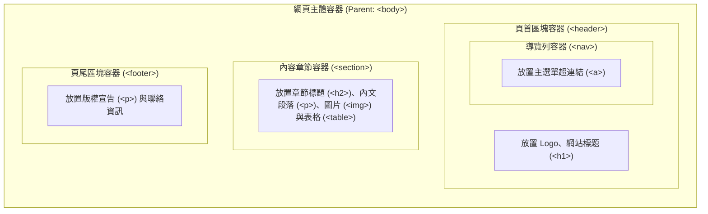

### 核心語意標籤職責：

| 語意標籤 | 中文名稱 | 主要職責與內容情境 |
| :--- | :--- | :--- |
| **`<header>`** | 頁首 | 放置網站名稱、Logo、網站標語或頂部主選單。 |
| **`<nav>`** | 導覽列 | 專門用來放置網站的主要選單連結群組。 |
| **`<section>`** | 內容章節 | 代表文件中的一個獨立專題區塊（如關於我、服務項目、最新消息）。 |
| **`<footer>`** | 頁尾 | 放置於頁面最下方，包含版權資訊 (Copyright)、聯絡 Email 或頁底選單。 |

---

### 隨堂實做小練習【步驟 4：升級為 HTML5 語意化佈局】

請嘗試使用語意化標籤包覆剛剛撰寫的頁面內容：

```html
<body>
    <header>
        <h1>歡迎來到我的網頁設計學習筆記</h1>
        <nav>
            <!-- 導覽列區塊 (下一小節將加入連結) -->
        </nav>
    </header>

    <section>
        <h2>關於我的學習目標</h2>
        <p>這是我在世新大學網頁設計通識課的第三週練習作品。</p>
        <p>透過每週逐步練習，希望能打造出專屬自己的網頁作品集！</p>
    </section>

    <footer>
        <p>© 2026 (你的名字) All Rights Reserved.</p>
    </footer>
</body>
```

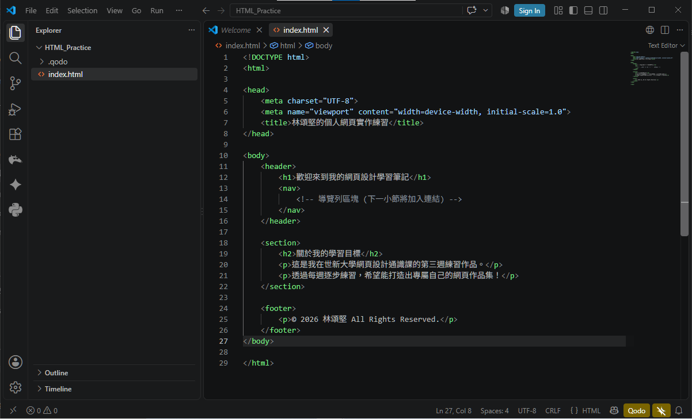

* **動作**：按 `Ctrl + S` 儲存，按 `F5` 重新整理頁面。雖然畫面看起來變化不大，但網頁的結構語意已經大大提升囉！

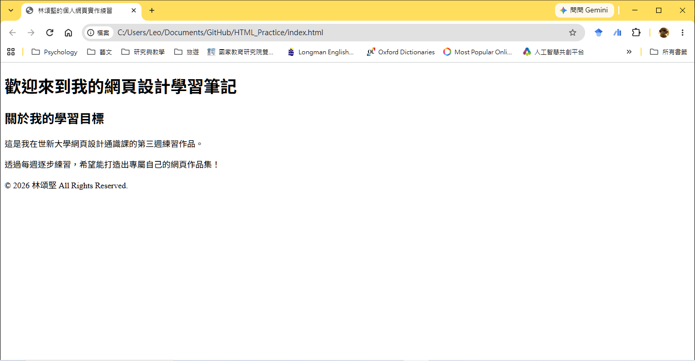

---

## Ⅴ. 超連結與多媒體圖片 (Links & Images)

超連結讓網頁之間相互串連，而圖片則為網頁注入豐富的視覺色彩。

### 1. 超連結 `<a>` (Anchor)
使用 `href` (Hypertext Reference) 屬性指定目標網址：

* **範例 1（連結至世新大學官網，使用 `target="_blank"` 在新分頁開啟）**：
  ```html
  <a href="https://www.shu.edu.tw/" target="_blank">世新大學首頁</a>
  ```
* **範例 2（連結至網站內部其他頁面）**：
  ```html
  <a href="about.html">點擊觀看「關於我們」頁面</a>
  ```

---

### 2. 多媒體圖片 `` (Image)
`` 是單一空標籤（沒有結束標籤 `</img>`）：

* **範例 1（從 `images/` 子資料夾載入圖片，並提供完整 alt 描述）**：
  ```html
  
  ```
* **範例 2（載入同資料夾圖片檔）**：
  ```html
  
  ```

> **老師的真心話**  
> `alt` 屬性非常重要，請務必養成撰寫習慣！它不僅能在圖片路徑寫錯時提供提示線索，也是無障礙網頁規範的核心要求，更能獲得搜尋引擎 (SEO) 的加分喔！

---

### 隨堂實做小練習【步驟 5：插入超連結與圖片】

1. 在 `<nav>` 標籤中，加入超連結：
   ```html
   <nav>
       <a href="index.html">首頁</a> | 
       <a href="https://www.shu.edu.tw/" target="_blank">世新大學首頁ˇ</a>
   </nav>
   ```
2. 在 `<section>` 區塊中，加入一張圖片（請先在專案資料夾放一張圖片，例如 `2021-log.png` 或使用圖片連結）：
   ```html
   
   ```

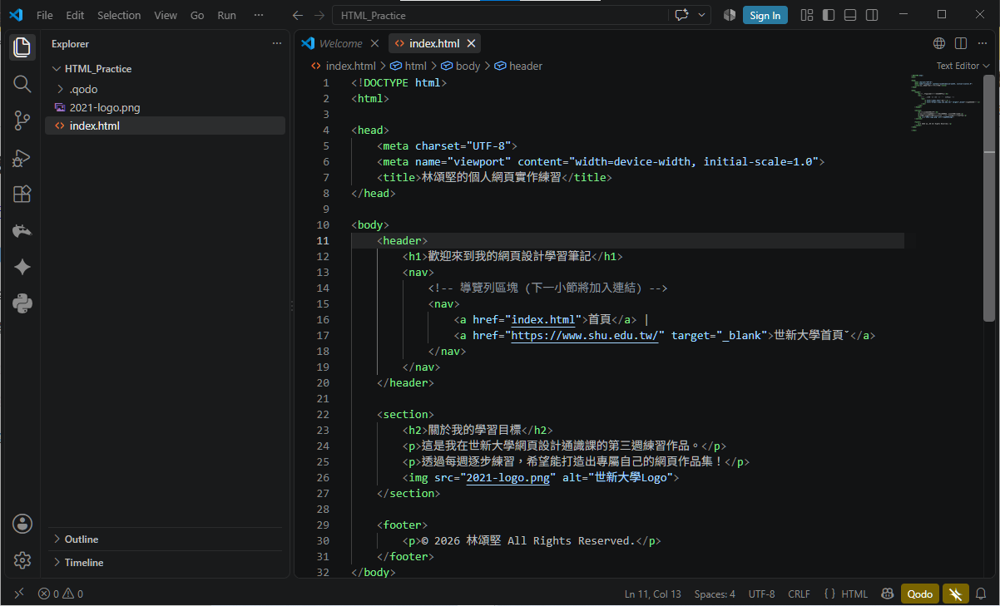

* **動作**：按 `Ctrl + S` 儲存，切換至瀏覽器按 `F5` 重新整理，點擊連結測試網頁跳轉！

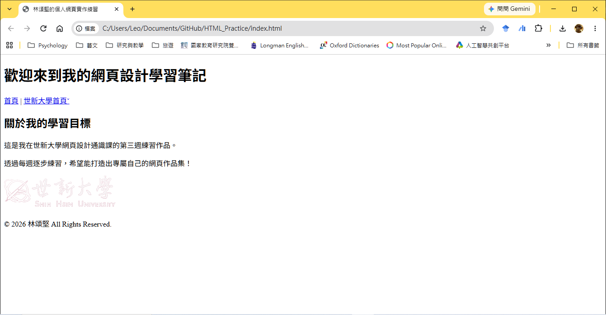

---

## Ⅵ. 清單與結構化表格 (Lists & Tables)

當需要呈現條列式項目或結構化數據時，HTML 提供了豐富的清單與表格標籤。

---

### 1. 清單列表標籤說明 (Lists)

在 HTML 中，清單由「清單容器」與「清單項目」共同組成：
* **`<ul>` (Unordered List，無序清單)**：用來建立沒有特定順序優先級的列表，項目開頭預設會呈現圓點符號 (`•`)。
* **`<ol>` (Ordered List，有序清單)**：用來建立具備前後順序或步驟關係的列表，項目開頭預設會自動顯示數字序號 (`1.`, `2.`, `3.`)。
* **`<li>` (List Item，清單項目)**：用來包覆單一列表項目的內容。`<li>` 必須放在 `<ul>` 或 `<ol>` 容器內部作為子元素使用。

#### 寫法範例：
* **範例 1：無序列表 `<ul>` 與 `<li>` (圓點符號呈現)**：
  ```html
  <ul>
      <li>HTML5 結構標籤搭建</li>
      <li>CSS3 視覺樣式設計</li>
      <li>JavaScript 動態互動功能</li>
  </ul>
  ```
* **範例 2：有序列表 `<ol>` 與 `<li>` (自動數字 1, 2, 3 序號)**：
  ```html
  <ol>
      <li>步驟一：開啟 Visual Studio Code 編輯器</li>
      <li>步驟二：在文件 GitHub 資料夾下新建 index.html</li>
      <li>步驟三：在瀏覽器開啟並按 F5 重新整理觀察成果</li>
  </ol>
  ```

---

### 2. 結構化表格標籤說明 (Tables)

表格是由列 (Row) 與欄 (Column) 交叉構成的數據方格，各標籤的職責分工如下：
* **`<table>` (Table，表格外層容器)**：整個表格的最外層父容器，包覆所有的表格列與單元格。
* **`<tr>` (Table Row，表格列/橫行)**：代表表格中的「一橫行 (Row)」。表格的每一行都必須由一個 `<tr>` 開始與結束。
* **`<th>` (Table Header，表頭單元格)**：用於表格第一行（或欄）的「標題欄位」，預設文字會**自動加粗並居中呈現**。
* **`<td>` (Table Data，資料單元格)**：用於填寫表格內部的「實際數據資料」，預設文字為一般粗細且左對齊。

> **階層包覆關係**：`<table>` 包覆 `<tr>`（橫行），而 `<tr>` 內部再包覆 `<th>` 或 `<td>`（單元格）。

#### 寫法範例：
* **範例 1：基本學生成績表 (簡易 2x2 結構)**：
  ```html
  <table>
      <tr>
          <th>學生姓名</th>
          <th>期中考分數</th>
      </tr>
      <tr>
          <td>王小明</td>
          <td>95 分</td>
      </tr>
  </table>
  ```
* **範例 2：課程進度簡表 (多列多欄與表頭設計)**：
  ```html
  <table>
      <tr>
          <th>週次</th>
          <th>單元主題</th>
          <th>授課重點內容</th>
      </tr>
      <tr>
          <td>第 1 週</td>
          <td>課程介紹</td>
          <td>網頁三大核心與建築比喻</td>
      </tr>
      <tr>
          <td>第 2 週</td>
          <td>環境設定</td>
          <td>VS Code 安裝與第一個 index.html 網頁</td>
      </tr>
      <tr>
          <td>第 3 週</td>
          <td>HTML5 基礎</td>
          <td>標題、段落、語意標籤與連結表格實作</td>
      </tr>
  </table>
  ```

---

### 隨堂實做小練習【步驟 6：加入技能清單與課程表格】

1. 在第一個 `<section>` 中，使用 `<ul>` 列出你的學習技能：
   ```html
   <h3>本週學會的技能列表：</h3>
   <ul>
       <li>掌握 HTML5 基礎結構與幕後 head 設定</li>
       <li>學會 h1~h6 標題階層與 p 段落</li>
       <li>運用 header, nav, section, footer 語意標籤</li>
       <li>加入超連結與圖片 (含 alt 描述)</li>
   </ul>
   ```
2. 在第一個 `<section>` 下方，新增第二個 `<section>`，並加入課程表格：
   ```html
   <section>
       <h2>本學期課程簡表</h2>
       <table>
           <tr>
               <th>週次</th>
               <th>主題模組</th>
           </tr>
           <tr>
               <td>W1 ~ W5</td>
               <td>模組一：HTML / CSS / JS 基礎建構</td>
           </tr>
           <tr>
               <td>W7 ~ W10</td>
               <td>模組二：個人履歷網頁實戰與 GitHub 部署</td>
           </tr>
       </table>
   </section>
   ```

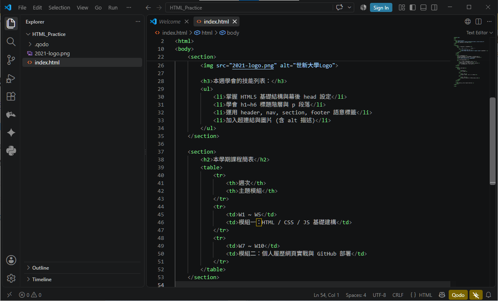

* **動作**：按 `Ctrl + S` 儲存，切換至瀏覽器按 `F5` 重新整理，檢查清單圓點與表格欄位。


---

## Ⅶ. 通用容器 — `<div>` 萬用分組 (Generic Division Container)

當我們找不到更符合語意的標籤（如 `section`, `article`），但又需要將某些內容包成一組以便未來設定 CSS 樣式或版面配置時，`<div>` 就是我們的最終選擇！

* **`<div>` (Division)**：沒有特定語意的區塊容器。
* **常配合 `class` 屬性**：為特定區塊命名以設定樣式（例如商品卡片）。

```html
<div class="product-card">
    <h2>極品手沖咖啡豆</h2>
    <p>風味：柑橘、花香、蜂蜜調性</p>
    <p>優惠價：NT$ 450</p>
</div>
```

> **老師的真心話**  
> 寫網頁就像「堆積木」！先認識每一塊積木（標籤）的用途與特性，隨後就能靈活組合出屬於自己的精彩網站作品！

---

### 隨堂實做小練習【步驟 7：使用 `<div>` 容器與整合測試】

嘗試用一個 `<div class="card">` 將第二個 `<section>` 中的表格包覆起來：

```html
<section>
    <h2>本學期課程簡表</h2>
    <div class="card">
        <table>
            <!-- 表格內容保持不變 -->
        </table>
    </div>
</section>
```

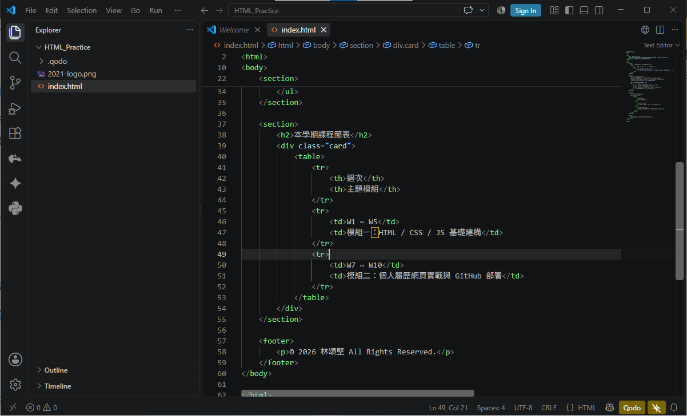

* **動作**：按下快捷鍵 `Shift + Alt + F` 自動整理排版縮排，按下 `Ctrl + S` 儲存，按 `F5` 重新整理！

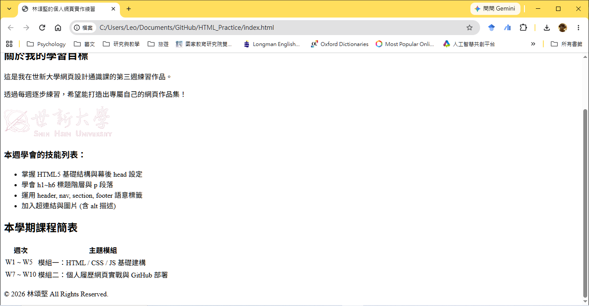

---

## Ⅷ. 本週學習成果總覽與歷程關卡 (Full Code Reference & Checklist)

恭喜你！跟著每個章節逐步練習，你已經完整建立了屬於自己的第一個結構化 HTML5 網頁作品！

### 本週完整完工程式碼參考 (`index.html`)：

```html
<!DOCTYPE html>
<html>
<head>
    <meta charset="UTF-8">
    <meta name="viewport" content="width=device-width, initial-scale=1.0">
    <title>小明的第三週 HTML 實作練習</title>
</head>
<body>
    <header>
        <h1>歡迎來到我的網頁設計學習筆記</h1>
        <nav>
            <a href="index.html">首頁</a> | 
            <a href="https://www.shu.edu.tw/" target="_blank">世新大學首頁</a>
        </nav>
    </header>

    <section>
        <h2>關於我的學習目標</h2>
        <p>這是我在世新大學網頁設計通識課的第三週練習作品。</p>
        <p>透過每週逐步練習，希望能打造出專屬自己的網頁作品集！</p>
        

        <h3>本週學會的技能列表：</h3>
        <ul>
            <li>掌握 HTML5 基礎結構與幕後 head 設定</li>
            <li>學會 h1~h6 標題階層與 p 段落</li>
            <li>運用 header, nav, section, footer 語意標籤</li>
            <li>加入超連結與圖片 (含 alt 描述)</li>
        </ul>
    </section>

    <section>
        <h2>本學期課程簡表</h2>
        <div class="card">
            <table>
                <tr>
                    <th>週次</th>
                    <th>主題模組</th>
                </tr>
                <tr>
                    <td>W1 ~ W5</td>
                    <td>模組一：HTML / CSS / JS 基礎建構</td>
                </tr>
                <tr>
                    <td>W7 ~ W10</td>
                    <td>模組二：個人履歷網頁實戰與 GitHub 部署</td>
                </tr>
            </table>
        </div>
    </section>

    <footer>
        <p>© 2026 小明 All Rights Reserved.</p>
    </footer>
</body>
</html>
```

---

### 隨堂練習進度自我核對表：

- [ ] **步驟 1 關卡**：在 `文件\GitHub` 下建立 `HTML_Practice` 資料夾與 `index.html` 基礎骨架。
- [ ] **步驟 2 關卡**：完成 `<head>` 中的 `<meta charset="UTF-8">` 與個人 `<title>` 設定。
- [ ] **步驟 3 關卡**：加入 `<h1>` 主標題、`<h2>` 章節標題與 `<p>` 段落說明。
- [ ] **步驟 4 關卡**：重構為 `<header>`、`<nav>`、`<section>` 與 `<footer>` 語意化佈局。
- [ ] **步驟 5 關卡**：加入 `<a>` 超連結連至 世新大學首頁，並加入 `` 圖片及寫上 `alt` 替代文字。
- [ ] **步驟 6 關卡**：使用 `<ul>` 清單列出學習技能，並製作 `<table>` 課程進度簡表。
- [ ] **步驟 7 關卡**：使用 `<div>` 容器分組，執行 `Shift + Alt + F` 格式化排版，`Ctrl + S` 儲存並在瀏覽器按 `F5` 呈現！

---

### 下週預告 (Next Week)
第 4 週我們將邁入**模組一：CSS 樣式美化與視覺設計**，學習色彩搭配、字形設定、元件邊界 (Margin/Padding) 與排版美化，為我們的 HTML 骨架穿上亮麗時髦的外衣！下課後別忘了多加練習喔！
