---
puppeteer:
  displayHeaderFooter: true
  scale: 1.15
  headerTemplate: '<div style="font-size: 11px; margin: 0 auto;">第四週：利用 CSS 賦予網頁外觀</div>'
  footerTemplate: '<div style="font-size: 11px; margin: 0 auto;">第 <span class="pageNumber"></span> 頁 / 共 <span class="totalPages"></span> 頁</div>'
  margin:
    top: "1.5cm"
    bottom: "1.5cm"
    left: "1.5cm"
    right: "1.5cm"
---

<style>
  /* 全域字型、字級與行距 */
  body {
    font-size: 13pt !important;
    line-height: 1.7 !important;
    font-family: "Microsoft JhengHei", "PingFang TC", "Helvetica Neue", sans-serif;
  }

  /* 階層標題微調 */
  h1 { font-size: 24pt !important; margin-bottom: 0.5em !important; }
  h2 { font-size: 18pt !important; page-break-before: always; }
  h3 { font-size: 15pt !important; }
  h4 { font-size: 13.5pt !important; }

  /* 表格文字放大與排版優化 */
  table, th, td {
    font-size: 12pt !important;
    line-height: 1.5 !important;
  }

  /* 程式碼區塊 */
  pre, code {
    font-size: 11.5pt !important;
    font-family: Consolas, "Courier New", monospace !important;
  }

  /* Mermaid 流程圖節點字體放大 */
  .mermaid text {
    font-size: 14px !important;
  }
</style>

---

# 第四週：利用 CSS 賦予網頁外觀 (CSS Basics & Styling)

**課程名稱**：網頁設計 (Webpage Design)  
**授課教師**：林頌堅 副教授 (Prof. Sung-Chien Lin)  
**授課單位**：世新大學 資訊傳播學系  
**聯絡方式**：scl@mail.shu.edu.tw  
**線上資源**：[W3Schools CSS Tutorial](https://www.w3schools.com/css/)  

---

## Ⅰ. CSS 基礎概念與三種引入方式 (CSS Introduction & Inclusion)

各位同學好！如果說 **HTML** 是網頁的「骨架」，那麼 **CSS (Cascading Style Sheets，層疊樣式表)** 就是網頁的「化妝師」與「室內設計師」。

CSS 負責網頁的所有視覺外觀設定，從顏色、字體、邊界、背景到多欄排版與動畫效果，都由它一手包辦。這堂課我們將學習如何使用 CSS，讓上週建立的純文字 HTML 骨架變得光彩動人！

---

### 1. 如何將 CSS 加入 HTML？

在開始化妝前，我們得先決定「化妝品」要放在哪裡。在網頁開發中，引入 CSS 主要有三種常見的方式：

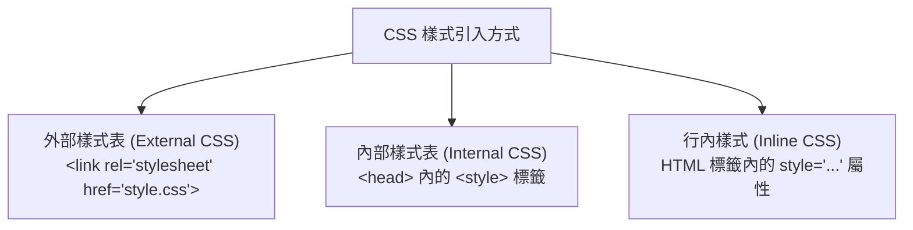

#### (1) 外部樣式表 (External CSS) — 最推薦的方式
將所有的 CSS 樣式寫在一個獨立的 `.css` 檔案中（例如 `style.css`），並在 HTML 的 `<head>` 區塊內使用 `<link>` 標籤引入。

* **HTML 檔案 (`index.html`)**：
  ```html
  <head>
      <link rel="stylesheet" href="style.css">
  </head>
  ```
* **CSS 檔案 (`style.css`)**：
  ```css
  body {
      background-color: #f4f6f9;
  }
  ```

#### (2) 內部樣式表 (Internal CSS)
直接把 CSS 寫在 HTML 檔案的 `<head>` 區塊內，並用 `<style>` 標籤包覆。適合用於「只有這個單一頁面需要特定樣式」的場合。
```html
<head>
    <style>
        h1 {
            color: #2c3e50;
        }
    </style>
</head>
```

#### (3) 行內樣式 (Inline CSS) — 不推薦
直接把 CSS 樣式寫在 HTML 元素的 `style` 屬性裡。
```html
<h1 style="color: blue; text-align: center;">這是藍色且置中的標題</h1>
```

> **老師的真心話：為什麼極力推薦「外部樣式表」？**  
> 把 CSS 獨立出來放到獨立的 `.css` 檔案中，就像把化妝品都整理在專用化妝箱裡，好處是「結構與視覺分離」。未來如果整個網站有 10 個頁面，要修改網站主題配色時，只需要修改這一個 `style.css` 檔案就能全部生效，超級省事！  
> 反之，「行內樣式」會把 HTML 內容與 CSS 樣式混雜在一起，程式碼會變得極難維護，除非是快速測試，否則請盡量避免使用！

---

### 隨堂實做小練習【步驟 1：建立 `style.css` 並在 `index.html` 引入】

請打開上週建立的專案資料夾 `文件\GitHub\HTML_Practice`：
1. 開啟 `index.html`，在 `<head>` 標籤內加入 `<link>` 引用外部樣式檔：

```html
<head>
    <meta charset="UTF-8">
    <meta name="viewport" content="width=device-width, initial-scale=1.0">
    <title>小明的第三週 HTML 實作練習</title>
    <!-- 引入外部 CSS 樣式表 -->
    <link rel="stylesheet" href="style.css">
</head>
```

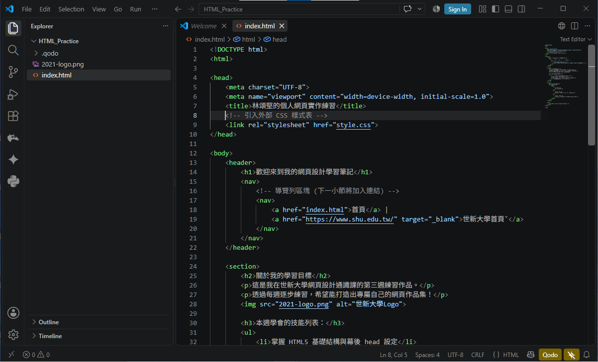


2. 按下 `Ctrl + S` 儲存檔案。

3. 在專案資料夾下新增一個檔案，命名為 `style.css`。

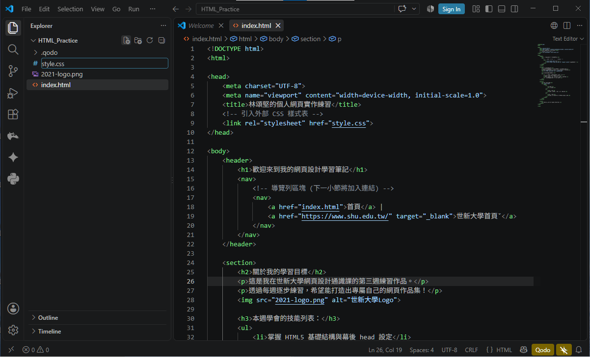

---

## Ⅱ. CSS 基本語法結構 (Syntax & Rules)

CSS 的語法就像在對瀏覽器下指令：「**嘿，幫我把某個 HTML 元素，變成某個樣子！**」

### 1. 語法構成解構

一段標準的 CSS 規則由以下核心部分組成：
1. **選擇器 (Selector)**：位於大括號前，指定要套用樣式的 HTML 標籤或區塊。
2. **宣告區塊 (Declaration Block)**：即大括號 `{ }` 包覆的範圍。
3. **屬性 (Property) 與 屬性值 (Value)**：在大括號內設定具體的視覺屬性。寫法為 **`屬性: 屬性值;`**。

#### 寫法範例：
```css
/* 將所有段落 <p> 的文字顏色設為黑色，行高設為 1.8 倍 */
p {
    color: #333333;
    line-height: 1.8;
}
```

> **老師的真心話：初學者最常犯的錯 — 漏寫「分號 ;」與排版縮排**  
> 1. **切記每句宣告結尾都要加分號 `;`**：如果漏寫分號，瀏覽器會看不懂下一行指令，導致後續整大串 CSS 樣式全部失效！  
> 2. **養成良善縮排習慣**：雖然 CSS 不強制換行，但將每個 `屬性: 值;` 獨立一行並縮排，是專業網頁工程師的自我要求，維護時才會一目了然。若使用 VS Code 編輯器，可隨時按下快捷鍵 `Shift + Alt + F` 自動整理與調整程式碼排版格式喔！

---

### 隨堂實做小練習【步驟 2：設定全域邊界重設與基本背景】

請開啟剛建立的 `style.css`，輸入以下 CSS 初始設定：

```css
/* 1. 全域重設：讓所有元素的盒子計算包含邊框與內距 */
* {
    box-sizing: border-box;
}

/* 2. 設定整體網頁預設背景與文字顏色 */
body {
    line-height: 1.6;
    color: #333333;
    background-color: #f4f6f9;
    margin: 0;
    padding: 0;
}
```

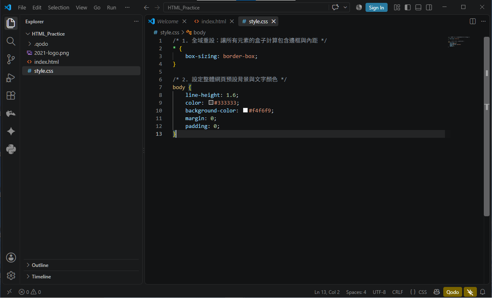

* **動作**：按 `Ctrl + S` 儲存，切換至瀏覽器按下 `F5` 重新整理，觀察整體背景與邊界的改變！

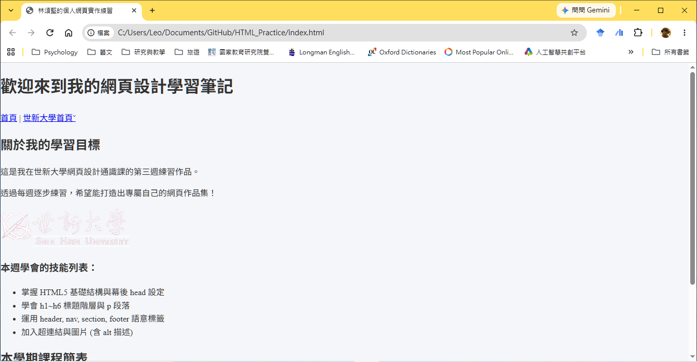

* 使用**開發人員工具**查看CSS

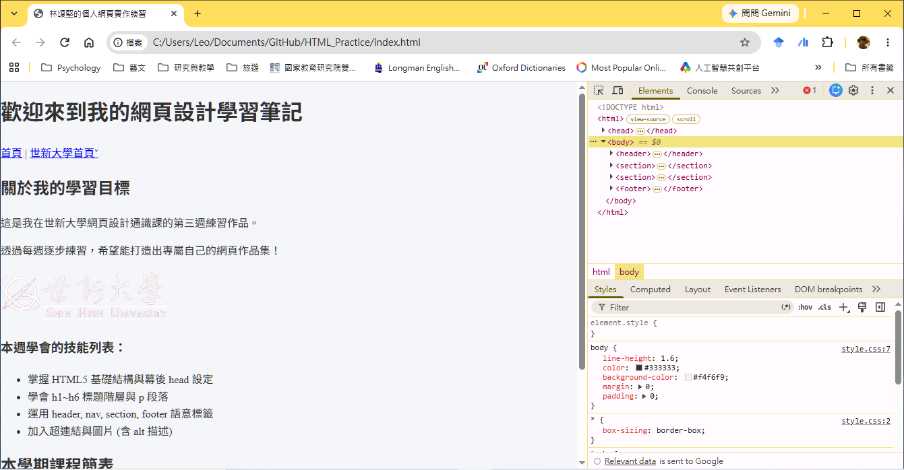

---

## Ⅲ. 精準選取目標 — 常用選擇器 (Selectors)

為了讓網頁不同部位展現出不同美感，我們需要運用各種「**選擇器**」來精確定位目標元素。

| 選擇器類型 | CSS 語法符號 | HTML 寫法範例 | CSS 選擇器寫法 | 說明與適用情境 |
| :--- | :--- | :--- | :--- | :--- |
| **元素選擇器** | 直接用標籤名 | `<p>段落</p>` | `p { color: gray; }` | 選取頁面上**所有**該名稱的 HTML 標籤。 |
| **ID 選擇器** | **`#`** (井號) | `<div id="header-area">` | `#header-area { background: gold; }` | 選取獨一無二的特定元素（全頁不可重複）。 |
| **Class 選擇器** | **`.`** (點號) | `<div class="card">` | `.card { background: white; }` | 選取具有特定類別名稱的元素（可重複套用）。 |
| **群組選擇器** | **`,`** (逗號) | `<h1>` 與 `<h2>` | `h1, h2 { font-weight: bold; }` | 同時選取多個不同元素並套用相同樣式。 |
| **後代選擇器** | **`空格`** | `<nav><a href="#">` | `nav a { text-decoration: none; }` | 僅選取指定父元素內部的特定子代標籤。 |

### 常用選擇器範例解析：

#### 1. ID 選擇器 (`#`) vs Class 選擇器 (`.`)
* **ID (`#`)**：就像身分證號碼，一個 HTML 頁面中同一個 ID 名稱**只能出現一次**！
  * **HTML 結構**：
    ```html
    <h1 id="main-title">歡迎來到我的個人網站</h1>
    ```
  * **CSS 樣式寫法**（使用 `#` 井號前綴）：
    ```css
    #main-title {
        color: #1a5276;
    }
    ```

* **Class (`.`)**：就像學校制服，可以同時套用在許多不同的 HTML 元素上，重用性最高。
  * **HTML 結構**：
    ```html
    <p class="highlight">這是一段重點說明的文字內容。</p>
    <p class="highlight">這是另一段同樣需要強調的重點內容。</p>
    ```
  * **CSS 樣式寫法**（使用 `.` 點號前綴）：
    ```css
    .highlight {
        background-color: #fff2ac;
        font-weight: bold;
    }
    ```

#### 2. 後代選擇器 (Descendant Combinator)
當你只想選取「某些區塊內部的特定標籤」時使用。例如只想去掉 `<nav>` 導覽列內超連結的底線，而不影響文章內文的一般連結：
* **HTML 結構**：
  ```html
  <header>
      <nav>
          <a href="index.html">首頁</a> <!-- 這個 <a> 會套用 nav a 樣式 -->
      </nav>
  </header>
  <p>這是文章內文，內含 <a href="https://www.shu.edu.tw/">世新大學</a> 連結。</p> <!-- 這個 <a> 不受影響 -->
  ```
* **CSS 樣式寫法**（父元素與子代標籤之間用 `空格` 隔開）：
  ```css
  /* 只選取 <nav> 內部的 <a> 標籤，去掉底線 */
  nav a {
      color: #2c3e50;
      text-decoration: none;
  }
  ```

> **老師的真心話：ID 與 Class 的使用時機**  
> 在寫 CSS 樣式時，**強烈建議優先使用 Class (`.`)**！因為 Class 的重用性高、擴充性強。ID (`#`) 通常留給 JavaScript 程式抓取特定元件或锚點跳轉使用。

---

### 隨堂實做小練習【步驟 3：為頁首與導覽列套用樣式】

請在 `style.css` 中加入對 `<header>`、`<h1>` 與 `<nav> a` 的選取與樣式設定：

```css
/* 頁首區塊樣式 */
header {
    background-color: #2c3e50;
    color: #ffffff;
    padding: 20px;
    text-align: center;
}

header h1 {
    margin: 0;
    font-size: 24px;
}

/* 導覽列超連結樣式 (後代選擇器) */
nav {
    margin-top: 10px;
}

nav a {
    color: #ecf0f1;
    text-decoration: none;
    margin: 0 10px;
    font-weight: bold;
}
```

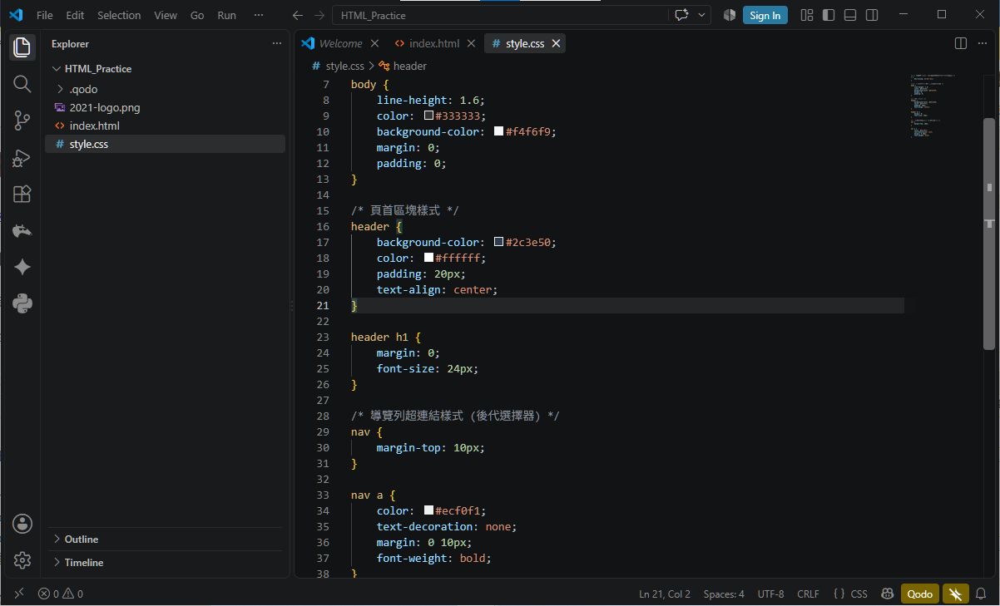

* **動作**：按 `Ctrl + S` 儲存，切換至瀏覽器按 `F5` 重新整理，觀察頁首是否變身為深藍色質感頂列！

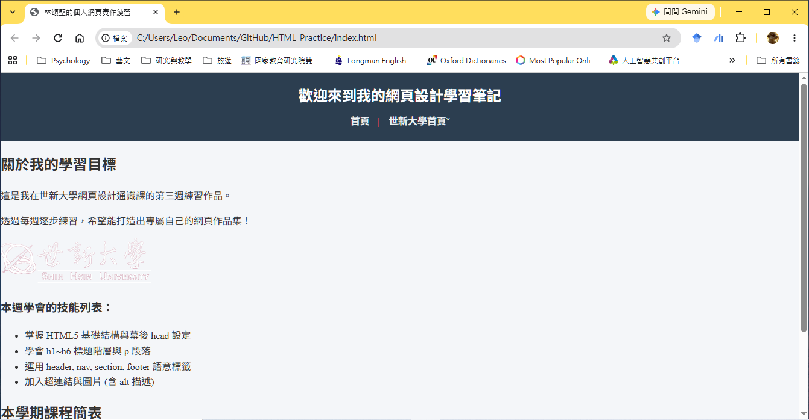

---

## Ⅳ. 常用 CSS 屬性：顏色、字體、長度單位、背景與超連結狀態

學會了如何選取目標，現在我們要來認識幾種最常用的「視覺化妝品」屬性！

---

### 1. 顏色與文字樣式 (Color & Typography)

文字是網頁傳達訊息的核心，透過 CSS 我們可以輕鬆控制文字的顏色、大小、對齊與行高：

* **`color`**：設定文字顏色。
* **`font-size`**：設定文字大小（配合長度單位使用，如 `px` 或 `rem`）。
* **`font-family`**：設定字型（如 `"Microsoft JhengHei", sans-serif`）。
* **`text-align`**：文字水平對齊方式（`left` / `center` / `right`）。
* **`line-height`**：行高（建議設定 `1.5` ~ `1.8` 倍，能大幅提升閱讀舒適度）。
* **`letter-spacing`**：字距拉開（增加文字質感）。

---

### 2. 色彩表示法 (Color Representations)

在 CSS 中指定顏色（例如 `color` 或 `background-color`）時，主要有三種常見的寫法：

1. **顏色英文單字**：最直觀的名稱，如 `red`, `blue`, `navy`, `white`, `gold`。
2. **十六進位色碼 (Hex Color Code)**：專業網頁開發最常用的格式，以 `#` 開頭後接 6 位十六進位數值。例如 `#2c3e50`（深藍灰）、`#3498db`（亮藍）、`#ffffff`（純白）、`#333333`（深灰）。
3. **RGB / RGBA 數值**：指定紅 (R)、綠 (G)、藍 (B) 的 0~255 數值，如 `rgb(44, 62, 80)`。若加上透明度 Alpha (0~1)，則為 `rgba(0, 0, 0, 0.1)`（10% 透明度黑色，常用於半透明陰影）。

---

### 3. 長度單位說明 (CSS Length Units)

在設定文字大小 (`font-size`)、元件寬高 (`width`/`height`) 以及內外距 (`padding`/`margin`) 時，都需要指定「長度單位」。CSS 的長度單位主要分為兩類：

#### (1) 絕對長度單位 (Absolute Units)
* **`px` (Pixel，像素)**：最常見的標準像素單位。`1px` 代表螢幕上的一個發光小點。大小固定且直觀，非常適合用於邊框線條 (`border`)、微調內外距或固定視覺元件。

#### (2) 相對長度單位 (Relative Units)
* **`rem` (Root em)**：相對於根元素 `<html>` 的字型大小（預設通常為 `16px`，如 `1.5rem = 24px`）。全頁統一基準，非常適合用於響應式字型與模組化排版。
* **`em`**：相對於「父元素」的字型大小（若父元素為 `16px`，則 `1.5em = 24px`）。
* **`%` (Percentage，百分比)**：相對於父容器尺寸的比例（例如 `width: 50%;` 代表寬度佔父容器的一半）。
* **`vw` / `vh` (Viewport Width / Height)**：相對於使用者螢幕視窗寬度/高度的百分比（`100vw` 代表整個螢幕寬度，`100vh` 代表整個螢幕高度）。

#### 常用長度單位對照表：

| 單位名稱 | 單位類型 | 參考基準 | 適用情境與建議 |
| :--- | :--- | :--- | :--- |
| **`px`** | 絕對單位 | 螢幕像素點 | 邊框線條 (`1px`~`3px`)、固定元件尺寸、微調邊界。 |
| **`rem`** | 相對單位 | 根元素 `<html>` 字級 | 網頁內文與標題字體大小 (例如 `1rem`, `1.5rem`)。 |
| **`em`** | 相對單位 | 父元素字級 | 標題內部的相對行高或按鈕內部 Padding。 |
| **`%`** | 相對單位 | 父容器對應寬高 | 容器寬度設定 (例如 `max-width: 80%`) 實現自適應排版。 |
| **`vw` / `vh`** | 相對單位 | 視窗寬高 (1vw = 1%) | 全螢幕輪播 Banner、滿版背景區塊高度 (`100vh`)。 |

---

### 4. 字型設計 (Font Design & Web Fonts)

當使用者造訪你的網站時，如果他們的電腦或手機沒有安裝你在 CSS `font-family` 中指定的字型（例如電腦裡沒有安裝「微軟正黑體」），瀏覽器就會退回使用預設字型，導致網站美感大打折扣！

為了解決這個問題，現代網頁開發普遍採用 **雲端 Web Fonts（如 Google Fonts）**，讓瀏覽器自動下載並呈現統一的精美字型。

#### (1) 如何引入 Google Fonts？修改 HTML `<head>`
以繁體中文最常用的 **Google Noto Sans TC (思源黑體)** 為例，我們需要在 HTML 檔案的 `<head>` 區塊內加入 Google 雲端字型的引用連結：

* **修改 `index.html` 中的 `<head>`**：
  ```html
  <head>
      <meta charset="UTF-8">
      <meta name="viewport" content="width=device-width, initial-scale=1.0">
      <title>網頁標題</title>

      <!-- 1. 預先連接 Google Fonts 伺服器以提升載入速度 -->
      <link rel="preconnect" href="https://fonts.googleapis.com">
      <link rel="preconnect" href="https://fonts.gstatic.com" crossorigin>
      <!-- 2. 引入 Google Noto Sans TC (思源黑體) 雲端字型 -->
      <link href="https://fonts.googleapis.com/css2?family=Noto+Sans+TC:wght@400;500;700&display=swap" rel="stylesheet">

      <!-- 3. 引入獨立的外部 style.css 樣式表 -->
      <link rel="stylesheet" href="style.css">
  </head>
  ```

> **跨國語言與學生所屬母語字型選擇**：若學生來自其他國家或網頁包含多國語言，可至 [Google Fonts 官網](https://fonts.google.com/) 搜尋選擇適合該語言的字型（例如：日文選擇 `Noto Sans JP`、韓文選擇 `Noto Sans KR`、英文選擇 `Roboto` 或 `Inter`），將複製的 `<link>` 貼入 `<head>` 即可！

---

#### (2) 如何在 CSS 設定 `font-family` 字型降級備案 (Font Fallback)？
在 CSS 的 `font-family` 中，我們可以設定一長串「字型優先順序備案」。瀏覽器會由左至右依序檢查並載入第一個可用的字型：

```css
body {
    /* 優先 1: Google 雲端字型 Noto Sans TC (思源黑體) */
    /* 優先 2: Windows 內建微軟正黑體 */
    /* 優先 3: Mac / iOS 內建蘋果蘋方體 */
    /* 備案 4: 系統通用無襯線字型 (sans-serif) */
    font-family: "Noto Sans TC", "Microsoft JhengHei", "PingFang TC", sans-serif;
}
```

* **雙引號規則**：字型名稱中間若包含空格（如 `"Noto Sans TC"`、`"Microsoft JhengHei"`），必須使用**雙引號**包覆。
* **通用備案 (sans-serif)**：最末尾一定要加上 `sans-serif` (無襯線體) 或 `serif` (襯線體)。這是告訴瀏覽器：「若前面指定的字型全部失效，請隨便使用一個系統內建的黑體/明體來代替」，避免網頁字型崩潰。

---

### 5. 背景與裝飾 (Background)

* **`background-color`**：設定區塊背景顏色。
* **`background-image`**：設定背景圖片，格式為 `url("圖片路徑")`。
* **`background-size`**：背景圖縮放控制。`cover` 代表讓圖片鋪滿整個容器（不變形）。
* **`background-position`**：背景圖對齊點，常用 `center`。
* **`background-repeat`**：背景圖是否重複。務必設定 `no-repeat` 防止圖片像瓷磚一樣重複拼貼！

---

### 6. 超連結的四種偽類狀態 (Link Pseudo-classes)

超連結 `<a>` 具備動態互動特性，我們可以針對它的四種狀態設定不同視覺效果：

* **`:link`**：尚未點擊過的常態連結。
* **`:visited`**：已經點選造訪過的連結。
* **`:hover`**：**當滑鼠游標懸停在連結上方時（極常用！）**。
* **`:active`**：滑鼠點擊下去的瞬間。

```css
/* 預設連結樣式 */
a {
    color: #2980b9;
    text-decoration: none;
}

/* 當滑鼠移上去時：文字變深藍色並出現底線 */
a:hover {
    color: #1a5276;
    text-decoration: underline;
}
```

> **老師的真心話：字型備案陷阱與 Chrome 開發人員工具**  
> 1. **通用字型備案 (Font Fallback)**：當你在 `font-family` 設定了「微軟正黑體」時，一定要在最後加上 `sans-serif` (無襯線體)。這樣當學生用 Mac 或手機開啟時，如果沒有安裝微軟正黑體，瀏覽器才會自動調用系統內建的黑體代替，不會變成亂碼或預設的明體。  
> 2. **活用 Chrome 開發人員工具**：在網頁上按 `F12` 或右鍵點擊「檢查 (Inspect)」，可以直接選取元素並即時測試修改 CSS 顏色與大小，這是工程師必備的調試利器！

---

### 隨堂實做小練習【步驟 4：設定 Google Fonts 雲端字型與文章標題/連結懸停效果】

1. 請開啟 `index.html`，在 `<head>` 標籤內加入 Google Fonts 思源黑體連結：
   ```html
   <head>
       <meta charset="UTF-8">
       <meta name="viewport" content="width=device-width, initial-scale=1.0">
       <title>小明的第四週 CSS 實作練習</title>
       <!-- 引入 Google Fonts 思源黑體 Noto Sans TC -->
       <link rel="preconnect" href="https://fonts.googleapis.com">
       <link rel="preconnect" href="https://fonts.gstatic.com" crossorigin>
       <link href="https://fonts.googleapis.com/css2?family=Noto+Sans+TC:wght@400;500;700&display=swap" rel="stylesheet">
       <!-- 引入外部 CSS 樣式表 -->
       <link rel="stylesheet" href="style.css">
   </head>
   ```

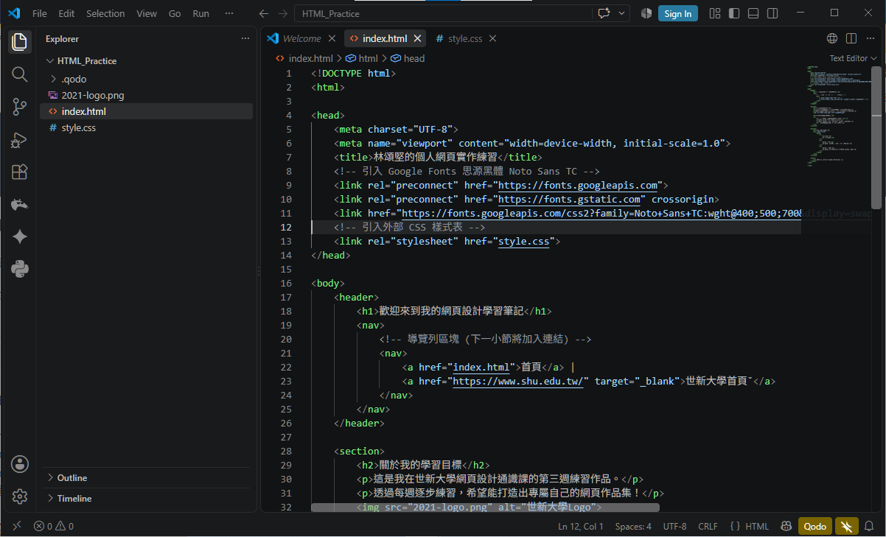

2. 開啟 `style.css`，加入 `body` 全域字型設定、標題美化與連結懸停效果：
   ```css
   /* 設定全域預設字型 */
   body {
       font-family: "Noto Sans TC", "Microsoft JhengHei", "PingFang TC", sans-serif;
   }

   /* 章節標題美化 */
   h2 {
       color: #2c3e50;
       border-bottom: 2px solid #3498db;
       padding-bottom: 8px;
       margin-top: 30px;
   }

   h3 {
       color: #34495e;
   }

   /* 導覽列超連結懸停效果 */
   nav a:hover {
       color: #f1c40f; /* 滑鼠移上去變明亮金黃色 */
       text-decoration: underline;
   }
   ```

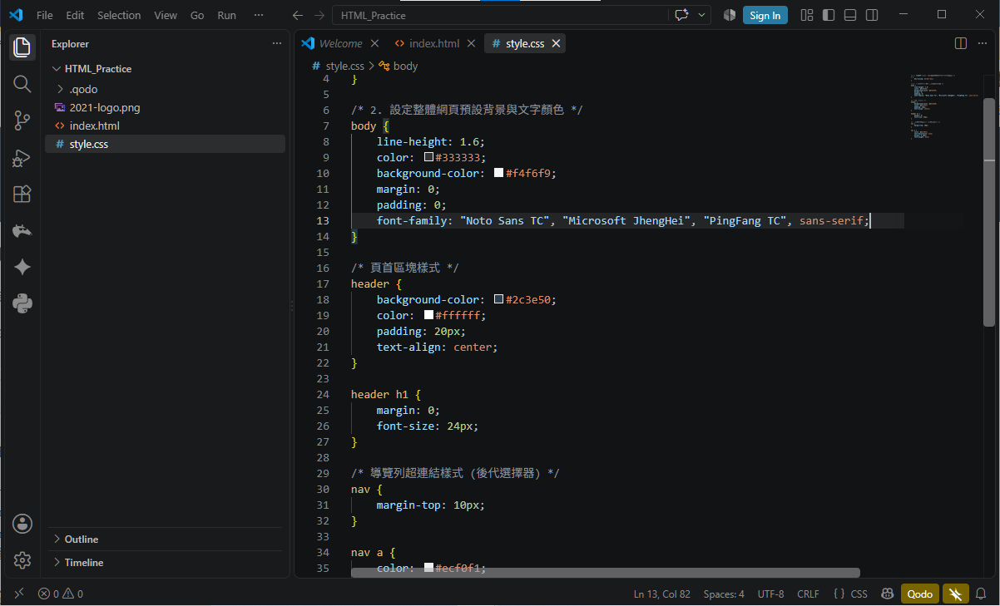

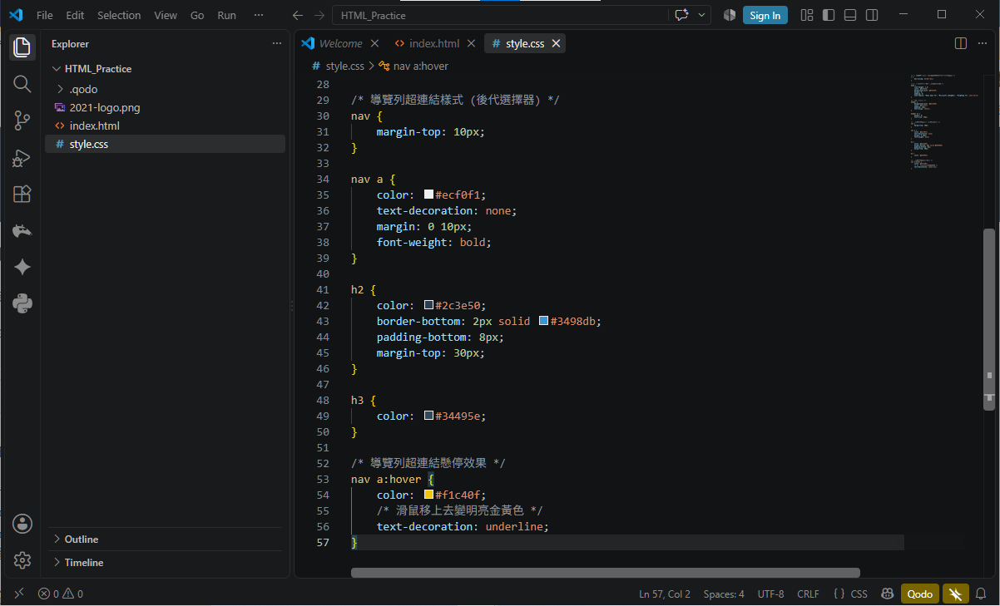

* **動作**：按 `Ctrl + S` 儲存，切換至瀏覽器按 `F5` 重新整理，觀察文字字型變身為高質感的思源黑體，以及標題下方出現藍色底線與超連結懸停效果！

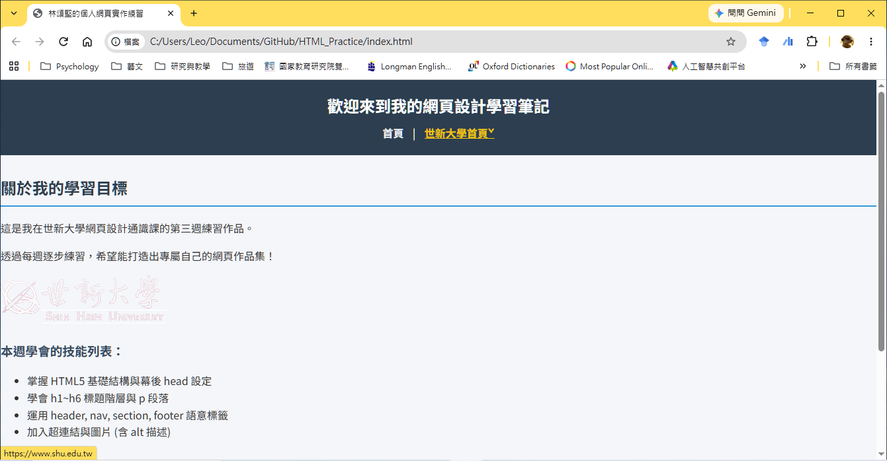

---

## Ⅴ. CSS 盒模型 (Box Model)

在 CSS 的世界裡，請記住一個最核心的觀念：**網頁上的每一個 HTML 元素，本質上都是一個「矩形盒子 (Box)」**！

無論是一個標題、一個段落、一張圖片還是一整排選單，瀏覽器都是以「盒子」的方式看待它們。

---

### 1. 盒子的四層結構 (由內而外)

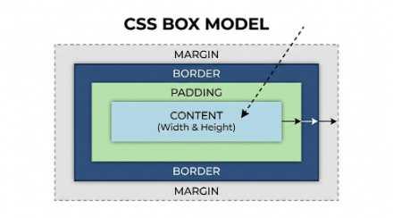

1. **Content (內容)**：盒子裡裝的貨物（文字、圖片）。透過 `width` 和 `height` 控制大小。
2. **Padding (內距)**：內容與邊框之間的距離，像快遞箱裡的泡泡紙。**增加 Padding 會放大背景顏色的範圍**。
3. **Border (邊框)**：包圍在內距外的外殼厚度。例如 `border: 2px solid #cccccc;`。
4. **Margin (外距)**：盒子與外圍其他盒子之間的留白距離，確保盒子不會擠在一起。

---

### 2. 決定盒子計算方式的關鍵：`box-sizing`

* **`content-box` (預設標準模式)**：你設定的 `width` 只包含內容本身。一旦加上 `padding` 或 `border`，**整個盒子會被往外撐大**，導致計算極易出錯！
* **`border-box` (邊框模式，老師強烈推薦)**：你設定的 `width` 就是**整個盒子的最終總寬度**！`padding` 與 `border` 會自動向內擠壓，不會撐大盒子。

```css
/* 工程師的小秘密：在 CSS 最開頭用全域選擇器設定 border-box */
* {
    box-sizing: border-box;
}
```

---

### 3. 盒模型常用排版技巧

#### (1) 水平置中技巧：`margin: 0 auto;`
當一個區塊元素設定了固定寬度（例如 `width: 800px;` 或 `max-width: 900px;`），設定 `margin: 0 auto;` 即可讓盒子在瀏覽器中央**自動水平置中**！

#### (2) 圓角邊框技巧 (`border-radius`)

`border-radius` 屬性可以將原本方方正正的邊框轉換為柔和圓潤的弧度。常用的設定數值與設計風格如下：

* **微圓角卡片風 (`border-radius: 8px;`)**：最普遍常見的設定。為四個角加上輕微弧度，常用於文章卡片容器 (`section`)、圖片、輸入框與對話視窗，賦予視覺柔和質感。
* **膠囊/大圓角風 (`border-radius: 20px;` 或 `25px`)**：當圓角數值較大時，呈現現代感強烈的膠囊 (Pill) 風格，常用於按鈕 (Button) 或分類標籤 (Badge/Tag)。
* **完美正圓形 (`border-radius: 50%;`)**：當元素的寬度和高度完全相等（正方形，例如 `100px x 100px`）時，設定 `50%` 就會變身為完美的正圓形，極常用於使用者大頭貼 (Avatar) 與圓形 Icon 按鈕。
* **對角非對稱風 (`border-radius: 15px 0px 15px 0px;`)**：可依序分別指定「左上角、右上角、右下角、左下角」四角弧度，營造獨特活潑的設計造型。

#### `border-radius` 風格範例與適用對照表：

| 單位與寫法範例 | 視覺效果風格 | 適用元件情境 |
| :--- | :--- | :--- |
| `border-radius: 4px;` ~ `8px;` | 微圓角卡片風格 | 文章卡片 (`<section>`)、表格容器、圖片外框。 |
| `border-radius: 20px;` ~ `30px;` | 膠囊圓角風格 | 搜尋按鈕、點擊按鈕 (Button)、分類標籤。 |
| `border-radius: 50%;` | 完美正圓形 | 個人大頭貼 (Avatar)、圓形 Icon 按鈕。 |
| `border-radius: 15px 0;` | 對角非對稱風格 | 促銷標籤 (Tag)、對話框提示區塊。 |

> **老師的真心話：Padding vs Margin 快速口訣**  
> * **Padding (內距)**：在邊框**裡面**擠空間，**會吃背景顏色**。  
> * **Margin (外距)**：在邊框**外面**推空間，是**純粹的透明留白**。

---

### 隨堂實做小練習【步驟 5：為內容區塊設定盒模型與 Margin 置中】

請在 `style.css` 中追加對 `<section>` 區塊與容器的盒模型設定：

```css
/* 主要內容章節區塊美化 */
section {
    background-color: #ffffff;
    max-width: 800px;         /* 設定最大寬度 */
    margin: 20px auto;        /* 上下外距 20px，左右自動置中 */
    padding: 25px;            /* 內距 25px */
    border-radius: 8px;       /* 圓角邊框 */
    box-shadow: 0 2px 5px rgba(0,0,0,0.1); /* 輕微陰影增添立體感 */
}
```

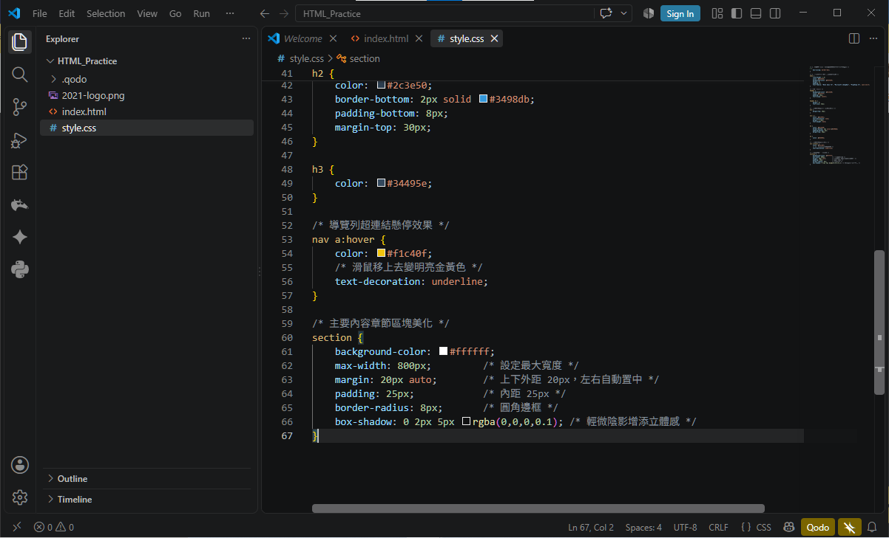

* **動作**：按 `Ctrl + S` 儲存，按 `F5` 重新整理，觀察頁面內容是否變成了置中且帶有精美陰影的卡片！

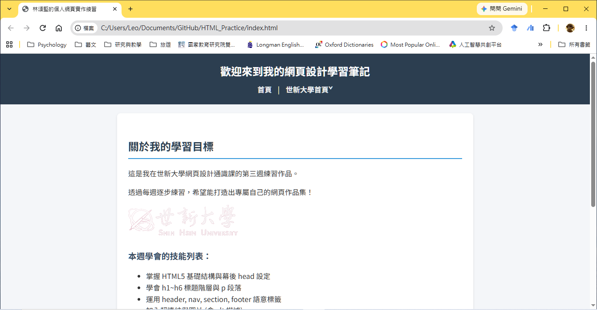
---

## Ⅵ. 進階網頁排版 — Flexbox 彈性盒模型 (Flexbox Layout)

學會了盒模型，我們能精準控制單一盒子。但如果想讓一群盒子整齊地列隊（例如導覽列選單水平並排、或是內容區垂直居中），傳統做法非常繁瑣。

現在，我們有了 **Flexbox (彈性盒模型)** 這個排版神器！

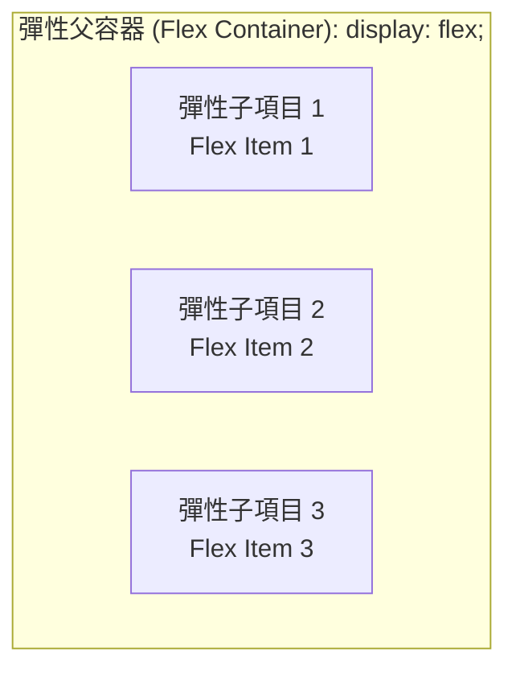

### 1. Flexbox 核心觀念：容器 (Container) 與 項目 (Items)

Flexbox 的操作分為兩層：
* **父層容器 (Container)**：負責下達控制指令。
* **子層項目 (Items)**：位於容器內部的子元素，會自動聽從指令進行排列。

---

### 2. 核心屬性說明

#### (1) 啟動 Flexbox：`display: flex;`
只要在父層容器寫上 `display: flex;`，裡面的所有子元素就會立即由上向下堆疊改為**由左至右水平並排**！

#### (2) 排列方向：`flex-direction`
* `row`：水平排列（預設值）。
* `column`：垂直排列。

#### (3) 主軸對齊 (水平向)：`justify-content`
決定子項目在水平方向上的分布方式：
* `flex-start`：靠左對齊（預設）。
* `center`：水平置中。
* `space-between`：左右貼齊兩端，中間項目均分剩餘空間（**選單最常用！**）。
* `space-around`：每個項目左右環繞相等空間。

#### (4) 交錯軸對齊 (垂直向)：`align-items`
決定子項目在垂直方向上的對齊方式：
* `center`：垂直置中。
* `flex-start`：靠上對齊。
* `flex-end`：靠下對齊。

---

### 3. 終極「上下左右置中」三行神技

在 Flexbox 出現前，要把一個元素在父容器裡上下左右完全置中非常困難，現在只需要三行 CSS：

```css
.parent-box {
    display: flex;
    justify-content: center; /* 水平置中 */
    align-items: center;     /* 垂直置中 */
}
```

> **老師的真心話：Flexbox 屬性要寫在哪裡？**  
> 學生最常搞混的地方就是不知道屬性要寫在誰身上。請記住：**`display: flex`、`justify-content` 與 `align-items` 都是寫在「父容器」上的**！  
> 另外，在 Chrome 按 `F12` 開發人員工具中，點擊 CSS `display: flex` 旁邊的「小圖示」，可以直接點選介面調試各種對齊方式，非常直覺！

---

### 隨堂實做小練習【步驟 6：將導覽列升級為 Flexbox 彈性佈局】

請修改 `style.css` 中的 `header` 與 `nav` 設定，運用 Flexbox 實現彈性對齊：

```css
/* 將 header 內部改為 Flex 佈局，讓標題與選單優雅排列 */
header {
    background-color: #2c3e50;
    color: #ffffff;
    padding: 15px 30px;
    display: flex;
    justify-content: space-between; /* 標題靠左，導覽列靠右 */
    align-items: center;            /* 垂直方向置中 */
}

/* 調整 nav 選單間距 */
nav {
    display: flex;
    gap: 15px; /* 子元素之間的間距 */
}

nav a {
    color: #ecf0f1;
    text-decoration: none;
    font-weight: bold;
    padding: 5px 10px;
    border-radius: 4px;
}
```

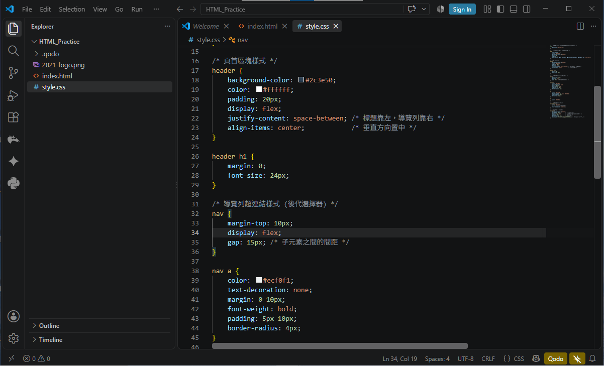

* **動作**：按 `Ctrl + S` 儲存，按 `F5` 重新整理，觀察網頁頂部標題與選單是否變成了左右貼齊的專業網站 Header 佈局！

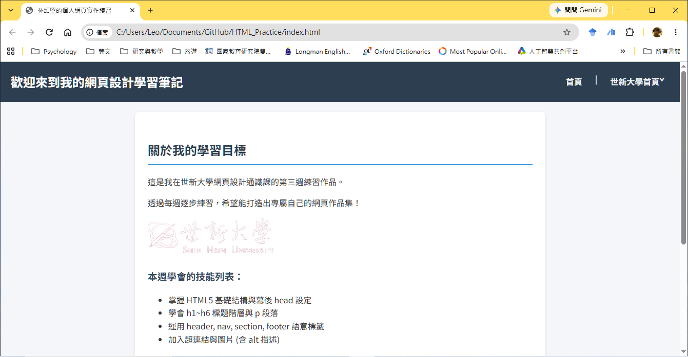

---

## Ⅶ. 表格與容器美化 (Card & Table Styling)

在第三週的 HTML 練習中，我們製作了課程簡表 `<table>`。未經 CSS 美化的原生表格非常樸素，現在我們來為它加上樣式！

```css
/* 表格整體樣式 */
table {
    width: 100%;
    border-collapse: collapse; /* 合併雙重邊框 */
    margin-top: 15px;
}

/* 表格單元格內距與邊框 */
th, td {
    padding: 12px 15px;
    text-align: left;
    border-bottom: 1px solid #ddd;
}

/* 表頭樣式美化 */
th {
    background-color: #3498db;
    color: white;
}

/* 偶數行背景色替換 (隔行變色效果) */
tr:nth-child(even) {
    background-color: #f9f9f9;
}
```

---

### 隨堂實做小練習【步驟 7：美化課程簡表與頁尾】

請在 `style.css` 底部加入表格與 `<footer>` 頁尾的美化樣式：

```css
/* 美化表格 */
table {
    width: 100%;
    border-collapse: collapse;
    margin-top: 15px;
}

th, td {
    padding: 12px 15px;
    text-align: left;
    border-bottom: 1px solid #e2e8f0;
}

th {
    background-color: #3498db;
    color: #ffffff;
}

tr:nth-child(even) {
    background-color: #f8fafc;
}

/* 美化頁尾 */
footer {
    text-align: center;
    padding: 20px;
    color: #7f8c8d;
    font-size: 14px;
    margin-top: 40px;
}
```

* **動作**：按下快捷鍵 `Ctrl + S` 儲存所有變更，切換至瀏覽器按下 `F5` 重新整理！

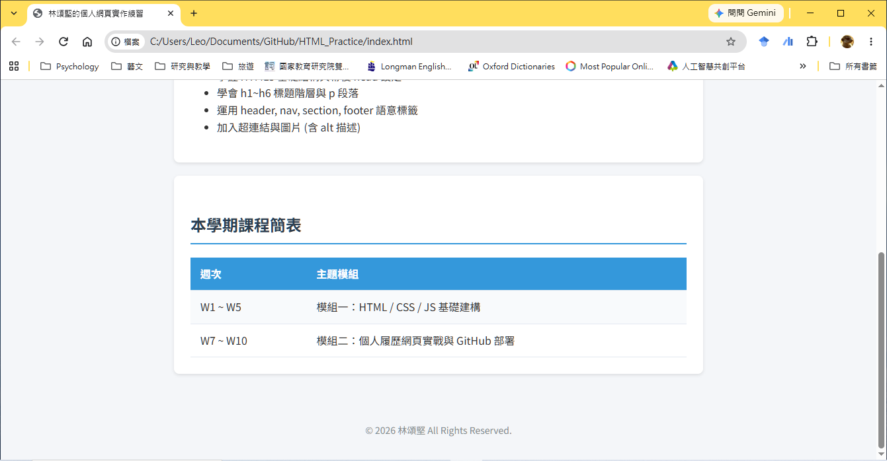

---

## Ⅷ. 本週學習成果總覽與歷程關卡 (Full Code Reference & Checklist)

恭喜你！跟著步驟完成了 `style.css` 的建立，現在你的第一個 HTML 網頁已經煥然一新，具備了現代化網站的視覺美感！

### 1. 本週 HTML 結構參考 (`index.html`)：

```html
<!DOCTYPE html>
<html>
<head>
    <meta charset="UTF-8">
    <meta name="viewport" content="width=device-width, initial-scale=1.0">
    <title>小明的第四週 CSS 實作練習</title>
    <!-- 引入 Google Fonts 思源黑體 Noto Sans TC -->
    <link rel="preconnect" href="https://fonts.googleapis.com">
    <link rel="preconnect" href="https://fonts.gstatic.com" crossorigin>
    <link href="https://fonts.googleapis.com/css2?family=Noto+Sans+TC:wght@400;500;700&display=swap" rel="stylesheet">
    <!-- 引入外部 CSS 樣式表 -->
    <link rel="stylesheet" href="style.css">
</head>
<body>
    <header>
        <h1>歡迎來到我的網頁設計學習筆記</h1>
        <nav>
            <a href="index.html">首頁</a>
            <a href="https://www.w3schools.com" target="_blank">W3Schools 學習網</a>
        </nav>
    </header>

    <section>
        <h2>關於我的學習目標</h2>
        <p>這是我在世新大學網頁設計通識課的第四週練習作品。</p>
        <p>透過每週逐步練習，希望能打造出專屬自己的網頁作品集！</p>
        
        <h3>本週學會的技能列表：</h3>
        <ul>
            <li>掌握 CSS 外部樣式表引入與基本語法</li>
            <li>學會 元素、ID、Class 與後代選擇器</li>
            <li>理解 CSS 盒模型 (Content, Padding, Border, Margin)</li>
            <li>運用 Flexbox 彈性盒進行 Header 導覽列排版</li>
            <li>美化表格與超連結 Hover 動態效果</li>
        </ul>
    </section>

    <section>
        <h2>本學期課程簡表</h2>
        <div class="card">
            <table>
                <tr>
                    <th>週次</th>
                    <th>主題模組</th>
                </tr>
                <tr>
                    <td>W1 ~ W5</td>
                    <td>模組一：HTML / CSS / JS 基礎建構</td>
                </tr>
                <tr>
                    <td>W7 ~ W10</td>
                    <td>模組二：個人履歷網頁實戰與 GitHub 部署</td>
                </tr>
            </table>
        </div>
    </section>

    <footer>
        <p>© 2026 小明 All Rights Reserved.</p>
    </footer>
</body>
</html>
```

---

### 2. 本週完整 CSS 程式碼參考 (`style.css`)：

```css
/* ==========================================
   第四週完整 CSS 樣式檔 (style.css)
   ========================================== */

/* 1. 全域重設與基本設定 */
* {
    box-sizing: border-box;
}

body {
    font-family: "Noto Sans TC", "Microsoft JhengHei", "PingFang TC", sans-serif;
    line-height: 1.6;
    color: #333333;
    background-color: #f4f6f9;
    margin: 0;
    padding: 0;
}

/* 2. 頁首與 Flexbox 導覽列排版 */
header {
    background-color: #2c3e50;
    color: #ffffff;
    padding: 15px 30px;
    display: flex;
    justify-content: space-between;
    align-items: center;
}

header h1 {
    margin: 0;
    font-size: 22px;
}

nav {
    display: flex;
    gap: 15px;
}

nav a {
    color: #ecf0f1;
    text-decoration: none;
    font-weight: bold;
    padding: 6px 12px;
    border-radius: 4px;
    transition: background-color 0.3s;
}

nav a:hover {
    color: #ffffff;
    background-color: #34495e;
    text-decoration: none;
}

/* 3. 主要內容區塊與盒模型 */
section {
    background-color: #ffffff;
    max-width: 800px;
    margin: 25px auto;
    padding: 30px;
    border-radius: 8px;
    box-shadow: 0 2px 8px rgba(0,0,0,0.08);
}

h2 {
    color: #2c3e50;
    border-bottom: 2px solid #3498db;
    padding-bottom: 8px;
    margin-top: 0;
}

h3 {
    color: #34495e;
}

/* 4. 清單與表格樣式美化 */
ul {
    padding-left: 20px;
    line-height: 1.8;
}

table {
    width: 100%;
    border-collapse: collapse;
    margin-top: 15px;
}

th, td {
    padding: 12px 15px;
    text-align: left;
    border-bottom: 1px solid #e2e8f0;
}

th {
    background-color: #3498db;
    color: #ffffff;
}

tr:nth-child(even) {
    background-color: #f8fafc;
}

/* 5. 頁尾樣式 */
footer {
    text-align: center;
    padding: 20px;
    color: #7f8c8d;
    font-size: 14px;
    margin-top: 40px;
}
```

---

### 隨堂練習進度自我核對表：

- [ ] **步驟 1 關卡**：建立 `style.css` 檔案，並在 `index.html` 的 `<head>` 中成功引入。
- [ ] **步驟 2 關卡**：完成 `* { box-sizing: border-box; }` 與 `body` 背景與邊界基本重設。
- [ ] **步驟 3 關卡**：設定 `header` 與 `nav a` 後代選擇器樣式。
- [ ] **步驟 4 關卡**：在 `<head>` 引入 Google Fonts 雲端字型，完成 `body` 字型、`h2` 藍色底線標題與 `nav a:hover` 懸停互動樣式。
- [ ] **步驟 5 關卡**：運用盒模型 (`padding`, `max-width`, `margin: auto`, `box-shadow`) 為 `section` 設定卡片視覺。
- [ ] **步驟 6 關卡**：啟動 `display: flex` 實現 `header` 標題與導覽列的左右彈性對齊。
- [ ] **步驟 7 關卡**：完成 `<table>` 邊框合併、`th` 表頭背景與 `tr:nth-child(even)` 隔行變色美化！

---

### 下週預告 (Next Week)
第 5 週我們將邁入**模組一：JavaScript 程式基礎與動態網頁互動**，學習變數、控制流程與事件處理，讓我們的靜態網頁活起來，具備與使用者互動的能力！下課後記得多加練習排版喔！
