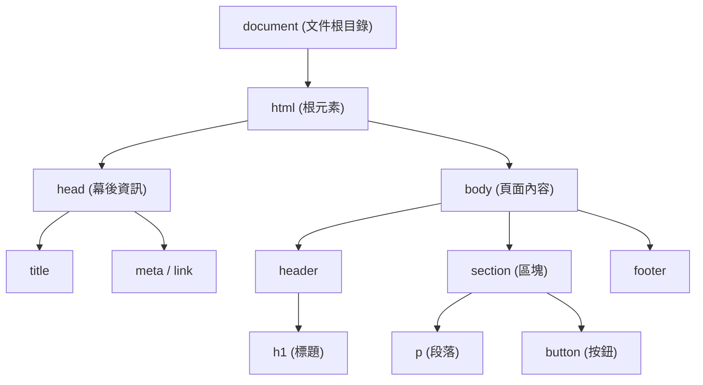
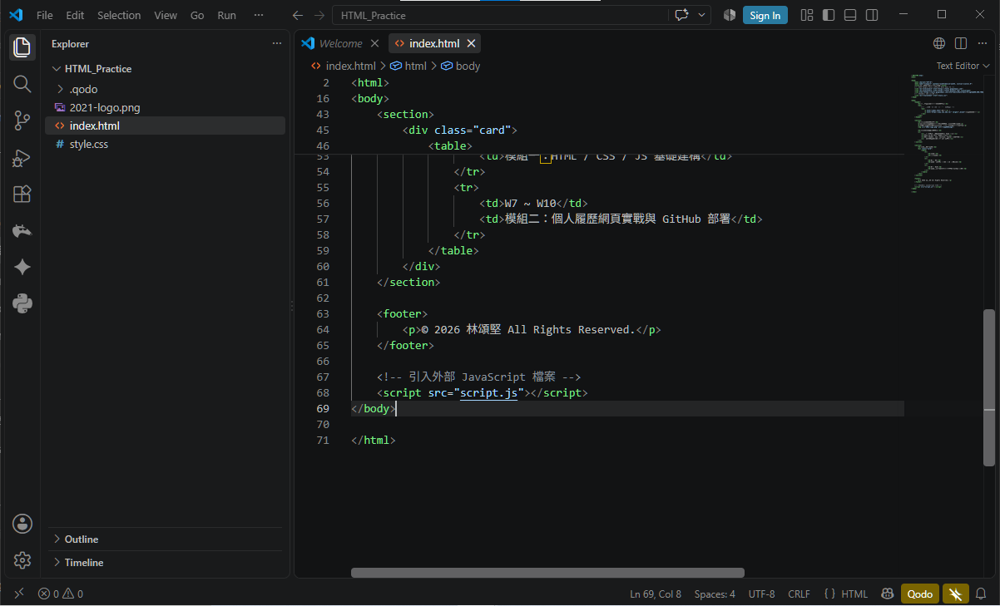
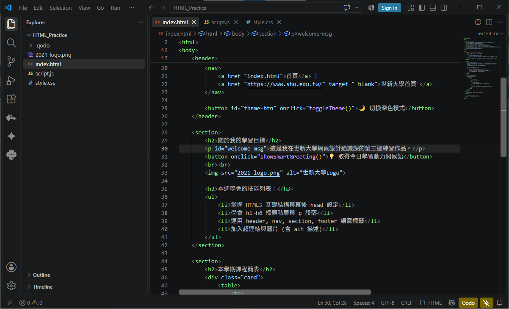
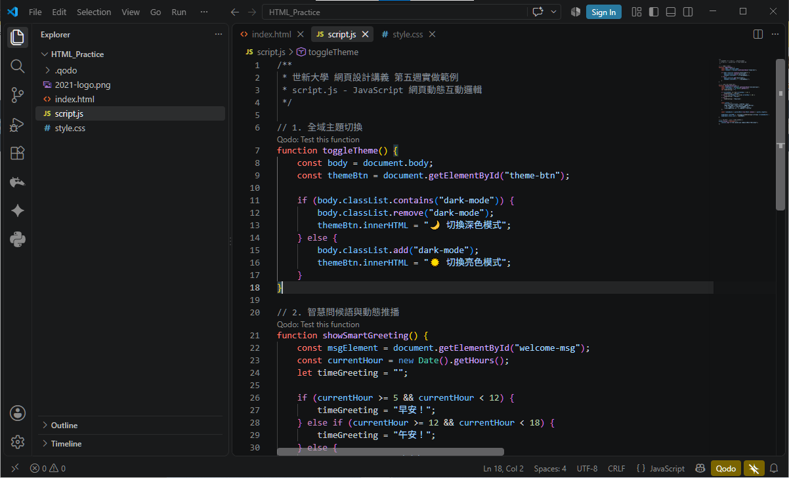
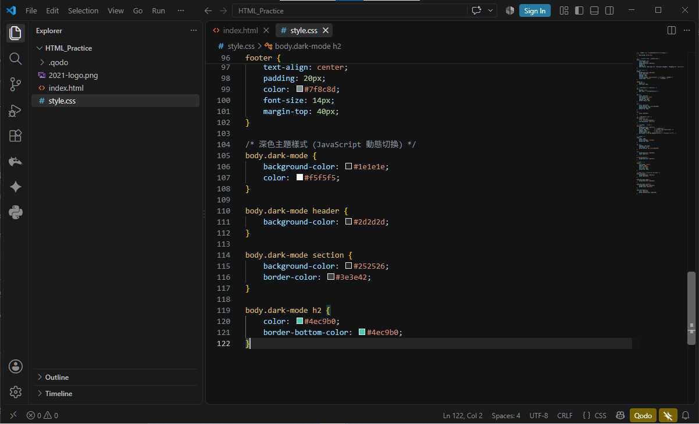
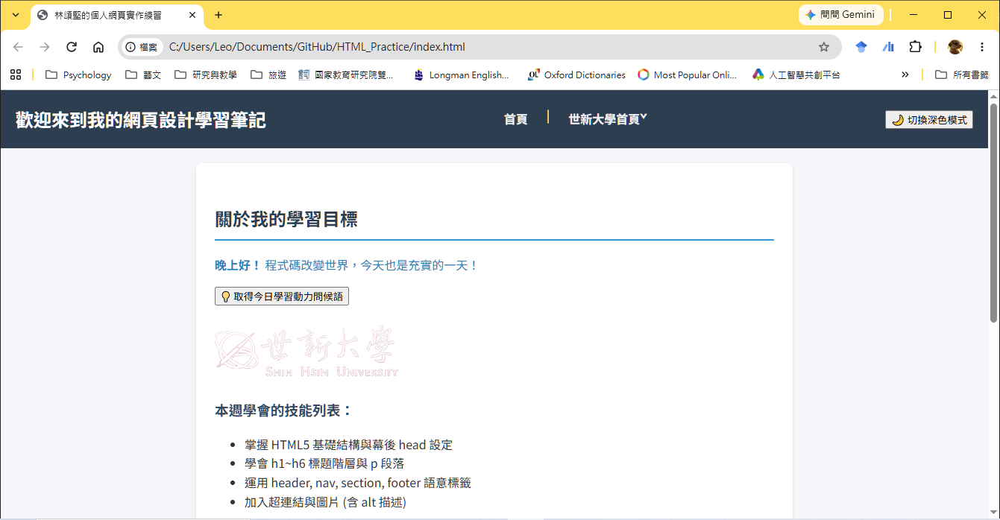

---
puppeteer:
  displayHeaderFooter: true
  scale: 1.15
  headerTemplate: '<div style="font-size: 11px; margin: 0 auto;">第五週：利用 JavaScript 產生動態效果</div>'
  footerTemplate: '<div style="font-size: 11px; margin: 0 auto;">第 <span class="pageNumber"></span> 頁 / 共 <span class="totalPages"></span> 頁</div>'
  margin:
    top: "1.5cm"
    bottom: "1.5cm"
    left: "1.5cm"
    right: "1.5cm"
---

<style>
  /* 全域字型、字級與行距 */
  body {
    font-size: 16pt !important;
    line-height: 1.7 !important;
    font-family: "Microsoft JhengHei", "PingFang TC", "Helvetica Neue", sans-serif;
  }

  /* 階層標題微調 */
  h1 { font-size: 30pt !important; margin-bottom: 0.5em !important; }
  h2 { font-size: 24pt !important; page-break-before: always; }
  h3 { font-size: 20pt !important; }
  h4 { font-size: 18pt !important; }

  /* 表格文字放大與排版優化 */
  table, th, td {
    font-size: 15pt !important;
    line-height: 1.5 !important;
  }

  /* 程式碼區塊 (自動換行防止 PDF 截斷) */
  pre, code {
    font-size: 13pt !important;
    font-family: Consolas, "Courier New", monospace !important;
    white-space: pre-wrap !important;
    word-break: break-all !important;
  }

  /* Mermaid 流程圖節點字體放大 */
  .mermaid text {
    font-size: 14px !important;
  }
</style>

# 第五週：利用 JavaScript 產生動態效果 (JavaScript Basics & DOM Manipulation)

各位同學好！我們已經學會了如何使用 **HTML** 搭建網頁的骨架，以及利用 **CSS** 為網頁化妝與美容。今天，我們要學習網頁開發三巨頭中的最後一位核心成員：**JavaScript (簡稱 JS)**。

如果說 HTML 是網頁的骨架，CSS 是衣服與外觀妝容，那麼 **JavaScript 就是驅動這一切的大腦與神經系統**。它負責處理使用者的動作、計算資料，並動態改變網頁內容，讓你的作品從靜態的「展示品」變身為可以即時互動的「動態應用程式」！

---

## Ⅰ. DOM 基礎概念與溝通橋樑 (DOM Concept & Family Tree)

在 JavaScript 開始進行互動控制之前，它必須先機能「看懂」HTML 的文件結構。這份瀏覽器內部建立的「結構樹狀圖」就叫做 **DOM (Document Object Model，文件物件模型)**。

你可以把 DOM 想像成一份網頁元素的「**家族樹 (Family Tree)**」：
* `document`（即 `<html>`）是最頂層的祖先。
* 底下有 `<head>` 和 `<body>` 兩個直系子孫。
* `<body>` 底下又各自展開 `<header>`, `<nav>`, `<section>`, `<article>`, `<footer>` 等層層節點。

JavaScript 就是透過這份家族樹，找到頁面上的任何一個元素，並對它進行操作與修改。



> 💡 **老師的真心話**  
> 在 DOM 的世界裡，每一個 HTML 標籤都被瀏覽器封裝成一個**「物件 (Object)」**。  
> 物件會擁有：  
> 1. **屬性 (Property)**：物件擁有的資訊或狀態，例如 `innerHTML` (裡面的文字或標籤)、`src` (圖片路徑)、`style.color` (文字顏色)。  
> 2. **方法 (Method)**：可以對物件執行的「動作」，例如 `document.getElementById()` (用 ID 搜尋元素)。

---

## Ⅱ. 精準抓取 HTML 元素 (Finding HTML Elements)

要命令一個元素改變，你必須先在 DOM 家族樹中「找到」它。JavaScript 提供了幾種常用的尋人方法：

### 1. 透過 ID 尋找 (`document.getElementById`)

這是最精準、也最常用的方法！因為在同一個 HTML 頁面中，`id` 必須是獨一無二的。

#### HTML 前導：
```html
<p id="intro">歡迎來到 JavaScript 的動態世界！</p>
```

#### JavaScript 程式碼：
```javascript
// 找到 id 為 "intro" 的元素並存入變數 element 中
const element = document.getElementById("intro");
```

---

### 2. 透過標籤名稱尋找 (`document.getElementsByTagName`)

如果你想一次抓出頁面上所有的同類標籤（例如所有的段落 `<p>`），就可以使用這個方法。

#### HTML 前導：
```html
<p>第一個段落</p>
<p>第二個段落</p>
```

#### JavaScript 程式碼：
```javascript
// 找到頁面上所有的 <p> 標籤，會回傳一個 HTMLCollection 類陣列
const allParagraphs = document.getElementsByTagName("p");
```

---

### 3. 透過 Class 名稱尋找 (`document.getElementsByClassName`)

Class 就像衣服的標籤，可以重複使用，非常適合用來一次抓取具備相同視覺特徵的一群元素。

#### HTML 前導：
```html
<div class="highlight">重點說明一</div>
<div class="highlight">重點說明二</div>
```

#### JavaScript 程式碼：
```javascript
// 找到所有 class 為 "highlight" 的元素
const highlightedItems = document.getElementsByClassName("highlight");
```

> 💡 **老師的真心話**  
> 仔細觀察方法名稱的英文單複數：  
> * `getElement...` (單數)：對應獨一無二的 **ID**，回傳單一元素物件。  
> * `getElements...` (複數)：對應 **TagName** 或 **ClassName**，會回傳多個元素的集合（類陣列）。  
> * **常見新手陷阱**：如果你用 ID 尋找卻打錯了名稱，JavaScript 會回傳 `null`（空值）。這時候如果強行對它讀取屬性，程式就會報錯當掉喔！

---

## Ⅲ. 動態修改 HTML 內容與 CSS 樣式 (Modifying Content & Styles)

找到目標元素後，接下來就是展現 JavaScript 魔法的時候了——我們可以隨時改寫網頁內容或變換 CSS 外觀！

### 1. 改變 HTML 內容 (`innerHTML`)

`innerHTML` 屬性可以讓你讀取或直接換掉一個元素裡面的所有 HTML 內容與文字。

#### HTML 前導：
```html
<div id="greeting">原本的招呼語</div>
```

#### JavaScript 程式碼：
```javascript
// 找到元素並換掉內部的 HTML 內容
const greetingElement = document.getElementById("greeting");
greetingElement.innerHTML = "<em>歡迎來到 JavaScript 的動態世界！</em>";
```

---

### 2. 改變 HTML 屬性值 (以圖片 `src` 為例)

我們可以透過 JavaScript 讓 HTML 屬性產生變換，例如製作「開燈 / 關燈」或「圖片切換」的效果。

#### HTML 前導：
```html

```

#### JavaScript 程式碼：
```javascript
// 透過改變 src 屬性更換圖片
document.getElementById("myImage").src = "on.png";
```

---

### 3. 改變 CSS 樣式 (`style`)

JavaScript 可以直接調整 HTML 元素的 `style` 物件，讓網頁產生即時的視覺回饋。

#### HTML 前導：
```html
<p id="p2">這是一段原本為黑色的文字。</p>
```

#### JavaScript 程式碼：
```javascript
// 找到 id 為 p2 的元素，並改變顏色與字體大小
const p2 = document.getElementById("p2");
p2.style.color = "#3498db";         // 變更文字顏色為亮藍色
p2.style.fontSize = "24px";         // 變更字體大小為 24px
p2.style.backgroundColor = "#f0f3f4"; // 變更背景顏色
```

> 💡 **老師的真心話**  
> * **關於寫法規範**：在 CSS 中我們寫 `font-size` 或 `background-color`（有連字號 `-`）；但在 JavaScript 中要改成小寫開頭、大寫相連的**「駝峰式命名法 (Camel Case)」**，例如 `fontSize` 與 `backgroundColor`！  
> * **效能與維護提示**：雖然直接寫 `style` 很方便，但如果要修改的樣式很多，業界最佳實踐是先在 CSS 寫好一個 Class（例如 `.dark-mode`），再用 JavaScript 去切換 Class，程式碼會更乾淨喔！

---

## Ⅳ. 事件驅動 (Events) 讓網頁活起來

如果說前面學的是「如何改變」，那麼事件 (Events) 要教的就是**「什麼時候改變」**。

「事件」就是使用者在網頁上發生的各種動作（如點擊、滑鼠移入、按鍵按下）。JavaScript 就像警衛一樣，隨時監聽這些事件，一旦觸發就執行對應的指令。

### 常用事件列表：
* **`onclick`**：當使用者點擊滑鼠時觸發。
* **`onmouseover`**：當滑鼠游標移入元素時觸發。
* **`onmouseout`**：當滑鼠游標移出元素時觸發。
* **`onchange`**：當輸入框內容發生改變時觸發。
* **`onload`**：當整個網頁或圖片載入完成時觸發。

---

### 事件與函式 (Function) 的結合

當事件發生時，我們通常會呼叫一個事先寫好的 **函式 (Function)** 來執行任務。

#### HTML 部分：
```html
<h1 id="header-title" onclick="changeText(this)">點擊我試試看！</h1>
```

#### JavaScript 部分：
```javascript
// 定義一個名為 changeText 的函式
function changeText(element) {
    // element 代表被點擊的那個元素自己 (this)
    element.innerHTML = "哎呀！你點到我了！";
    element.style.color = "#e74c3c";
}
```

> 💡 **老師的真心話**  
> * **什麼是函式 (Function)？** 你可以把它想像成一個「**動作工具包**」。我們把要執行的一連串指令（如改顏色、換文字）用 `function 名字() { ... }` 包起來，這樣就能在 HTML 的事件中隨時呼叫它。  
> * **關鍵字 `this` 的妙用**：在 HTML 中寫 `onclick="changeText(this)"` 時，`this` 就代表「**被點擊的那個 HTML 元素本身**」。這樣傳給 JS 後，你就不用再寫一次 `getElementById()` 去重新尋找它了！

---

## Ⅴ. 安放 JavaScript 程式碼的最佳實踐 (Internal vs External JS)

隨著程式碼逐漸增多，我們不能把所有的程式碼都塞在 HTML 的標籤屬性裡。JavaScript 的存放位置主要有兩種：

### 1. 內部 JavaScript (Internal JS)

直接寫在 HTML 檔案中的 `<script>` 標籤內。適合用於程式碼極少的小測試。

```html
<script>
    console.log("這段 JavaScript 在內部標籤中執行！");
</script>
```

---

### 2. 外部 JavaScript (External JS) — 老師強烈推薦！

將所有 JavaScript 程式碼獨立寫在一個 `.js` 檔案中（例如 `script.js`），再透過 `<script src="...">` 標籤引入 HTML。這能讓 HTML 骨架與 JS 邏輯徹底解耦，易於維護！

#### HTML 檔案 (`index.html`)：
```html
<body>
    <h1>我的首頁</h1>

    <!-- 放在 body 結束標籤的正前方 -->
    <script src="script.js"></script>
</body>
```

#### JS 檔案 (`script.js`)：
```javascript
// 這裡直接寫 JavaScript 程式碼，不需要加 <script> 標籤
console.log("外部 script.js 載入成功！");
```

---

### 3. 最佳實踐：為什麼 `<script>` 要放在 `</body>` 正前方？

你可能會好奇，`<script>` 標籤應該放在 `<head>` 裡面，還是放在 `<body>` 底部？

**標準答案：放在 `</body>` 結束標籤的正前方。**

* **原因解析**：瀏覽器讀取網頁是「由上而下」進行渲染的。如果把龐大的 JS 檔案放在 `<head>` 頂部，瀏覽器會暫停網頁繪製去下載並執行 JS，導致下方的文字與畫面延遲顯示，使用者會看到一片空白。
* **最佳體驗 (UX)**：把 JS 放在最下面，能確保使用者**先看到完整的網頁內容**，隨後 JavaScript 才在背景無縫啟動互動功能！

> 💡 **老師的真心話：打開 F12 開發者工具與常見錯誤解析**  
> 寫 JavaScript 時，一定要養成按下 **F12** (或右鍵點擊「檢查」) 打開「**開發者工具 (Developer Tools)**」的習慣！  
> 切換到 **Console (主控台)** 分頁，如果你寫錯了語法或抓不到元素，這裡會出現紅色的錯誤訊息警告。這是程式員除錯 (Debug) 時最不可或缺的好夥伴！  
> * **新手常見錯誤第一名**：`Uncaught TypeError: Cannot set properties of null (setting 'innerHTML')`  
>   當你看到這行錯誤時，代表 JavaScript 執行的 `document.getElementById(...)` 找不到對應元素而回傳了 `null`。請優先檢查 `index.html` 中的 `id` 名稱是否拼錯（例如把連字號 `welcome-msg` 打成底線 `welcome_msg`），或是 HTML 檔案中忘記寫上該標籤！

---

## Ⅵ. 隨堂實做小練習：在 HTML_Practice 中應用 JavaScript (Hands-on Practice)

現在，請將本週學到的 JavaScript 知識，無縫應用到我們前兩週在 `文件\GitHub\HTML_Practice` 資料夾中建立的 `index.html` 網頁！

---

### 隨堂實做步驟解構：

#### 步驟 1：建立 `script.js` 並在 `index.html` 引入
1. 在 VS Code 的 `HTML_Practice` 專案資料夾下，新增一個檔案，命名為 `script.js`。
2. 開啟 `index.html`，捲動到最下方，在 `</body>` 結束標籤的正上方加入引入標籤：
   ```html
       <!-- 引入外部 JavaScript 檔案 -->
       <script src="script.js"></script>
   </body>
   </html>
   ```

---



#### 步驟 2：在 `index.html` 的 `<header>` 與 `<section>` 增加互動元件
1. 在 `<header>` 的導覽列下方，新增一個主題切換按鈕：
   ```html
   <header>
       <h1>歡迎來到我的網頁設計學習筆記</h1>
       <nav>
           <a href="index.html">首頁</a> | 
           <a href="https://www.shu.edu.tw/" target="_blank">世新大學首頁</a>
       </nav>
       <button id="theme-btn" onclick="toggleTheme()">🌙 切換深色模式</button>
   </header>
   ```

2. 在第一個 `<section>` 關於學習目標中，加入動態問候語區塊與按鈕：
   ```html
   <section id="about-section">
       <h2>關於我的學習目標</h2>
       <p id="welcome-msg">這是我在世新大學網頁設計通識課的練習作品。</p>
       <button onclick="showSmartGreeting()">💡 取得今日學習動力問候語</button>
       <br><br>
       
   </section>
   ```



---

#### 步驟 3：撰寫 `script.js` 實現互動邏輯
開啟 `script.js` 檔案，輸入以下程式碼：

```javascript
// 1. 頁面主題切換功能 (日間/深色模式)
function toggleTheme() {
    const body = document.body;
    const themeBtn = document.getElementById("theme-btn");

    // 判斷當前 body 是否帶有 dark-mode class
    if (body.classList.contains("dark-mode")) {
        body.classList.remove("dark-mode");
        themeBtn.innerHTML = "🌙 切換深色模式";
    } else {
        body.classList.add("dark-mode");
        themeBtn.innerHTML = "☀️ 切換亮色模式";
    }
}

// 2. 智慧問候語功能 (結合時間判斷與隨機挑選)
function showSmartGreeting() {
    const msgElement = document.getElementById("welcome-msg");
    const currentHour = new Date().getHours();
    let timeGreeting = "";

    // 依據時間判斷時段
    if (currentHour >= 5 && currentHour < 12) {
        timeGreeting = "早安！";
    } else if (currentHour >= 12 && currentHour < 18) {
        timeGreeting = "午安！";
    } else {
        timeGreeting = "晚上好！";
    }

    const quotes = [
        "程式碼改變世界，今天也是充實的一天！",
        "遇到 Bug 不要慌，F12 是你的好朋友！",
        "一步一腳印，網頁設計其實超有成就感！",
        "保持好奇心，持續打造專屬你的數位作品集！"
    ];

    const randomQuote = quotes[Math.floor(Math.random() * quotes.length)];
    
    // 更新網頁上的文字內容
    msgElement.innerHTML = `<strong>${timeGreeting}</strong> ${randomQuote}`;
    msgElement.style.color = "#2980b9";
}
```



---

#### 步驟 4：在 `style.css` 補上 `.dark-mode` 樣式支援
開啟 `style.css`，在檔案最下方追加深色模式樣式：

```css
/* 深色主題樣式 (JavaScript 動態切換) */
body.dark-mode {
    background-color: #1e1e1e;
    color: #f5f5f5;
}

body.dark-mode header {
    background-color: #2d2d2d;
}

body.dark-mode section {
    background-color: #252526;
    border-color: #3e3e42;
}

body.dark-mode h2 {
    color: #4ec9b0;
    border-bottom-color: #4ec9b0;
}
```



* **動作**：按下 `Ctrl + S` 儲存所有檔案，切換至瀏覽器按 `F5` 重新整理。點擊「切換深色模式」按鈕觀察整頁色彩瞬間轉換，點擊「取得今日學習動力問候語」觀察動態時間問候與隨機金句！



---

## Ⅶ. 本週學習成果總覽與歷程關卡 (Full Code Reference & Checklist)

恭喜你！你已經正式邁入網頁開發三巨頭 (HTML, CSS, JS) 齊備的階段！

### 本週完整 JS 程式碼參考 (`script.js`)：

```javascript
/**
 * 世新大學 網頁設計講義 第五週實做範例
 * script.js - JavaScript 網頁動態互動邏輯
 */

// 1. 全域主題切換
function toggleTheme() {
    const body = document.body;
    const themeBtn = document.getElementById("theme-btn");

    if (body.classList.contains("dark-mode")) {
        body.classList.remove("dark-mode");
        themeBtn.innerHTML = "🌙 切換深色模式";
    } else {
        body.classList.add("dark-mode");
        themeBtn.innerHTML = "☀️ 切換亮色模式";
    }
}

// 2. 智慧問候語與動態推播
function showSmartGreeting() {
    const msgElement = document.getElementById("welcome-msg");
    const currentHour = new Date().getHours();
    let timeGreeting = "";

    if (currentHour >= 5 && currentHour < 12) {
        timeGreeting = "早安！";
    } else if (currentHour >= 12 && currentHour < 18) {
        timeGreeting = "午安！";
    } else {
        timeGreeting = "晚上好！";
    }

    const quotes = [
        "程式碼改變世界，今天也是充實的一天！",
        "遇到 Bug 不要慌，F12 Console 是你的好朋友！",
        "一步一腳印，網頁設計其實超有成就感！",
        "保持好奇心，持續打造專屬你的數位作品集！"
    ];

    const randomQuote = quotes[Math.floor(Math.random() * quotes.length)];
    
    msgElement.innerHTML = `<strong>${timeGreeting}</strong> ${randomQuote}`;
    msgElement.style.color = "#2980b9";
}

// 3. 控制台歡迎訊息 (頁面載入時觸發)
window.onload = function() {
    console.log("網頁與 JavaScript 已順利完成初始化載入！");
};
```

---

### 課後練習挑戰：

光看是不夠的，動手做才能真正學會！試著完成下面的挑戰：

* **挑戰一：智慧問候語 (重點練習)**  
  目標：點擊按鈕時，程式自動抓取當前時間（`new Date().getHours()`），判斷是白天還是晚上，並顯示對應的隨機問候語。

* **挑戰二：圖片換換樂 (屬性操作)**  
  目標：在頁面上放兩張小圖或按鈕，點擊時下方的大圖 (``) 會隨之更換成對應的圖片路徑 `src`。

* **挑戰三：字體大小調控器 (變數應用)**  
  目標：設計兩個按鈕「字體變大」與「字體變小」。每次點擊時，讓某個段落的 `fontSize` 增加或減少 2px（提示：宣告外部變數 `let currentSize = 16;` 來記錄數值）。

* **挑戰四：清單隱身術 (顯示控制)**  
  目標：製作一個「顯示/隱藏技能清單」的按鈕。點擊時，如果 `<ul>` 清單是出現的就讓它消失，反之則出現（提示：切換 CSS 的 `display: none` 與 `display: block`，或使用 `style.display`）。

---

### 隨堂練習進度自我核對表：

- [ ] **關卡 1**：在 `HTML_Practice` 資料夾中建立 `script.js`，並成功在 `index.html` 的 `</body>` 正前方引入。
- [ ] **關卡 2**：能正確使用 `document.getElementById()` 找到頁面上的 DOM 元素。
- [ ] **關卡 3**：理解 `innerHTML` 改寫內容與 `style` 修改 CSS 樣式的駝峰式命名法 (Camel Case)。
- [ ] **關卡 4**：學會使用 `onclick` 事件觸發 JS 函式 (Function)。
- [ ] **關卡 5**：成功完成「深色主題切換」與「智慧問候語」互動功能。
- [ ] **關卡 6**：學會按 `F12` 打開 Chrome 開發者工具的 Console 分頁查看 Log 與錯誤訊息。
