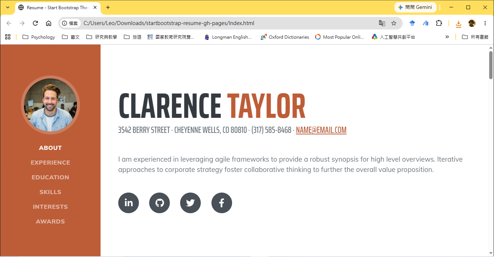
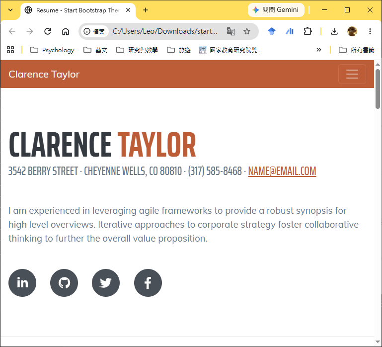
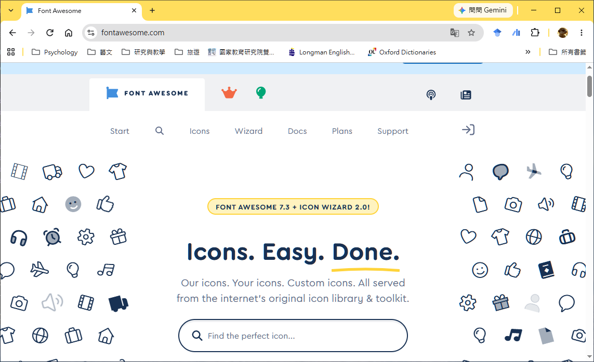
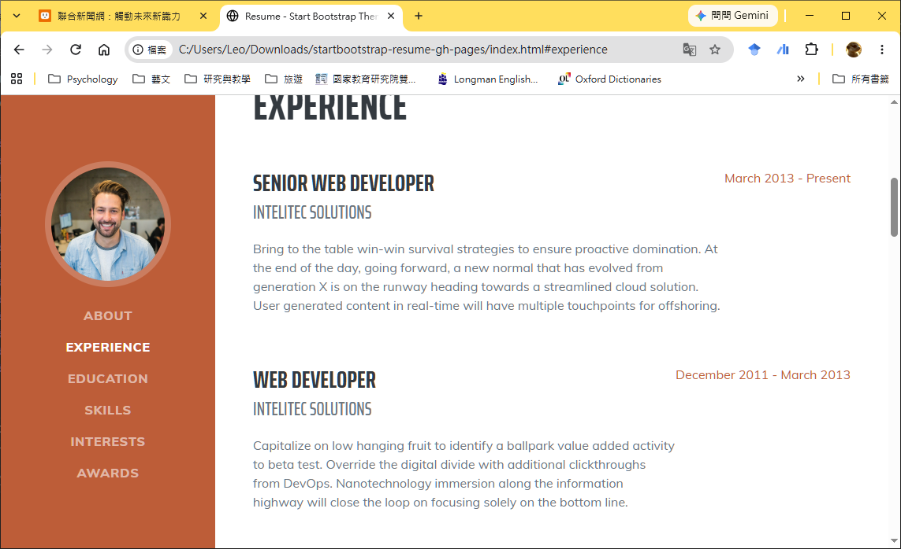
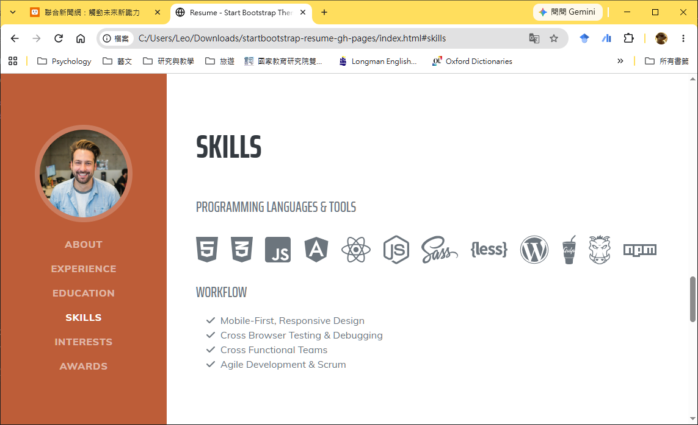

---
puppeteer:
  displayHeaderFooter: true
  scale: 1.15
  headerTemplate: '<div style="font-size: 11px; margin: 0 auto;">第七週：實作專案一 — 打造線上個人履歷(內容篇)</div>'
  footerTemplate: '<div style="font-size: 11px; margin: 0 auto;">第 <span class="pageNumber"></span> 頁 / 共 <span class="totalPages"></span> 頁</div>'
  margin:
    top: "1.5cm"
    bottom: "1.5cm"
    left: "1.5cm"
    right: "1.5cm"
---

<style>
  /* 全域字型、字級與行距 */
  body {
    font-size: 13pt !important;
    line-height: 1.7 !important;
    font-family: "Microsoft JhengHei", "PingFang TC", "Helvetica Neue", sans-serif;
  }

  /* 階層標題微調 */
  h1 { font-size: 24pt !important; margin-bottom: 0.5em !important; }
  h2 { font-size: 18pt !important; page-break-before: always; }
  h3 { font-size: 15pt !important; }
  h4 { font-size: 13.5pt !important; }

  /* 表格文字放大與排版優化 */
  table, th, td {
    font-size: 12pt !important;
    line-height: 1.5 !important;
  }

  /* 程式碼區塊 */
  pre, code {
    font-size: 11.5pt !important;
    font-family: Consolas, "Courier New", monospace !important;
  }

  /* Mermaid 流程圖節點字體放大 */
  .mermaid text {
    font-size: 14px !important;
  }
</style>

---

# 第七週：實作專案一 — 打造線上個人履歷(內容篇) (Personal Online Resume - Content Customization)

**課程名稱**：網頁設計 (Webpage Design)  
**授課教師**：林頌堅 副教授 (Prof. Sung-Chien Lin)  
**授課單位**：世新大學 資訊傳播學系  
**聯絡方式**：scl@mail.shu.edu.tw  
**線上資源**：[Start Bootstrap - Resume Template](https://startbootstrap.com/theme/resume)  

---

## Ⅰ. 專案目標與評分標準 (Project Goals & Grading Criteria)

各位同學好！歡迎來到我們的第一個實作專案！在接下來的課程中，我們將運用前面所學的 **HTML** 和 **CSS** 知識，將一份業界專業的網頁模板，修改成屬於你自己的「單頁式線上個人履歷 (Single-Page Online Resume)」。

這份履歷模板是基於前端主流框架 **Bootstrap** 製作的，它已經幫我們處理好了大部分複雜的版面排版與**響應式網頁設計 (RWD, Responsive Web Design)**。這意味著你所製作的履歷，無論是在桌上型電腦、平板電腦還是智慧型手機上，都能自動呈現完美的瀏覽視覺效果！

本週我們的核心任務，就是聚焦在**理解該模板的 HTML 架構**，並將範例文字與圖片替換為你自己的個人真實資料。

---

### 1. 本專案四大學習目標

1. **閱讀並修改既有模板**：培養工程師閱讀他人原生的專業 HTML/CSS 程式碼結構的能力。
2. **替換範例內容為個人資料**：將預設的英文範例姓名、頭像、經歷與簡介替換為真實資料。
3. **熟練 HTML 標籤與屬性操作**：精準修改 `id`, `class`, `src`, `href`, `alt` 等 HTML 核心屬性。
4. **發佈與部署準備**：最終完成一個具備完整結構、隨時可以部署上線的個人履歷網頁。

---

### 2. 專案評分標準

本次實作專案的評分，將與**網頁內容的豐富程度與專業度**有直接關係：

* **內容深度與廣度**：請盡可能充實你的個人資料，包含完整的個人簡介、求學經歷、社團/實習經驗、專業技能與個人興趣。
* **條理清晰與排版專業感**：豐富不等於雜亂無章！請在充實內容的同時，保持視覺版面的清晰與層次感。內容愈豐富且資訊排版愈有條理，分數愈高！

---

## Ⅱ. 履歷模板結構拆解 (Template Structure Analysis)

在開始動手修改程式碼之前，我們先來整體拆解這份 `index.html` 履歷模板的架構。該模板主要由兩大核心區域構成：



---

### 1. 左側導覽列 (`<nav id="sideNav">`)

* **桌機版呈現**：固定在螢幕左側的垂直導覽欄，頂部包含個人正方形圓角大頭照，下方為各章節區塊的錨點跳轉連結。
* **手機/平板版 (RWD 響應式)**：當螢幕寬度縮小時，導覽列會自動收合至網頁最上方，並切換為三條線的「漢堡選單 (Hamburger Menu)」按鈕。



* **平滑滾動 (Smooth Scroll)**：點擊導覽項時，頁面會以平滑的滑動動畫滾動至對應的 `<section>` 區塊。

---

### 2. 右側主要內容區 (`<div class="container-fluid p-0">`)

這裡是履歷的主要展示空間，由多個獨立的 `<section>` 區塊組成。每個 `<section>` 都帶有獨一無二的 `id` 屬性，例如：
* `<section id="about">`：關於我與聯絡資訊
* `<section id="experience">`：工作與社團經歷
* `<section id="education">`：學歷背景
* `<section id="skills">`：專業技能與工具標籤
* `<section id="interests">`：個人興趣與休閒
* `<section id="awards">`：榮譽獎項與證照

---

## Ⅲ. 網頁標題與 Meta 搜尋引擎資訊修改 (Title & Meta Settings)

請在 VS Code 中開啟 `index.html` 檔案。第一步，我們先找到頁面最頂端的 `<head>` 區塊，修改網頁分頁標籤顯示的標題與給搜尋引擎看的 Metadata。

### 1. 修改網頁分頁標題 (`<title>`)

將 `<title>` 標籤內的預設文字，替換為包含你自己姓名的履歷標題。

#### 修改前 (範例碼)：
```html
<title>Resume - Start Bootstrap Theme</title>
```

#### 修改後 (示範碼)：
```html
<title>王大明的個人線上履歷 | Personal Resume</title>
```

---

### 2. 修改 Meta 搜尋引擎與作者資訊 (`<meta>`)

為了讓 Google 等搜尋引擎能精準檢索你的個人網頁，請填寫 `<meta>` 標籤中的 `description` (網頁描述) 與 `author` (作者姓名)。

#### 修改前 (範例碼)：
```html
<meta name="description" content="" />
<meta name="author" content="" />
```

#### 修改後 (示範碼)：
```html
<meta name="description" content="這是王大明的個人線上履歷，包含前端網頁設計技能、世新大學資傳系學歷與實習經歷展示。" />
<meta name="author" content="王大明" />
```

---

## Ⅳ. 左側導覽列與大頭照替換 (Sidebar & Avatar Settings)

接下來，我們來修改左側導覽列中的個人大頭照與導覽選單項目。

### 1. 替換大頭照與手機版顯示姓名

找到 `<nav id="sideNav">` 標籤內部的 `<a class="navbar-brand">` 區塊：

#### 原始碼結構：
```html
<a class="navbar-brand js-scroll-trigger" href="#page-top">
    <span class="d-block d-lg-none">Clarence Taylor</span>
    <span class="d-none d-lg-block">
        
    </span>
</a>
```

#### 修改要點：
1. **手機版姓名**：將 `<span class="d-block d-lg-none">` 內部的 `Clarence Taylor` 替換為你的中文姓名。
2. **大頭照圖片檔名與路徑**：
   * 請準備一張**正方形**的個人大頭照圖片（建議解析度尺寸為 `500x500` 像素左右，避免檔案過大導致載入緩慢）。
   * 將照片存入專案目錄下的 `assets/img/` 資料夾中（例如命名為 `my-photo.jpg`）。
   * 將 `` 標籤的 `src` 屬性修改為 `"assets/img/my-photo.jpg"`，並將 `alt` 屬性寫上 `"王大明的大頭照"`。

---

### 2. 中文化與自訂導覽列項目

向下找到導覽列的 `<ul>` 列表，將裡面的英文選單項目修改為中文：

```html
<div class="collapse navbar-collapse" id="navbarResponsive">
    <ul class="navbar-nav">
        <li class="nav-item"><a class="nav-link js-scroll-trigger" href="#about">關於我</a></li>
        <li class="nav-item"><a class="nav-link js-scroll-trigger" href="#experience">個人經歷</a></li>
        <li class="nav-item"><a class="nav-link js-scroll-trigger" href="#education">學歷背景</a></li>
        <li class="nav-item"><a class="nav-link js-scroll-trigger" href="#skills">專業技能</a></li>
        <li class="nav-item"><a class="nav-link js-scroll-trigger" href="#interests">個人興趣</a></li>
        <li class="nav-item"><a class="nav-link js-scroll-trigger" href="#awards">榮譽獎項</a></li>
    </ul>
</div>
```

> 💡 **老師的真心話**  
> 如果你不需要某個區塊（例如目前沒有「榮譽獎項」要展示），請直接將該對應的 `<li>...</li>` 整行刪除，並同時把右側內容區對應的 `<section id="awards">` 區塊整段刪除即可！

---

## Ⅴ. 個人核心簡介與社群連結修改 (About Section & Social Icons)

找到右側內容區的第一個區塊 `<section id="about">`，這是 HR 或訪客進入你履歷時的第一印象！

### 1. 修改姓名與聯絡資訊

```html
<section class="resume-section" id="about">
    <div class="resume-section-content">
        <h1 class="mb-0">
            大明
            <span class="text-primary">王</span>
        </h1>
        <div class="subheading mb-5">
            台北市文山區木柵路111號 · 0912-345-678 ·
            <a href="mailto:daming@email.com">daming@mail.shu.edu.tw</a>
        </div>
        <p class="lead mb-5">
            您好！我是王大明，目前就讀於世新大學資訊傳播學系。熱愛網頁前端開發、視覺設計與數位內容創作。具備 HTML/CSS/JavaScript 基礎，並具備良好的團隊溝通與問題解決能力。
        </p>
    </div>
</section>
```

---

### 2. 設定社群網站圖示連結 (Font Awesome Icons)

在 `<div class="social-icons">` 區塊中，包含多個社群媒體連結按鈕。這些精美的圖示使用了業界標準的 **Font Awesome** 圖示庫。

```html
<div class="social-icons">
    <!-- LinkedIn 連結 -->
    <a class="social-icon" href="https://www.linkedin.com/in/your-profile" target="_blank"><i class="fab fa-linkedin-in"></i></a>
    <!-- GitHub 連結 -->
    <a class="social-icon" href="https://github.com/your-username" target="_blank"><i class="fab fa-github"></i></a>
    <!-- Facebook 連結 -->
    <a class="social-icon" href="https://facebook.com/your-id" target="_blank"><i class="fab fa-facebook-f"></i></a>
    <!-- Instagram 連結 -->
    <a class="social-icon" href="https://instagram.com/your-id" target="_blank"><i class="fab fa-instagram"></i></a>
</div>
```



> 💡 **老師的真心話：認識 Font Awesome 圖示庫**  
> 網頁上的小圖示（如 `<i class="fab fa-github"></i>`）並不是圖片，而是「圖示字型」！  
> 你可以前往 [Font Awesome 官方網站](https://fontawesome.com/search?o=r&m=free) 搜尋數千個免費圖示。只需複製對應的 `<i class="..."></i>` 語法，即可輕鬆更換或新增社群圖示。

---

## Ⅵ. 經歷與學歷區塊修訂 (Experience & Education Sections)

「經歷 (`#experience`)」與「學歷 (`#education`)」這兩個區塊的 HTML 排版結構非常相似，皆採用 Bootstrap 的 Flexbox 佈局 (`d-flex`)。



---

### 1. 經歷區塊語法對應與新增/刪除

每一個工作或社團經歷，都是由一個 `class="d-flex flex-column flex-md-row justify-content-between mb-5"` 的 `<div>` 容器所包覆。

#### 語法結構示範：
```html
<div class="d-flex flex-column flex-md-row justify-content-between mb-5">
    <div class="flex-grow-1">
        <h3 class="mb-0">前端網頁設計 實習生</h3>
        <div class="subheading mb-3">科技數位行銷有限公司</div>
        <p>負責公司官網活動頁面維護與 RWD 響應式切版，運用 HTML5 與 CSS3 重構產品展示頁，使手機端瀏覽留存率提升 15%。</p>
    </div>
    <div class="flex-shrink-0">
        <span class="text-primary">2024 年 7 月 - 2024 年 8 月</span>
    </div>
</div>
```

* **新增經歷**：直接複製上方整段 `<div class="d-flex...">...</div>` 區塊並貼在下方。
* **刪除經歷**：若經歷較少，直接刪除多餘的 `<div class="d-flex...">...</div>` 即可。

---

### 2. 學歷區塊語法修訂

開啟 `<section id="education">`，依據相同結構替換為你的學歷資訊：

```html
<div class="d-flex flex-column flex-md-row justify-content-between mb-5">
    <div class="flex-grow-1">
        <h3 class="mb-0">世新大學 (Shih Hsin University)</h3>
        <div class="subheading mb-3">資訊傳播學系 學士班</div>
        <div>主修數位內容設計、網頁前端開發與資料庫管理</div>
    </div>
    <div class="flex-shrink-0">
        <span class="text-primary">2023 年 9 月 - 就讀中</span>
    </div>
</div>
```

---

## Ⅶ. 專業技能與 Font Awesome 圖示庫 (Skills & Font Awesome)

在 `<section id="skills">` 區塊中，包含了程式語言與工具的圖示清單與文字條列。



### 1. 技能圖示清單 (`dev-icons`)

```html
<div class="subheading mb-3">程式語言 & 開發工具</div>
<ul class="list-inline dev-icons">
    <li class="list-inline-item"><i class="fab fa-html5"></i></li>
    <li class="list-inline-item"><i class="fab fa-css3-alt"></i></li>
    <li class="list-inline-item"><i class="fab fa-js-square"></i></li>
    <li class="list-inline-item"><i class="fab fa-react"></i></li>
    <li class="list-inline-item"><i class="fab fa-node-js"></i></li>
    <li class="list-inline-item"><i class="fab fa-figma"></i></li>
    <li class="list-inline-item"><i class="fab fa-git-alt"></i></li>
</ul>
```

---

### 2. 工作流程與能力條列 (`fa-ul`)

使用 `<ul class="fa-ul mb-0">` 配合勾選圖示 (`fa-check`) 條列你的軟實力與工作流程特點：

```html
<div class="subheading mb-3">專業能力與工作流程</div>
<ul class="fa-ul mb-0">
    <li>
        <span class="fa-li"><i class="fas fa-check"></i></span>
        跨裝置響應式網頁設計 (RWD) 與 Mobile-First 開發流程
    </li>
    <li>
        <span class="fa-li"><i class="fas fa-check"></i></span>
        跨跨部門團隊溝通與敏捷開發 (Agile Workflow) 協作經驗
    </li>
</ul>
```

---

## Ⅷ. 興趣、獎項與進階自訂區塊 (Interests, Awards & Custom Sections)

### 1. 修改興趣 (`#interests`) 與獎項 (`#awards`) 區塊

這兩個區塊結構相對簡單，直接修改段落 `<p>` 或列表 `<ul><li>` 中的文字內容即可：

```html
<section class="resume-section" id="interests">
    <div class="resume-section-content">
        <h2 class="mb-5">個人興趣</h2>
        <p>課餘時間我熱愛攝影與自主學習新技術，喜歡記錄城市街景與自然風光。此外，我也熱衷於參與開源社群研討會。</p>
    </div>
</section>
```

---

### 2. 進階技巧：新增自訂專案區塊 (例如「作品集 Portfolio」)

如果你想在履歷中額外加入「作品集」或「推薦信」區塊，只需簡單四個步驟：

1. **步驟 1：複製現有區塊** — 在 `index.html` 中，複製整段現有的 `<section>` 區塊（例如複製整個 `id="interests"` 的區塊），並貼到你想要新增的位置。
2. **步驟 2：修改 ID 屬性** — 將新複製區塊的 `id` 改為一個全新的、有意義的名稱，例如 `id="portfolio"`。
3. **步驟 3：更換內部標題與內容** — 將新區塊內的 `<h2>` 標題（例如改成 `<h2>作品集展示</h2>`）與 `<p>` 文字內容，全部換成你新區塊的資料。
4. **步驟 4：新增導覽連結** — 回到最上方的 `<nav>` 導覽列區塊，複製一個 `<li>...</li>` 項目，將 `<a>` 標籤的 `href` 屬性修改為 `#` 加上新區塊的 id（例如 `href="#portfolio"`），同時修改連結顯示文字。

#### 程式碼示範：

##### (1) 在右側內容區新增作品集區塊 (`index.html`)：
```html
<section class="resume-section" id="portfolio">
    <div class="resume-section-content">
        <h2 class="mb-5">作品集展示</h2>
        
        <!-- 作品項目 1 -->
        <div class="d-flex flex-column flex-md-row justify-content-between mb-5">
            <div class="flex-grow-1">
                <h3 class="mb-0">線上電子商城 UI/UX 設計</h3>
                <div class="subheading mb-3">網頁前端實作專案</div>
                <p>運用 HTML5、CSS3 與 Bootstrap 框架打造的響應式商務平台原型，優化購物流程體驗。</p>
                <p><a href="https://github.com/your-username/online-store" target="_blank">查看 GitHub 程式碼專案</a></p>
            </div>
            <div class="flex-shrink-0">
                <span class="text-primary">2024 年 5 月</span>
            </div>
        </div>

        <!-- 作品項目 2 -->
        <div class="d-flex flex-column flex-md-row justify-content-between mb-5">
            <div class="flex-grow-1">
                <h3 class="mb-0">城市微光 攝影專題</h3>
                <div class="subheading mb-3">視覺傳達與圖像編排</div>
                <p>記錄台北街頭夜間光影人文紀錄特輯，包含專題文章撰寫、影像編排與視覺海報設計。</p>
            </div>
            <div class="flex-shrink-0">
                <span class="text-primary">2024 年 3 月</span>
            </div>
        </div>
    </div>
</section>
```

##### (2) 在左側 `<nav>` 補上跳轉連結：
```html
<li class="nav-item"><a class="nav-link js-scroll-trigger" href="#portfolio">作品集展示</a></li>
```

> 💡 **老師的真心話：內容篇與外觀篇的分工**  
> 在本週的「內容篇」中，我們聚焦於**將作品集的文字、標題、說明與連結等 HTML 內容寫得豐富且清晰**。  
> 到了下週的第 8 週「外觀篇」，我們將教大家如何撰寫 CSS 樣式，將這些 HTML 作品資料升級為極具視覺吸引力的**便當盒風格 (Bento-Box Grid)** 或 **瀑布流風格 (Waterfall Layout)**！

---

## Ⅸ. 儲存預覽與檔案管理 (Saving & Cloud Backup)

完成上述所有章節的修改後，請執行以下檢查步驟：

1. **隨時儲存檔案**：在 VS Code 中按下快捷鍵 `Ctrl + S` (Mac `Cmd + S`) 儲存 `index.html`。
2. **瀏覽器即時預覽**：開啟瀏覽器並按下 `F5` 重新整理，檢查文字是否正確顯示、圖片大頭照有無破圖、以及左側導覽列點擊時能否平滑滾動到正確區塊。
3. **備份專案檔案**：下課前，請務必將整個履歷專案資料夾壓縮為 ZIP 檔，上傳備份至你的雲端硬碟 (Google Drive / OneDrive)！

---

### 下週預告 (Next Week)

本週我們順利完成了履歷網頁的 **HTML 內容中文化與資料替換**。  
第 8 週開始，我們將進入 **CSS 外觀客製化篇**！我們將學習如何覆寫 Bootstrap 預設樣式，修改導覽列主題配色、更換字體風格與調整邊距，打造獨一無二、深具個人特色的視覺履歷！下課後別忘了多充實你的履歷文字喔！
