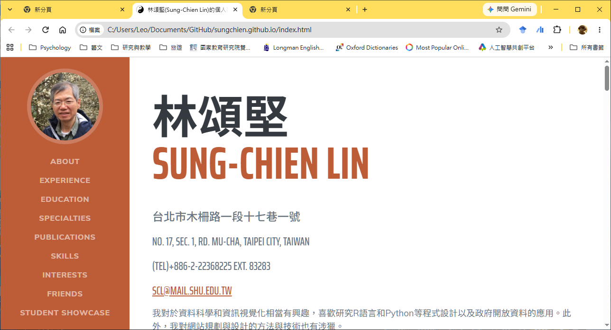
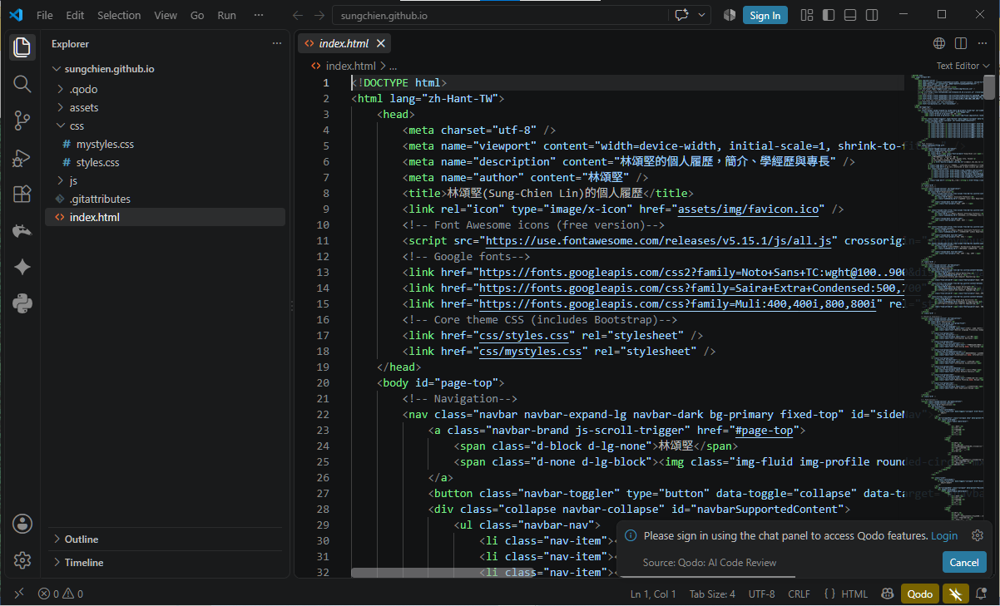
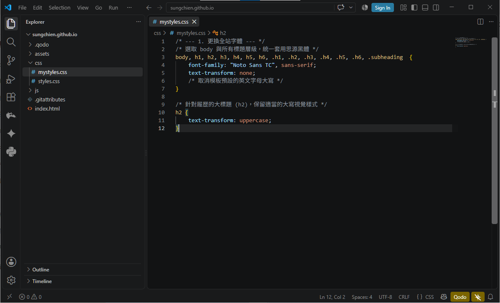
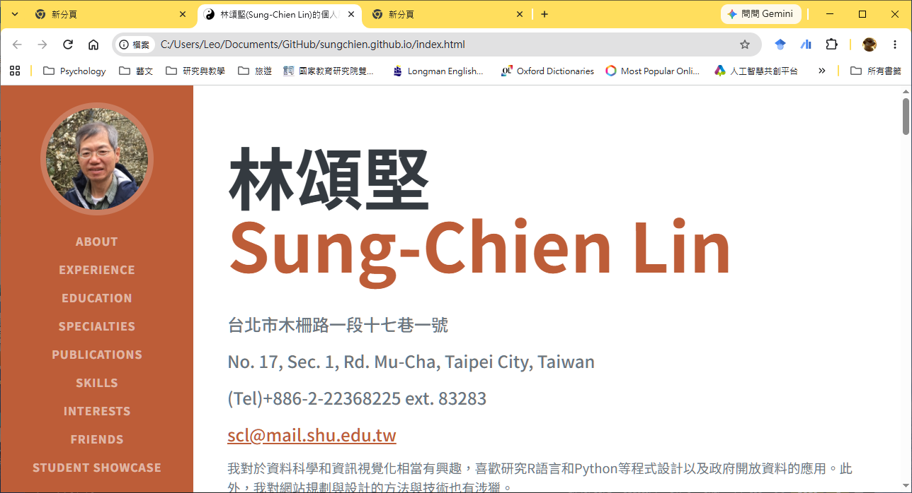
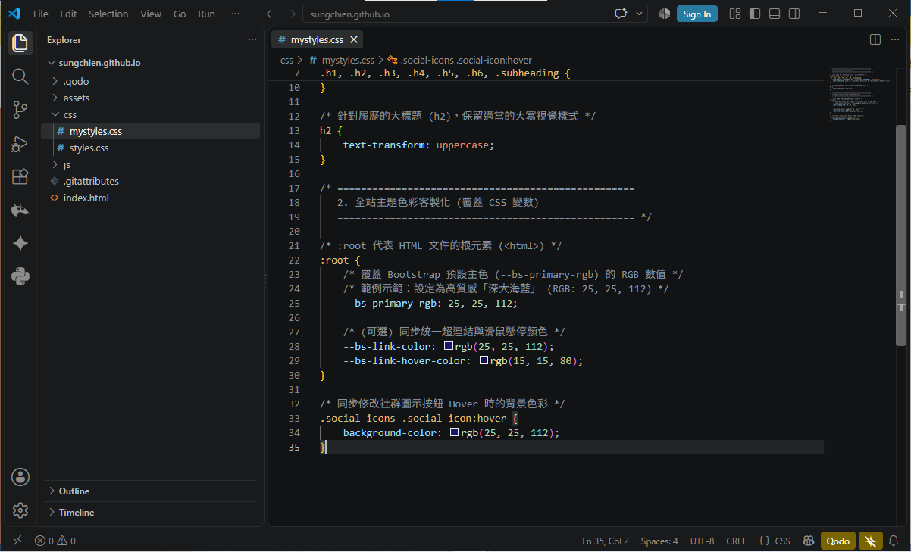
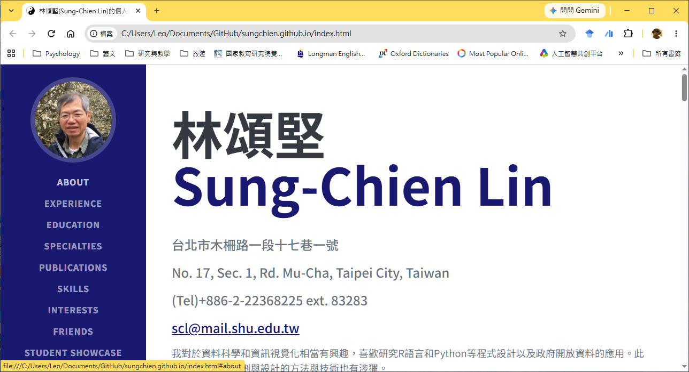
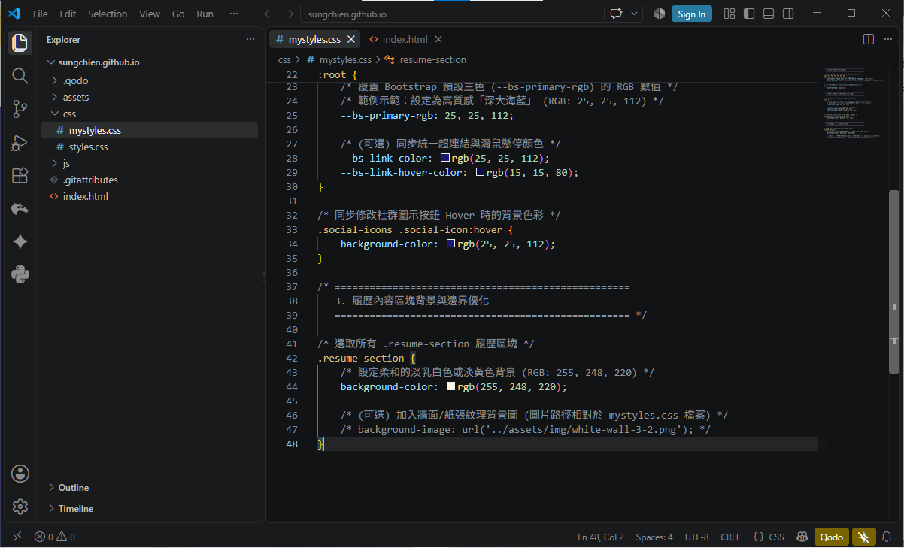
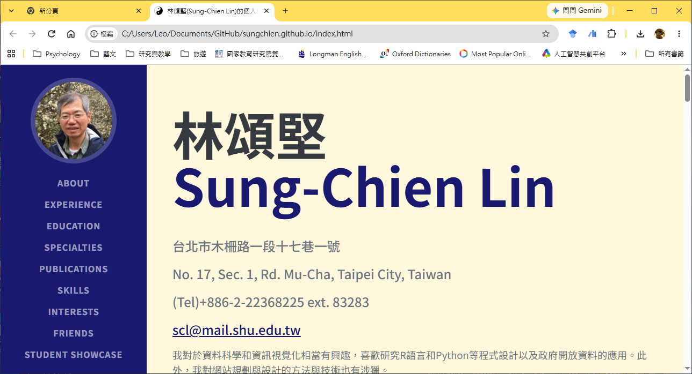

---
puppeteer:
  displayHeaderFooter: true
  scale: 1.15
  headerTemplate: '<div style="font-size: 11px; margin: 0 auto;">第八週：實作專案二 — 用 CSS 客製化你的履歷風格</div>'
  footerTemplate: '<div style="font-size: 11px; margin: 0 auto;">第 <span class="pageNumber"></span> 頁 / 共 <span class="totalPages"></span> 頁</div>'
  margin:
    top: "1.5cm"
    bottom: "1.5cm"
    left: "1.5cm"
    right: "1.5cm"
---

<style>
  /* 全域字型、字級與行距 */
  body {
    font-size: 16pt !important;
    line-height: 1.7 !important;
    font-family: "Microsoft JhengHei", "PingFang TC", "Helvetica Neue", sans-serif;
  }

  /* 階層標題微調 */
  h1 { font-size: 30pt !important; margin-bottom: 0.5em !important; }
  h2 { font-size: 24pt !important; page-break-before: always; }
  h3 { font-size: 20pt !important; }
  h4 { font-size: 18pt !important; }

  /* 表格文字放大與排版優化 */
  table, th, td {
    font-size: 15pt !important;
    line-height: 1.5 !important;
  }

  /* 程式碼區塊 (自動換行防止 PDF 截斷) */
  pre, code {
    font-size: 13pt !important;
    font-family: Consolas, "Courier New", monospace !important;
    white-space: pre-wrap !important;
    word-break: break-all !important;
  }

  /* Mermaid 流程圖節點字體放大 */
  .mermaid text {
    font-size: 14px !important;
  }
</style>

---

# 第八週：實作專案二 — 用 CSS 客製化你的履歷風格 (Personal Online Resume - Styling Customization)

**課程名稱**：網頁設計 (Webpage Design)  
**授課教師**：林頌堅 副教授 (Prof. Sung-Chien Lin)  
**授課單位**：世新大學 資訊傳播學系  
**聯絡方式**：scl@mail.shu.edu.tw  
**線上資源**：[Adobe Color 專業配色工具](https://color.adobe.com/) | [Google Fonts 雲端字型庫](https://fonts.google.com/)  

---

## Ⅰ. 專案目標與核心觀念 (Project Goals & Core Concepts)

各位同學好！在上週的課程中，我們順利完成了個人履歷的 **HTML** 內容填充與中文化，恭喜大家都擁有了一張結構完整的線上履歷！

不過，目前的履歷看起來依然是 Bootstrap 模板預設的視覺風格。本週我們的核心任務，就是要運用 **CSS** 來客製化這份履歷，賦予它獨一無二的個人視覺風格！



我們將學習如何在**完全不修改原始模板檔案的前提下**，透過我們自訂的 CSS 檔案，來巧妙「覆蓋 (Override)」掉模板的預設樣式。

---

### 1. 本週四大學習目標

1. **掌握 CSS 的「層疊 (Cascading)」與「優先級」特性**：深入理解樣式覆蓋的底層運作原理。
2. **建立並正確連結自訂 CSS 檔案**：學習如何在 HTML 中以正確順序引入客製化樣式檔。
3. **活用瀏覽器「開發者工具 (Inspect / F12)」**：精準查找網頁元素的 CSS 屬性與 CSS 變數名稱。
4. **客製化全站視覺風格**：熟練修改字體、主題配色（CSS 變數 `:root`）與背景材質。

---

### 2. 核心觀念：為什麼要「覆蓋」而不是直接「修改」原始檔案？

我們為什麼不直接去修改模板提供的 `css/styles.css` 檔案，而是要新增一個獨立的 `css/mystyles.css` 呢？

> 💡 **老師的真心話：專業開發者的優良習慣**  
> 這是網頁工程領域中一個非常關鍵且嚴謹的**專業習慣**！  
> `css/styles.css` 是 Bootstrap 模板的核心基礎檔案。未來如果模板更新（例如升級 Bootstrap 版本或修復排版 Bug），你只需直接下載最新版的 `styles.css` 進行替換，而你所有寫在 `mystyles.css` 中的客製化視覺樣式，都將**絲毫不受影響**！  
> 相反地，如果你直接去改動 `styles.css`，一旦未來模板升級，你的所有修改都會被覆蓋抹除，必須重新修改一次，非常痛苦。「**保持核心檔案的乾淨，用獨立檔案去擴充與覆蓋**」，是所有專業網頁開發的基礎金科玉律。

---

## Ⅱ. 建立與引入自訂樣式檔 (Setting up mystyles.css)

請跟著以下步驟，為你的履歷換上全新的專屬新裝！

### 1. 建立 `mystyles.css` 檔案

在 VS Code 中打開你的履歷專案資料夾，找到 `css/` 資料夾，在裡面新增一個空白檔案，命名為 `mystyles.css`（路徑為 `css/mystyles.css`）。

---

### 2. 在 `index.html` 中正確連結自訂檔案

打開 `index.html` 檔案，在 `<head>` 區塊中，找到載入預設 `styles.css` 的那一行。在它的**正下方**，加入新的一行來連結我們的 `mystyles.css`：

```html
<head>
    <meta charset="utf-8" />
    <meta name="viewport" content="width=device-width, initial-scale=1, shrink-to-fit=no" />
    <title>王大明的個人線上履歷</title>
    
    <!-- 1. 模板原始核心 CSS (包含 Bootstrap) -->
    <link href="css/styles.css" rel="stylesheet" />
    
    <!-- 2. 個人客製化自訂 CSS (必須放在 styles.css 的正下方！) -->
    <link href="css/mystyles.css" rel="stylesheet" />
</head>
```



> 💡 **老師的真心話：載入順序至關重要！**  
> 瀏覽器讀取網頁是「由上而下」依序讀取與套用 CSS 的。當兩個 CSS 檔案對同一個 HTML 元素（例如 `<body>`）設定了相同的樣式屬性時，**後讀取的 CSS 設定會覆蓋掉先讀取的設定**！  
> 因此，我們必須把自訂的 `mystyles.css` 放在原始 `styles.css` 的後方，瀏覽器才會優先採用我們在 `mystyles.css` 中所寫的新樣式！

---

## Ⅲ. 全站中文字體更換與文字轉換控制 (Typography & Google Fonts)

模板預設的英文字體非常俐落，但對於中文內容來說，系統預設細字體效果並不理想。我們將全站字體替換為更適合中文螢幕閱讀的高質感字體——**思源黑體 (Noto Sans TC)**。

### 1. 檢查並引入 Google Fonts 雲端字型

請檢查你的 `index.html` 的 `<head>` 中是否已經引入 Google Fonts 的字體連結。如果沒有，請加入以下程式碼：

```html
<!-- 引入 Google Fonts 思源黑體 Noto Sans TC -->
<link rel="preconnect" href="https://fonts.googleapis.com">
<link rel="preconnect" href="https://fonts.gstatic.com" crossorigin>
<link href="https://fonts.googleapis.com/css2?family=Noto+Sans+TC:wght@300;400;500;700&display=swap" rel="stylesheet">
```

---

### 2. 在 `mystyles.css` 撰寫字體與大小寫覆蓋規則

開啟 `css/mystyles.css` 檔案，輸入以下 CSS 規則：

```css
/* ===================================================
   1. 全站字體與大小寫轉換控制
   =================================================== */

/* 選取 body 與所有標題層級，統一套用思源黑體 */
body, h1, h2, h3, h4, h5, h6,
.h1, .h2, .h3, .h4, .h5, .h6, .subheading {
    font-family: "Noto Sans TC", "Microsoft JhengHei", sans-serif;
    text-transform: none; /* 關鍵：取消 Bootstrap 預設強制英文字母大寫的設定 */
}

/* 針對履歷的大標題 (h2)，保留適當的大寫視覺樣式 */
h2 {
    text-transform: uppercase;
}
```



* **動作**：按下 `Ctrl + S` 儲存 `mystyles.css`，切換至瀏覽器按 `F5` 重新整理，觀察中文內文是不是立刻變得圓潤且極具設計質感！



---

## Ⅳ. 掌握 Bootstrap CSS 變數更換主題配色 (Theme Color Customization via CSS Variables)

這份模板使用了現代 CSS 的核心技術——**CSS 變數 (CSS Variables)** 來控制全站的主題色彩。

我們不需要一個個去找選單、按鈕、連結或標題顏色來逐一修改，只需要在 `mystyles.css` 中覆蓋掉掌管顏色的那個「**總開關變數**」即可全站一鍵換色！

---

### 1. 覆蓋 `:root` 中的主色變數 (`--bs-primary-rgb`)

請將以下程式碼加入到 `css/mystyles.css` 中：

```css
/* ===================================================
   2. 全站主題色彩客製化 (覆蓋 CSS 變數)
   =================================================== */

/* :root 代表 HTML 文件的根元素 (<html>) */
:root {
    /* 覆蓋 Bootstrap 預設主色 (--bs-primary-rgb) 的 RGB 數值 */
    /* 範例示範：設定為高質感「深大海藍」 (RGB: 25, 25, 112) */
    --bs-primary-rgb: 25, 25, 112;

    /* (可選) 同步統一超連結與滑鼠懸停顏色 */
    --bs-link-color: rgb(25, 25, 112);
    --bs-link-hover-color: rgb(15, 15, 80);
}

/* 同步修改社群圖示按鈕 Hover 時的背景色彩 */
.social-icons .social-icon:hover {
    background-color: rgb(25, 25, 112);
}
```



---

### 2. 觀察全站即時換色效果

儲存檔案並重新整理網頁，你會驚喜地發現：
* 左側固定導覽列的背景色彩
* 你的姓名關鍵字顏色
* 所有章節大標題與時間點前綴
* 所有超連結與社群圖示 Hover 效果

原本所有的預設橘藍色，都瞬間統一變成了你所設定的深藍色主題！



> 💡 **老師的真心話：如何查找模板使用了哪個 CSS 變數？**  
> 想知道模板是用哪個 CSS 變數控制顏色的嗎？  
> 在瀏覽器中對你想改顏色的地方（例如左側導覽列）按右鍵選擇「**檢查 (Inspect / F12)**」，在右側的 Styles 面板中，點擊元素就能看到類似 `background-color: var(--bs-primary);` 的宣告。`--bs-primary` 或 `--bs-primary-rgb` 就是你要在 `mystyles.css` 中覆蓋的目標變數！

---

## Ⅴ. 背景材質與邊界視覺優化 (Background Textures & Border Styling)

預設白底黑字略顯單調，我們可以為右側的履歷內容區塊加上微甜的背景顏色，甚至是高質感紋理圖片！

### 1. 替換履歷區塊背景色彩與材質

在 `css/mystyles.css` 最下方追加以下樣式：

```css
/* ===================================================
   3. 履歷內容區塊背景與邊界優化
   =================================================== */

/* 選取所有 .resume-section 履歷區塊 */
.resume-section {
    /* 設定柔和的淡乳白色或淡黃色背景 (RGB: 255, 248, 220) */
    background-color: rgb(255, 248, 220);
    
    /* (可選) 加入牆面/紙張紋理背景圖 (圖片路徑相對於 mystyles.css 檔案) */
    /* background-image: url('../assets/img/white-wall-3-2.png'); */
}
```



* **提示**：上例中的 `background-image` 先被註解掉了。如果你想要紋理效果，可以到 [Transparent Textures](https://www.transparenttextures.com/) 免費無縫紋理網站下載喜歡的透明紋理圖，放到 `assets/img/` 資料夾中，並取消 `/* ... */` 註解即可！



---

## Ⅵ. 進階作品集視覺排版：便當盒風 (Bento Box) 與 瀑布流 (Waterfall / Masonry)

在上週的「內容篇」中，我們學會了如何在 `index.html` 中新增作品集 (Portfolio) 區塊與文字內容。本週，我們要運用 CSS 來大幅提升作品集的視覺動態感與質感！

現代網頁設計極度推薦以下兩種高質感作品集 CSS 排版風格，你可以任選一種實作於你的 `mystyles.css` 中：

---

### 1. 便當盒風格 (Bento-Box Grid Layout)

像日式便當盒一樣，利用 **CSS Grid** 將不同尺寸大小的作品卡片（如大尺寸代表作跨雙欄、標準尺寸單欄專案）整齊拼貼於網格中。能突出主打作品，極具視覺節奏感！

#### HTML 結構範例 (`index.html`)：
```html
<section class="resume-section" id="portfolio">
    <div class="resume-section-content">
        <h2 class="mb-5">作品集展示 (Bento Grid 風格)</h2>
        <div class="bento-grid">
            <!-- 跨雙欄的主打重點作品 -->
            <div class="bento-item bento-wide">
                <div class="subheading text-primary">代表作 · 網頁設計</div>
                <h3>線上電子商城 UI/UX 設計</h3>
                <p>運用 Bootstrap 與 CSS Grid 打造的響應式商務平台原型，優化購物流程體驗。</p>
            </div>
            <!-- 標準單欄作品卡片 1 -->
            <div class="bento-item">
                <div class="subheading text-primary">平面視覺</div>
                <h3>音樂節主題海報</h3>
                <p>高對比配色與幾何字體設計。</p>
            </div>
            <!-- 標準單欄作品卡片 2 -->
            <div class="bento-item">
                <div class="subheading text-primary">前端互動</div>
                <h3>資料視覺化儀表板</h3>
                <p>結合 JS 的數據圖表介面。</p>
            </div>
        </div>
    </div>
</section>
```

#### CSS 客製化樣式 (`mystyles.css`)：
```css
/* ===================================================
   4. Bento Grid 便當盒風格作品集樣式
   =================================================== */
.bento-grid {
    display: grid;
    grid-template-columns: repeat(auto-fit, minmax(240px, 1fr));
    gap: 20px;
}

.bento-item {
    background-color: #ffffff;
    border: 1px solid #e9ecef;
    border-radius: 12px;
    padding: 24px;
    box-shadow: 0 4px 6px rgba(0, 0, 0, 0.03);
    transition: transform 0.2s ease, box-shadow 0.2s ease;
}

/* 滑鼠懸停時微升效果 */
.bento-item:hover {
    transform: translateY(-4px);
    box-shadow: 0 8px 15px rgba(0, 0, 0, 0.08);
}

/* 桌機與平板螢幕下，讓首張主打作品跨越 2 欄 */
@media (min-width: 768px) {
    .bento-wide {
        grid-column: span 2;
    }
}
```

---

### 2. 瀑布流風格 (Waterfall / Masonry Layout)

類似 Pinterest 或 Instagram 探索頁面，利用 **CSS Multi-column** 讓包含圖片、海報或長圖的作品卡片依據圖像高度自動垂直緊密錯落排列。

#### HTML 結構範例 (`index.html`)：
```html
<section class="resume-section" id="portfolio">
    <div class="resume-section-content">
        <h2 class="mb-5">作品集展示 (瀑布流風格)</h2>
        <div class="waterfall-container">
            <!-- 作品卡片 1 -->
            <div class="waterfall-item">
                
                <h3>城市微光 攝影專題</h3>
                <p>記錄台北街頭夜間光影人文紀錄特輯。</p>
            </div>
            <!-- 作品卡片 2 -->
            <div class="waterfall-item">
                
                <h3>品牌識別手冊設計</h3>
                <p>企業 VI 系統設計規範全輯展示。</p>
            </div>
            <!-- 作品卡片 3 -->
            <div class="waterfall-item">
                
                <h3>3D 角色模型渲染</h3>
                <p>Blender 數位藝術角色創作。</p>
            </div>
        </div>
    </div>
</section>
```

#### CSS 客製化樣式 (`mystyles.css`)：
```css
/* ===================================================
   5. Waterfall 瀑布流風格作品集樣式
   =================================================== */
.waterfall-container {
    column-count: 3; /* 電腦螢幕預設切分為 3 欄瀑布流 */
    column-gap: 20px;
}

.waterfall-item {
    break-inside: avoid; /* 核心技巧：防止卡片被欄位裁切跨欄 */
    margin-bottom: 20px;
    background-color: #ffffff;
    border: 1px solid #e9ecef;
    border-radius: 12px;
    padding: 16px;
    box-shadow: 0 4px 6px rgba(0, 0, 0, 0.05);
}

/* 手機版還原為單欄顯示 */
@media (max-width: 768px) {
    .waterfall-container {
        column-count: 1;
    }
}
```

---

## Ⅶ. 配色工具推薦與課後自主設計作業 (Coloring Tools & Assignment)

恭喜你！透過上述幾個關鍵步驟，你已經成功掌握了 professional CSS 覆蓋技術，並為履歷換上了專屬視覺外觀！

### 1. 專業線上配色資源推薦

在選擇個人主題色時，切忌隨意混搭過多高飽和度色彩。推薦使用以下專業工具進行配色調和：

* **[Adobe Color](https://color.adobe.com/)**：Adobe 官方出品的專業調色盤工具，提供色環、補色、同色系與社群熱門配色提案。
* **[Web Pattern Color Reference](https://brandcolors.net/)**：收錄全球各大知名品牌與網站標準色碼表，非常適合初學者參考。
* **[Transparent Textures](https://www.transparenttextures.com/)**：提供數百款免費 CSS 透明紋理背景圖，能大幅提升網頁的材質質感。

---

### 2. 本週課後自主設計作業

請同學們發揮創意，完成以下個人履歷視覺客製化挑戰：

1. **自訂專屬主題色**：使用 Adobe Color 挑選最能代表你個人特質的主題色，修改 `:root` 中的 `--bs-primary-rgb` 數值。
2. **更換 Google Fonts 字體**：嘗試到 Google Fonts 尋找其他喜歡的中文字體（如思源宋體 `Noto Serif TC`），於 `index.html` 引入並於 `mystyles.css` 更新 `font-family`。
3. **優化作品集與背景**：選擇實作便當盒風或瀑布流風格排版，並為內容區塊加上適當的背景顏色、邊框弧度 (`border-radius`) 或輕微陰影 (`box-shadow`)，讓版面更具視覺質感與立體感。

---

### 下週預告 (Next Week)

下週我們將進入本課程的最終重頭戲——**實作專案三：上傳到 GitHub 並設為個人首頁**！  
我們將手把手教大家申請 GitHub 帳號、使用 GitHub Desktop 圖形化介面建立 `username.github.io` 個人首頁倉庫，並透過 **GitHub Pages** 免費網頁託管服務，將你在本機電腦上製作的個人履歷網頁正式發佈到網際網路上，獲得專屬的個人網站網址，讓全台灣甚至全世界的面試官與朋友都能隨時瀏覽你的精彩作品！下課後記得將專案打包備份喔！
