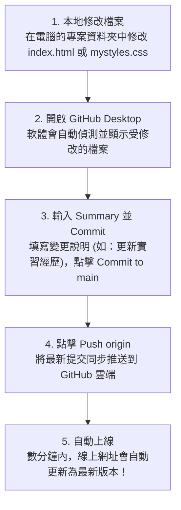

---
puppeteer:
  displayHeaderFooter: true
  scale: 1.15
  headerTemplate: '
第九週：實作專案三 — 上傳到 GitHub 並設為個人首頁
'
  footerTemplate: '
第  頁 / 共  頁
'
  margin:
    top: "1.5cm"
    bottom: "1.5cm"
    left: "1.5cm"
    right: "1.5cm"
---

---

# 第九週：實作專案三 — 上傳到 GitHub 並設為個人首頁 (Deploying Resume to GitHub Pages)

**課程名稱**：網頁設計 (Webpage Design)  
**授課教師**：林頌堅 副教授 (Prof. Sung-Chien Lin)  
**授課單位**：世新大學 資訊傳播學系  
**聯絡方式**：scl@mail.shu.edu.tw  
**線上資源**：[GitHub 官方網站](https://github.com/) | [GitHub Desktop 下載專區](https://desktop.github.com/)  

---

## Ⅰ. 專案目標與平台簡介 (Project Goals & Platform Overview)

各位同學好！經過前兩週的努力，我們已經擁有一份 HTML 結構完整、CSS 視覺風格獨特的線上個人履歷網頁。但是，目前這份作品還靜靜地躺在你的電腦本機硬碟裡，只有你自己看得到。

本週我們的終極目標，就是將這份履歷網頁正式發佈到網際網路上，獲得專屬的個人網站網址，讓任何人（包括你未來的雇主、面試官與朋友）只要點擊網址，就能隨時欣賞你的精彩作品！

我們將使用全世界所有軟體工程師與設計師都必須認識的全球最大平台：**GitHub**。

---

### 1. 什麼是 GitHub 與 GitHub Pages？

* **GitHub**：簡單來說，GitHub 是「**程式碼的雲端硬碟**」兼「**全球開發者的社群平台**」。全世界的工程師都會把他們的程式碼專案存放在 GitHub 上，方便進行版本管理、雲端備份與團隊協作。
* **GitHub Pages**：GitHub 提供了一項殺手級的免費託管服務叫做 **GitHub Pages**，它允許你將程式碼倉庫 (Repository) 中的網頁檔案直接轉化為公開的網態網站。這對我們展示線上個人履歷來說，是絕佳且免費的官方工具！

---

### 2. 本專案五大實作目標

1. **申請 GitHub 帳號**：打造你未來在軟體與設計社群的全球數位身份證。
2. **安裝與設定 GitHub Desktop**：透過圖形化介面工具進行操作，無需輸入複雜命令列指令。
3. **建立個人首頁專用倉庫 (Repository)**：學習特殊的個人首頁命名規則 `username.github.io`。
4. **將履歷專案檔 Commit 提交並 Push 上傳**：掌握本地版控與雲端同步。
5. **啟動 GitHub Pages 免費發佈**：取得個人專屬網址並進行線上除錯與驗證。

---

## Ⅱ. 步驟一：申請 GitHub 帳號 (Creating a GitHub Account)

請開啟瀏覽器，著手註冊你的 GitHub 個人帳號：

1. 前往 [GitHub 官方網站](https://github.com/)。
2. 點擊右上角藍色的 **"Sign up"** 按鈕，依照畫面指示輸入 Email、密碼並完成驗證。
3. **選擇你的使用者名稱 (Username)**：這是最關鍵的一步！

> 💡 **老師的真心話：請務必慎選你的 GitHub 使用者名稱 (Username)！**  
> 這個使用者名稱未來將會直接成為你個人網站網址的一部分（例如 `https://your-username.github.io`），並且很可能會跟隨你整個職業生涯！  
> 建議使用**具備專業感、容易辨識的英文姓名或專業暱稱**（例如 `chen-shiau-ming` 或 `sming-dev`），避免使用像 `apple123` 或 `god-of-game` 這類非專業感的暱稱喔！

---

## Ⅲ. 步驟二：下載與設定 GitHub Desktop (Setting up GitHub Desktop)

雖然專業工程師大多使用指令列 (Terminal / Command Line)，但對初學者來說，圖形化介面的 **GitHub Desktop** 是我們最好的朋友。

1. 請前往 [GitHub Desktop 官網](https://desktop.github.com/) 下載符合你作業系統（Windows 或 macOS）的版本。
2. 安裝完成後開啟 GitHub Desktop，軟體會引導你進行授權登入。請點擊 **"Sign in to GitHub.com"** 並於瀏覽器完成登入授權。
3. **確認登入狀態**：
   * 登入後，點擊左上角選單的 **File** > **Options...** (macOS 為 **GitHub Desktop** > **Preferences...**)。
   * 在 **Accounts** 分頁中，務必確認顯示的是你自己的 GitHub 帳號！

> 💡 **老師的真心話 (超級重要)：在電腦教室忘記確認登入會怎樣？**  
> * **公用電腦風險**：如果你在學校電腦上忘了確認登入帳號，你可能會不小心使用到前一位同學留下的 GitHub Desktop 帳號！你辛苦完成的履歷提交紀錄 (Commit) 都會被算在別人頭上。
> * **發佈失敗**：若未成功登入，最後一步發佈專案時程式會不知道要傳送到哪個雲端帳號而失敗。
> * **解決方法**：隨時可以開啟 **File** > **Options...** > **Accounts** 檢查。如果登錯了，點擊 **Sign out** (登出) 再重新 **Sign in** (登入) 你自己的帳號即可！

---

## Ⅳ. 步驟三：建立個人首頁專用倉庫 (Creating the Special Repository)

這是最關鍵的一步！為了啟動 GitHub Pages 的「個人頂級網域首頁」功能，你的第一個履歷倉庫必須使用一個**特殊的命名規則**：

$$\text{你的使用者名稱} + \text{.github.io}$$

* **命名範例**：若你的 GitHub Username 是 `sung-chien-lin`，則你的 Repository 名稱必須精準命名為 **`sung-chien-lin.github.io`**（全小寫、無空格）。

---

### 操作步驟：

1. 在 GitHub Desktop 中，點擊左上角選單 **File** > **New repository...**。
2. 在 **Name** 欄位，輸入這個特殊名稱（例如 `your-username.github.io`）。
3. 在 **Local path** 欄位，點擊 Choose 選擇一個你電腦中乾淨的資料夾（例如桌面上的 `github-project` 資料夾），用來存放這個線上專案。
4. **Git ignore** 選擇 `None`，**License** 選擇 `None`。
5. 點擊右下角藍色的 **"Create repository"** 按鈕。

---

## Ⅴ. 步驟四：複製檔案、Commit 提交與 Push 推送 (Copy, Commit & Push)

現在，你的電腦本地 (Local) 已經有了一個空的 Git 倉庫資料夾，接著我們要將前幾週製作的履歷檔案複製進去並推送上雲端：

### 1. 複製履歷檔案

開啟你前兩週製作履歷的專案資料夾，將裡面所有的檔案與資料夾（包含 `index.html`、`css/` 資料夾、`assets/` 圖片資料夾等），**全部複製**並貼到剛剛步驟三所建立的 `your-username.github.io` 資料夾中！

---

### 2. 提交變更 (Commit)

回到 GitHub Desktop 視窗，你會發現左側的 **Changes** 欄位自動跳出了你剛剛複製進去的所有檔案列表。

1. 在左下角 **Summary (required)** 欄位中，輸入本次上傳的中文說明，例如：`首次上傳個人履歷網頁`。
2. 點擊藍色的 **"Commit to main"** 按鈕。

> 💡 **核心觀念解析：什麼是 Commit (提交)？**  
> Commit 的意思是「**在本地電腦上記錄並確認這筆存檔變更**」。這就像是在玩遊戲時建立了一個存檔點 (Save Point)，未來隨時可以回溯！

---

### 3. 發佈與推送 (Publish & Push)

1. 完成 Commit 後，GitHub Desktop 主畫面中央上方會出現一個 **"Publish repository"** 按鈕，請點擊它。
2. 在跳出的確認視窗中，**請務必確認「Keep this code private (保持程式碼私有)」選項沒有被勾選**！
   * **關鍵**：我們的履歷網站必須設定為 **Public (公開)**，GitHub Pages 才能免費將網頁發佈給全世界看！
3. 點擊 **"Publish repository"** 按鈕，GitHub Desktop 就會把檔案正式「推送 (Push)」到遠端 GitHub 伺服器上了！

---

## Ⅵ. 步驟五：啟動 GitHub Pages 並檢查成果 (Activating GitHub Pages & Debugging)

因為你使用了 `your-username.github.io` 這個特殊名稱命名倉庫，GitHub Pages 伺服器通常會自動為你啟動網頁發佈！

### 1. 檢查網頁發佈狀態

1. 開啟瀏覽器回到 [GitHub 網站](https://github.com/)，登入後點擊右上角個人頭像，選擇 **"Your repositories"**。
2. 點擊進入你剛剛建立的 `your-username.github.io` 倉庫。
3. 點擊頂部選單列的 **"Settings" (設定)**。
4. 在左側選單欄中，點擊 **"Pages"**。
5. 在 "GitHub Pages" 區塊上方，你應該會看到綠色的成功提示：  
   `Your site is live at https://your-username.github.io/`

* **測試**：點擊該綠色網址，看看你的個人履歷是否已經順利在網路上開啟了！

---

### 2. 老師的真心話與常見 404 錯誤排查

> 💡 **老師的真心話：遇到 404 Page Not Found 怎麼辦？**  
> 第一次發佈網站時，GitHub 伺服器通常需要 **1 到 5 分鐘** 的時間進行編譯生效。如果你剛點開網址看到 404 錯誤，請先泡杯茶稍等 2 分鐘，再按 `F5` 重新整理。  
> 如果超過 10 分鐘依然顯示 404 錯誤，最常見的故障原因有以下兩個：  
> 1. **倉庫名稱拼錯**：倉庫名稱必須與你的 GitHub 使用者名稱 **完全一模一樣**（含字母大小寫與連字號，如 `your-username.github.io`）。若少打了 `.github.io` 或 Username 打錯，就無法自動觸發個人首頁！  
> 2. **`index.html` 位置放錯**：你的 `index.html` 檔案必須直接放在倉庫的**最上層根目錄**中！如果把它誤放在內層子資料夾裡，GitHub Pages 會找不到首頁而報錯。

---

## Ⅶ. 總結與日後履歷更新維護流程 (Future Maintenance Workflow & Checklist)

恭喜你！你現在正式擁有了一個**全球通行的個人履歷網站**！快把這個專屬網址加入到你的履歷表、LinkedIn 與名片中吧！

未來每當你想要更新履歷內容或樣式時，維護流程非常簡單流暢：

---

### 隨堂實做進度自我核對表：

- [ ] **關卡 1**：成功申請 GitHub 帳號，並挑選了具專業感的 Username。
- [ ] **關卡 2**：下載並安裝 GitHub Desktop，於 Options 中確認已成功登入個人帳號。
- [ ] **關卡 3**：精準建立名稱為 `your-username.github.io` 的個人首頁專用倉庫。
- [ ] **關卡 4**：將履歷所有專案檔案複製至倉庫目錄，填寫 Summary 完成 Commit 並 Publish Push 上傳。
- [ ] **關卡 5**：確認取消勾選 Private 私有選項，讓專案保持 Public 公開。
- [ ] **關卡 6**：於 GitHub Settings > Pages 確認綠色發佈成功提示，並能在瀏覽器透過 `https://your-username.github.io` 順利開啟個人線上履歷！
